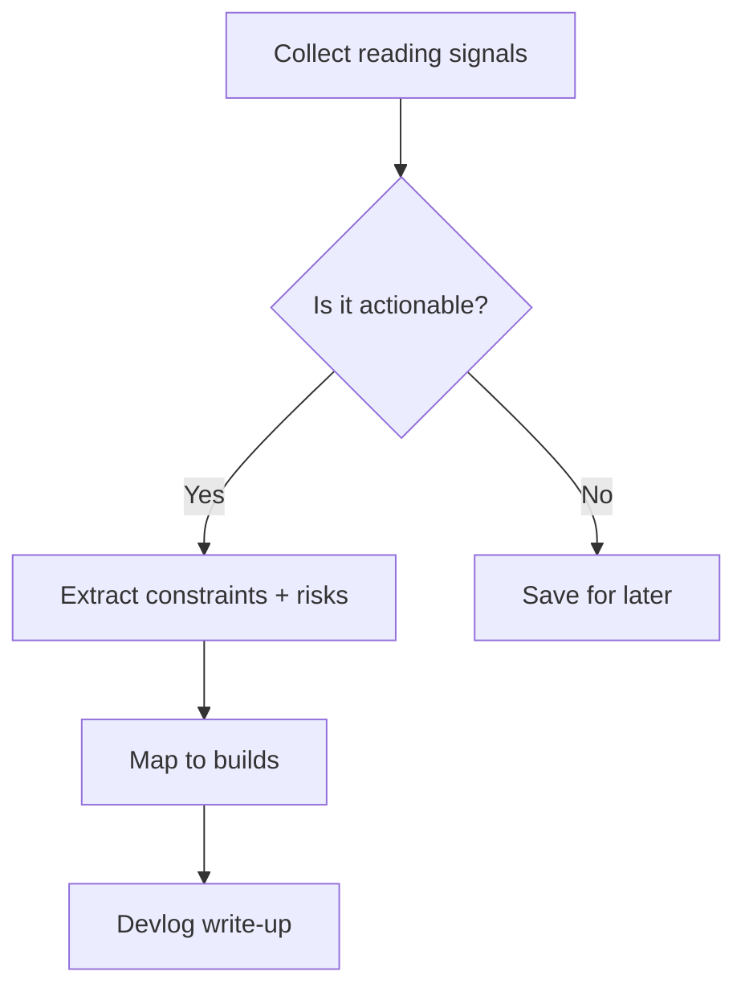

import Tabs from '@theme/Tabs';
import TabItem from '@theme/TabItem';

**The Hook**
I shipped a focused devlog pipeline update that turns my reading queue into concrete build decisions for the week.
<!-- truncate -->

**Why I Built It**
My days were getting noisy: too many good posts, not enough synthesis. I wanted a lightweight path from "interesting idea" to "actionable build," and a way to record it so I can see patterns over time.

**The Solution**
I wired a simple flow that separates signal capture, decision pressure, and actual build notes.



<Tabs>
  <TabItem value="flow" label="Flow">

```txt
capture -> filter -> extract -> map -> ship
```

  </TabItem>
  <TabItem value="pseudo" label="Pseudo">

```python
signals = read_queue()
insights = [s for s in signals if s.actionable()]
notes = summarize(insights)
plan = map_to_builds(notes)
write_devlog(plan, notes)
```

  </TabItem>
</Tabs>

<details>
  <summary>Click to view raw logs</summary>
  Read queue normalized, 10 sources tagged, 4 insights promoted to build notes.
</details>

:::note
Small, repeatable loops beat big, fragile systems.
:::

:::tip
If an insight can't change a build plan, it's just trivia.
:::

:::warning
Don't let "nice to know" overwhelm "need to ship."
:::

:::danger
Automating without guardrails turns your roadmap into a blender.
:::

**The Code**
[View Code](https://github.com/victorstack-ai/agent-hq)

**What I Learned**
- The WordPress AI Leaders pilot is a paid micro-credential that starts with a March 2026 cohort, prioritizes UIC students, and ties learning to real WordPress contributions.
- The WordPress MCP Adapter supports STDIO and HTTP transports, with STDIO + WP-CLI as the simplest path for local development.
- MCP adapter safety hinges on least-privilege capabilities and avoiding destructive abilities for public endpoints.
- Drupal Commerce can support B2B portals inside a single Drupal install without a separate platform, using built-in capabilities and modules.
- The Mail Composer module provides an OOP + Twig-based email API in Drupal, and has stable releases with Drupal 11 compatibility.
- The old IE stylesheet tag limit (around 31 link/style tags) remains a real reminder of why CSS aggregation strategy matters.
- WPTavern's #203 podcast features Miriam Schwab on Elementor's growth and AI direction, which frames how product teams talk about cautious rollouts and AI experimentation.

I still have a few items queued to dig into deeper (Pantheon's new dashboard traffic metrics, Gutenberg 22.5 notes, and a Drupal community values post), but the themes above were enough to shape next week's build priorities.
