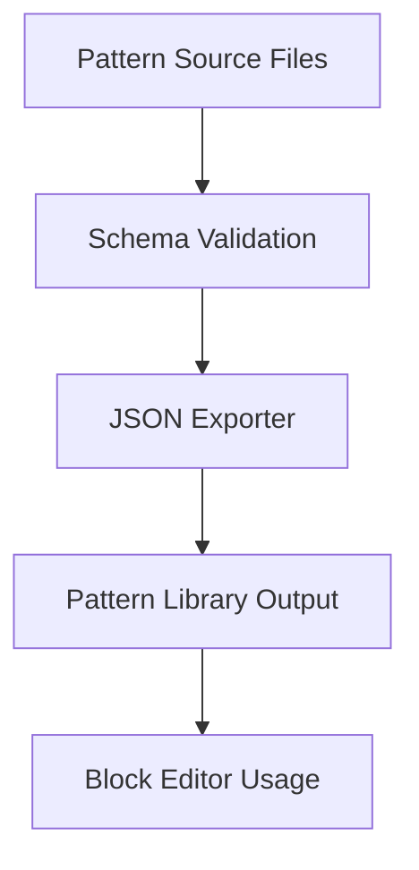

import Tabs from '@theme/Tabs';
import TabItem from '@theme/TabItem';

**The Hook**
I shipped a WordPress block pattern library scaffold with a JSON exporter and wrapped it with a compatibility review for WordPress 6.9.1 RC1.

**Why I Built It**
I wanted a repeatable way to author and export block patterns without hand-curating JSON every time a design changed. At the same time, a major RC is the perfect moment to audit plugin/theme compatibility, so I paired the scaffold work with a focused 6.9.1 RC1 impact review to catch breaking changes early.

**The Solution**
I built a small pattern library scaffold that standardizes pattern metadata and pipes it through a JSON export step. The exporter acts as a single source of truth: the pattern files remain developer-friendly, while the JSON output stays consistent for distribution and tooling.



<Tabs>
  <TabItem value="arch" label="Architecture">
    ```text
    patterns/
      hero.json
      features.json
      cta.json
    scripts/
      export-patterns.js
    dist/
      patterns.json
    ```
  </TabItem>
  <TabItem value="js" label="JS">
    ```js
    // export-patterns.js
    // Reads pattern metadata, validates shape, writes a bundled JSON.
    export function exportPatterns(inputDir, outputFile) {
      const patterns = readPatternFiles(inputDir);
      const validated = validatePatterns(patterns);
      writeJson(outputFile, validated);
    }
    ```
  </TabItem>
</Tabs>

:::note
The exporter keeps the authoring workflow flexible while ensuring the published JSON is predictable for consumers.
:::

:::warning
I treat RC releases as “time to check assumptions.” Even small editor changes can cascade into theme and plugin behavior.
:::

<details>
  <summary>Click to view raw logs</summary>
  Pattern scan: 18 files
  Validation: 18 passed, 0 failed
  Export: dist/patterns.json
  Compatibility review: WP 6.9.1 RC1
</details>

**The Code**
[View Code](https://github.com/victorstack-ai/agent-hq)

**What I Learned**
- Drupal communities are grappling with how algorithmic bias can conflict with community values; governance and culture still matter as much as tooling.
- Pantheon’s Site Dashboard now surfaces traffic metrics for top IPs, user agents, and visited paths, which is gold for quick anomaly checks.
- WordPress is piloting an AI Leaders Micro-Credential, a clear sign that AI fluency is becoming part of core contributor growth.
- Gutenberg 22.5’s updates (released Feb 4) reinforce how quickly editor capabilities evolve; it’s worth aligning patterns with new blocks early.
- Elementor’s leadership is betting on AI for the next decade of growth, which will raise the bar for editor UX across the ecosystem.
- The WordPress MCP Adapter shows a path from “abilities” to real agent workflows—less glue code, more composable automation.
- Drupal Commerce shops can add B2B portals without a full replatform, which lowers the barrier for hybrid catalog/price logic.
- Sending multilingual HTML emails in Drupal is getting saner with Mail Composer patterns; email UX is finally catching up.
- A quiet interview on international upbringing reminded me how product intuition is often rooted in lived context.
- A sharp reminder: Drupal CSS aggregation can still bite—test with aggregation on, not just in dev.

:::tip
I’m going to keep the exporter small and strict. The more predictable the output, the easier it is to integrate downstream.
:::

:::danger
Compatibility checks are not optional on RCs. Shipping without them is how “minor” updates become major fire drills.
:::
