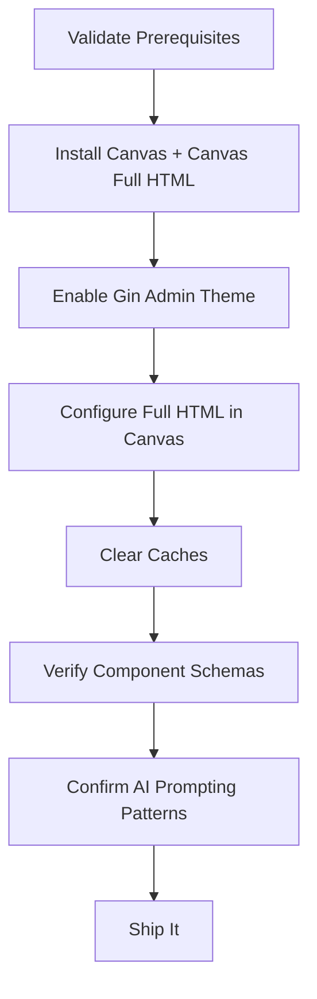

import TOCInline from '@theme/TOCInline';

I turned my Drupal Canvas Full HTML notes into a clear rollout guide and backed it with a runnable repo so teams can ship rich editing without breaking permissions.

<!-- truncate -->

<TOCInline toc={toc} minHeadingLevel={2} maxHeadingLevel={2} />

<details>
<summary>TL;DR — 30 second version</summary>

- Canvas Full HTML is powerful but risky if the configuration is sloppy
- I built a step-by-step rollout guide with a reference implementation
- Key: validate prerequisites, configure Full HTML in Canvas, verify component schemas, confirm AI behavior
- Gin admin theme materially improves the Canvas authoring experience

</details>

## Why I Built It

Canvas ships with a powerful editor, but Full HTML in Canvas can be risky if the configuration is sloppy. I wanted a deterministic, step-by-step guide that makes the rollout safe and auditable, plus a concrete reference implementation I can point to.

## The Rollout Sequence

I distilled the guide into a predictable sequence and mapped it to actual code:

- Validate prerequisites (Drupal 11.2+, Canvas 1.0.4, Full HTML text format)
- Install Canvas and Canvas Full HTML
- Enable Gin for a consistent editing baseline
- Configure Full HTML in Canvas and clear caches
- Verify component schemas expose `contentMediaType: text/html`
- Confirm Canvas AI behavior and prompting patterns for safe component use



### Component Schema Example

```yaml title="component.schema.yml"
props:
  type: object
  properties:
    content:
      type: string
      title: Content
      contentMediaType: text/html
      x-formatting-context: block
```

:::tip[Top Takeaway]
Canvas AI is safer when prompts emphasize placement over creation, reducing unintended component generation. Design your prompts accordingly.
:::

:::info[Context]
Canvas Full HTML supports Drupal ^10.3 and ^11, but stable Canvas targets ^11.2, so version alignment matters. Do not assume backward compatibility without checking.
:::

## The Code

I built a small module/demo that mirrors the rollout steps and schema expectations. You can clone it or browse the key files here: [View Code](https://github.com/victorstack-ai/drupal-canvas-full-html-example)

## What I Learned

- Canvas Full HTML supports Drupal ^10.3 and ^11, but stable Canvas targets ^11.2, so version alignment matters.
- The Gin admin theme materially improves the Canvas authoring experience.
- Canvas AI is safer when prompts emphasize placement over creation, reducing unintended component generation.

## Signal Summary

| Topic | Signal | Action | Priority |
|---|---|---|---|
| Canvas Full HTML | Risky without proper config | Follow deterministic rollout guide | High |
| Gin Admin Theme | Improves Canvas UX | Enable for Canvas authoring | Medium |
| Canvas AI Prompts | Can generate unintended components | Emphasize placement over creation | High |
| Version Alignment | Stable Canvas targets ^11.2 | Verify Drupal version before install | High |

## References

- [Canvas Full HTML Module Addresses Rich Text Limitations in Drupal Canvas](https://www.thedroptimes.com/66196/canvas-full-html-module-brings-full-ckeditor-support-drupal-canvas)
