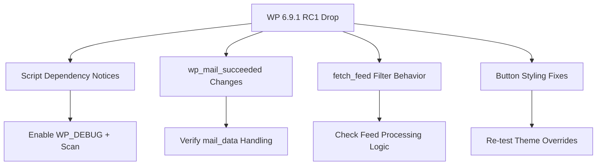

import TOCInline from '@theme/TOCInline';

I distilled WordPress 6.9.1 RC1 into a compatibility checklist for plugins and themes before the maintenance release landed. I also packaged the checklist and notes into a small repo so teams can clone it and wire it into their own QA flow.

<!-- truncate -->

<TOCInline toc={toc} minHeadingLevel={2} maxHeadingLevel={2} />

<details>
<summary>TL;DR — 30 second version</summary>

- RC releases are where regressions sneak in -- don't skip testing
- Key surfaces: `_doing_it_wrong()` notices, `wp_mail_succeeded` changes, `fetch_feed()` filter behavior, button styling
- Enable `WP_DEBUG` and scan for new dependency warnings
- Editor package updates can break pinned assumptions even when core diffs look small

</details>

## Why I Built It

RC releases are where regressions sneak in. I wanted a fast, scoped review that highlights the exact compatibility surfaces teams should retest, without wading through the full changelog.

## Key Compatibility Surfaces

I focused on the deltas that affect plugin and theme behavior:

- `_doing_it_wrong()` notices when dependencies are missing in enqueued scripts/modules
- `wp_mail_succeeded` adding an `embeds` key to `$mail_data`
- `fetch_feed()` filters firing per URL instead of once per array
- Button styling regressions being addressed (themes should re-check overrides)



## Suggested Test Focus

```bash title="wp-config.php debug setup"
define( 'WP_DEBUG', true );
define( 'WP_DEBUG_LOG', true );
define( 'WP_DEBUG_DISPLAY', false );
```

:::tip[Top Takeaway]
A focused test checklist beats ad-hoc "scan the changelog" workflows. Target the exact surfaces that changed instead of re-testing everything blindly.
:::

- Enable `WP_DEBUG` and scan for new dependency warnings
- Validate module loading order and resource priority
- Verify `$mail_data` handling is robust to added keys
- Re-run block editor flows for custom blocks and UI extensions
- Re-check outlined button styling in classic + block themes

:::info[Context]
Short-cycle maintenance releases still have meaningful compatibility edges for plugins. Editor package updates can break pinned assumptions even when core diffs look small.
:::

## The Code

I built a small checklist package you can clone or browse for the exact test list and notes. [View Code](https://github.com/victorstack-ai/wp-691-rc1-compat-suite)

## What I Learned

- Short-cycle maintenance releases still have meaningful compatibility edges for plugins.
- Editor package updates can break pinned assumptions even when core diffs look small.
- A focused test checklist beats ad-hoc "scan the changelog" workflows.

## Signal Summary

| Topic | Signal | Action | Priority |
|---|---|---|---|
| Script Dependencies | New `_doing_it_wrong()` notices | Enable WP_DEBUG, scan logs | High |
| wp_mail_succeeded | Added `embeds` key to `$mail_data` | Verify mail handler robustness | Medium |
| fetch_feed() | Filters fire per URL now | Check feed processing logic | Medium |
| Button Styling | Regression fixes in RC1 | Re-test theme overrides | Low |

## Why this matters for Drupal and WordPress

WordPress maintenance releases like 6.9.1 directly affect every plugin and theme in the ecosystem. Developers maintaining WooCommerce extensions, custom blocks, or multisite configurations need to validate `_doing_it_wrong()` notices and `wp_mail_succeeded` changes before the release lands on production. Drupal developers who also maintain WordPress properties benefit from the same structured testing discipline — scoping changes to exact API surfaces rather than full regression suites.

## References

- [Summary, Dev Chat, February 4, 2026](https://make.wordpress.org/core/2026/02/06/summary-dev-chat-february-4-2026/)
- [What's new in Gutenberg 22.5? (04 February)](https://make.wordpress.org/core/2026/02/04/whats-new-in-gutenberg-22-5-04-february/)
