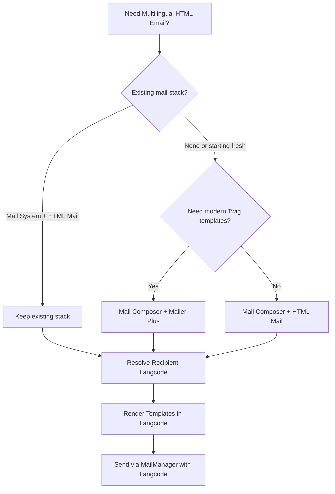

import TOCInline from '@theme/TOCInline';

I outlined a practical stack for multilingual HTML email in Drupal using Mail Composer plus a dedicated HTML mailer, and packaged it as a small demo repo you can reference.

<!-- truncate -->

<TOCInline toc={toc} minHeadingLevel={2} maxHeadingLevel={2} />

<details>
<summary>TL;DR — 30 second version</summary>

- Mail Composer is a composition layer, not an HTML renderer -- pairing matters
- Use Mailer Plus (Symfony Mailer) for modern HTML rendering + Twig templates
- Resolve recipient language early and explicitly
- A clear decision guide avoids "half migrations" between mail stacks

</details>

## Why I Built It

Drupal mail APIs are flexible, but multilingual HTML email becomes messy without a clear composition pattern. I wanted a repeatable blueprint: compose once, render per language, and deliver with predictable theming.

## The Decision Tree

I captured a lightweight decision tree:

- **Mail Composer** for object-oriented message composition
- **Mailer Plus (Symfony Mailer)** if you need modern HTML rendering + Twig templates
- **Mail System + HTML Mail/Mime Mail** if that stack already exists
- **Language flow**: resolve recipient langcode -> render templates in that language -> pass langcode to MailManager



## Recommended Flow

```php title="Multilingual mail sending pattern" showLineNumbers
// 1. Determine recipient language
$langcode = $user->getPreferredLangcode();

// 2. Build the Mail Composer message in that language context
$message = $mail_composer->createMessage('my_module', 'welcome', $langcode);

// 3. Render HTML + text templates in that language
$message->setBody($renderer->render($template, $langcode));

// 4. Send via MailManager using $langcode
$mail_manager->mail('my_module', 'welcome', $to, $langcode, $params);
```

:::tip[Top Takeaway]
Multilingual strategy is easiest when language resolution is explicit and early. Resolve the langcode first, then let everything downstream respect it.
:::

:::info[Context]
Mail Composer is a composition layer, not an HTML renderer. You always need to pair it with an actual HTML rendering module. This is by design, not a limitation.
:::

## The Code

I built a small module/demo so the flow is tangible. You can clone it or browse the key files here: [View Code](https://github.com/victorstack-ai/drupal-multilingual-html-email-example)

## What I Learned

- Mail Composer is a composition layer, not an HTML renderer, so pairing matters.
- Multilingual strategy is easiest when language resolution is explicit and early.
- A clear decision guide avoids "half migrations" between mail stacks.

## Signal Summary

| Topic | Signal | Action | Priority |
|---|---|---|---|
| Mail Composer | Composition layer only | Pair with HTML renderer | High |
| Mailer Plus | Modern Symfony Mailer path | Use for new projects | Medium |
| Language Resolution | Must be explicit and early | Resolve langcode before composition | High |
| Existing Mail System | Already works? Keep it | Avoid unnecessary migration | Low |

## Why this matters for Drupal and WordPress

Multilingual transactional email is a common pain point for Drupal agencies serving international clients. Mail Composer paired with Symfony Mailer gives Drupal sites a modern, Twig-based email pipeline that avoids the fragmented mail module landscape. WordPress teams solving the same problem with plugins like WP Mail SMTP or FluentSMTP can compare approaches — Drupal's explicit langcode-first pattern is a design worth studying for any CMS that needs per-recipient language rendering.

## References

- [Mail Composer: Sending multilingual HTML emails with Drupal](https://gbyte.dev/blog/mail-composer-sending-multilingual-html-emails-drupal)
- [Mail Composer module](https://www.drupal.org/project/mail_composer)


***
*Need an Enterprise CMS Architect to modernize your legacy PHP platforms? View my case studies at [victorjimenezdev.github.io](https://victorjimenezdev.github.io) or connect with me on LinkedIn.*
