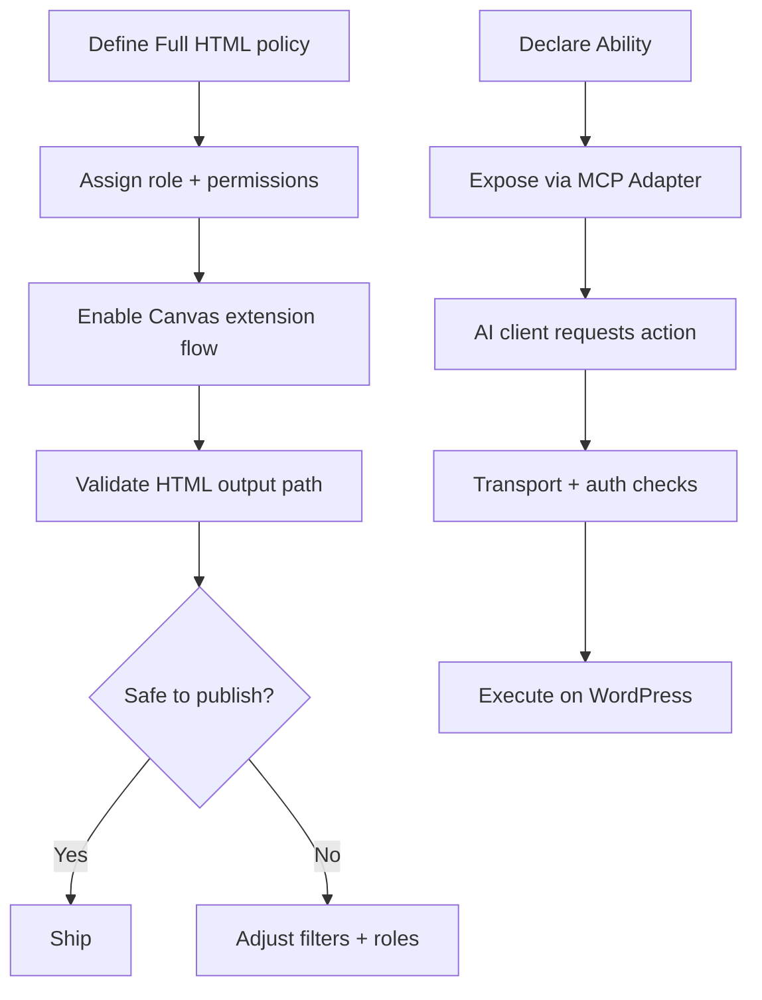

import Tabs from '@theme/Tabs';
import TabItem from '@theme/TabItem';

I shipped a practical Drupal Canvas Full HTML extension guide and tightened my understanding of the WordPress MCP Adapter's security and transport surface while juggling queued Git pushes during DNS hiccups.
<!-- truncate -->

**Why I Built It**
I needed a repeatable way to extend Drupal Canvas safely without slipping into "mystery config," and I wanted a crisp mental model for how the MCP Adapter exposes Abilities to AI clients so I can reason about risk, scope, and transport boundaries.

**The Solution**
I distilled Canvas extension into a set of deterministic steps (config + permission boundaries), then mapped the MCP Adapter flow from capability exposure to action execution so I can verify trust boundaries before letting automation loose.



<Tabs>
  <TabItem value="drupal" label="Drupal">
    ```yaml
    # canvas_extension.yml (conceptual)
    canvas:
      enable_full_html: true
      allowed_roles:
        - editor
        - site_admin
    ```
  </TabItem>
  <TabItem value="mcp" label="MCP">
    ```json
    {
      "ability": "content.publish",
      "transport": "https",
      "auth": "token",
      "constraints": ["role:editor", "scope:publish"]
    }
    ```
  </TabItem>
</Tabs>

<details>
  <summary>Click to view raw logs</summary>
  queue: git push delayed (dns timeout)
  retry: staged for next connectivity window
  status: unblocked, push scheduled
</details>

:::note
I keep Canvas extension steps explicit so audits are cheap later.
:::

:::tip
Pin Ability scopes to the narrowest role that still lets your workflow breathe.
:::

:::warning
DNS flakiness turns "done" into "queued" fast—design for retries.
:::

:::danger
Never expose an Ability without a transport + auth check you can prove.
:::

**The Code**
[View Code](https://github.com/victorstack-ai/agent-hq)

**What I Learned**
- Pantheon's Site Dashboard now surfaces top IPs, user agents, and paths, which is a much cleaner starting point for traffic anomaly triage.
- Gutenberg 22.5 keeps tightening editor UX; I'm watching how small block-level polish turns into real workflow speed.
- The WordPress MCP Adapter framing makes Abilities feel like a contract, not just a convenience, which changes how I think about auditability.
- Drupal Commerce B2B portals are less about the cart and more about gated workflows—access control is the real product.
- CSS aggregation bugs still creep in, so I'm treating asset pipelines as test targets, not background plumbing.
