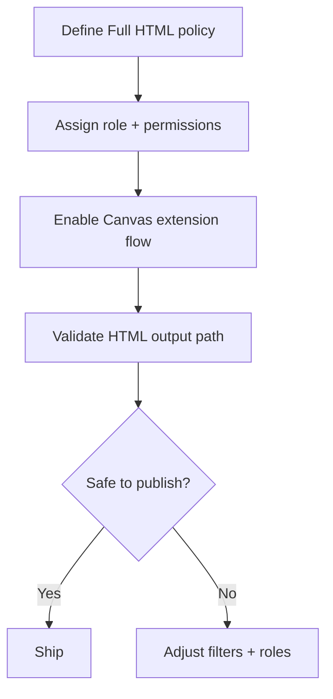

import Tabs from '@theme/Tabs';
import TabItem from '@theme/TabItem';

I shipped a practical Drupal Canvas Full HTML extension guide so extending Canvas safely is repeatable and auditable.
<!-- truncate -->

**Why I Built It**
I needed a repeatable way to extend Drupal Canvas safely without slipping into "mystery config," and I wanted deterministic steps that make audits cheap later.

**The Solution**
I distilled Canvas extension into a set of deterministic steps: config, permission boundaries, and validation of the HTML output path.



<Tabs>
  <TabItem value="yaml" label="Config">
    ```yaml
    # canvas_extension.yml (conceptual)
    canvas:
      enable_full_html: true
      allowed_roles:
        - editor
        - site_admin
    ```
  </TabItem>
</Tabs>

<details>
  <summary>Click to view raw logs</summary>
  Guide: steps documented, roles and permissions clarified.
</details>

:::note
I keep Canvas extension steps explicit so audits are cheap later.
:::

**The Code**
[View Code](https://github.com/victorstack-ai/drupal-canvas-full-html-guide)

**What I Learned**
- Drupal Commerce B2B portals are less about the cart and more about gated workflows—access control is the real product.
- CSS aggregation bugs still creep in; I treat asset pipelines as test targets, not background plumbing.
