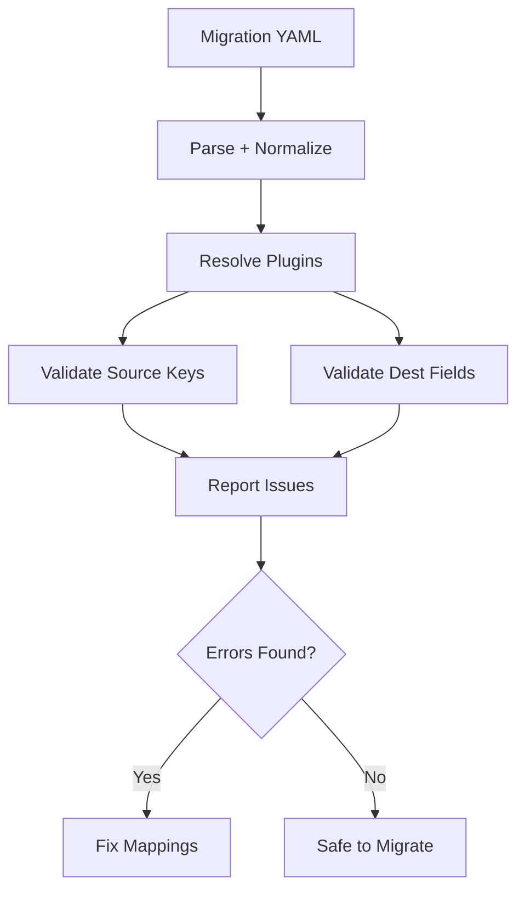

import TOCInline from '@theme/TOCInline';

I shipped a Drupal migrate mapping validator utility that catches broken mappings before they land in prod.

<!-- truncate -->

<TOCInline toc={toc} minHeadingLevel={2} maxHeadingLevel={2} />

<details>
<summary>TL;DR — 30 second version</summary>

- Built a validator that checks migration YAML against source schemas and destination field definitions
- Catches typos and type mismatches at lint time instead of squinting at logs in prod
- Pantheon's Site Dashboard now exposes top IPs, user agents, and paths for faster anomaly triage
- Drupal CSS aggregation bug can surface as missing styles only in production

</details>

## Why I Built It

Migration debugging is a time sink when a single typo in a mapping silently drops fields. I wanted a fast, deterministic way to validate mappings against source schemas and destination field definitions so I could fail early instead of squinting at logs later.

## The Solution

I built a validator that loads migration YAML, resolves plugin chains, then checks each mapping against source keys and destination field types. It surfaces conflicts with clear, line-level errors so I can fix the right mapping in minutes.


```mermaid
flowchart TD
  A[Migration YAML] --> B[Parse + Normalize]
  B --> C[Resolve Plugins]
  C --> D[Validate Source Keys]
  C --> E[Validate Dest Fields]
  D --> F[Report Issues]
  E --> F
  F --> G{Errors Found?}
  G -->|Yes| H[Fix Mappings]
  G -->|No| I[Safe to Migrate]
```

### CLI Usage

```bash title="Terminal"
drupal-migrate-validate --migration user_profiles --strict
```

### Validator Config

```yaml title="validator.settings.yml"
validator:
  strict: true
  allow_missing_sources: false
  field_type_checks: true
```

### Example Output

```text title="Validation output"
[validate] migration=user_profiles
[ok] source keys: 18
[error] mapping: field_bio -> source:bio_text (missing)
[error] field type mismatch: field_age expects integer, got string
```

:::tip[Top Takeaway]
Failing fast on mapping errors is the cheapest performance optimization you can buy. Validate at lint time, not at migration time.
:::

## Other Signals This Week

### Pantheon Site Dashboard Traffic Metrics

Pantheon's Site Dashboard now exposes top IPs, user agents, and paths, which makes anomaly triage much faster for ops reviews.

:::info[Context]
These new metrics give enough signal to separate "real users" from scrapers and misconfigured monitors without needing a full analytics platform.
:::

### Drupal CSS Aggregation Bug

A Drupal CSS aggregation bug can surface as missing styles only in production, so I now add an aggregation-on check to my smoke tests.

:::warning
Aggregation issues can hide until cache layers are warm. Test with aggregation enabled in staging before shipping.
:::

### Algorithmic Bias in Drupal Tooling

The Drupal community is debating algorithmic bias in tooling recommendations. It is a useful reminder to evaluate "default" platform choices critically instead of accepting whatever the algorithm surfaces first.

## The Code

[View Code](https://github.com/victorstack-ai/drupal-migration-mapping-validator)

## Signal Summary

| Topic | Signal | Action | Priority |
|---|---|---|---|
| Migration Mapping Validator | Silent field drops from typos | Validate mappings at lint time | High |
| Pantheon Traffic Metrics | New top IPs/agents/paths dashboard | Use for anomaly triage | Medium |
| CSS Aggregation Bug | Missing styles in production only | Add aggregation-on smoke test | High |
| Algorithmic Bias | Community debate on defaults | Evaluate platform recommendations critically | Low |

## Why this matters for Drupal and WordPress

Migration is one of the most common Drupal agency tasks — whether upgrading from Drupal 7 or importing content from WordPress. A mapping validator catches silent field drops that would otherwise surface as missing data weeks after launch. The CSS aggregation bug is a classic Drupal production-only issue that affects any site using asset optimization, and the Pantheon traffic metrics apply equally to Drupal and WordPress sites hosted on the platform.

## References

- [Site Dashboard now reports traffic metrics for top IPs, user agents, and visited paths](https://docs.pantheon.io/release-notes/2026/02/site-dashboard-metrics-top-traffic-patterns)
- [Drupal CSS is broken when Aggregation is turned on](https://mark.ie/blog/drupal-css-is-broken-when-aggregation-is-turned-on)
- [The Algorithmic Bias Against Drupal Community Values](https://tresbien.tech/blog/algorithmic-bias-against-drupal-community-values/)


***
*Need an Enterprise CMS Architect to modernize your legacy PHP platforms? View my case studies at [victorjimenezdev.github.io](https://victorjimenezdev.github.io) or connect with me on LinkedIn.*
