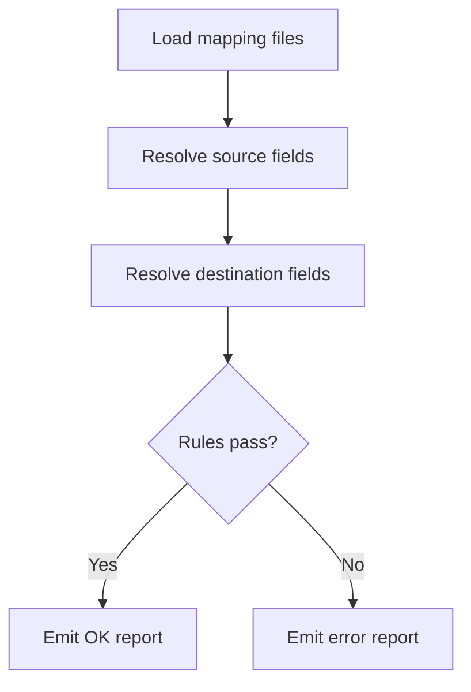

import Tabs from '@theme/Tabs';
import TabItem from '@theme/TabItem';

**The Hook** I shipped a Drupal migrate mapping validator that catches broken field maps before a migration ever runs.

**Why I Built It** I was tired of migrations failing halfway through because a single field map drifted or referenced a missing destination field. Those failures are expensive: you discover them late, and the error message is usually buried in runtime logs. I wanted a fast, deterministic way to validate mapping files up front and surface actionable errors.

**The Solution** I built a small CLI-style utility that loads mapping definitions, resolves source and destination fields, and runs a strict ruleset before any migrate job starts.



<Tabs>
  <TabItem value="yaml" label="Mapping YAML">
    ```yaml
    id: article_migrate
    source:
      plugin: csv
      path: data/articles.csv
    process:
      title: title
      body/value: body
      field_tags:
        plugin: explode
        delimiter: ","
        source: tags
    destination:
      plugin: "entity:node"
      default_bundle: article
    ```
  </TabItem>
  <TabItem value="json" label="Validator Output">
    ```json
    {
      "mapping": "article_migrate",
      "status": "fail",
      "errors": [
        "Missing destination field: field_tags",
        "Unknown source column: tags"
      ]
    }
    ```
  </TabItem>
</Tabs>

:::warning
Run the validator against every mapping change before you queue a migration. It’s cheaper than a rollback.
:::

<details>
  <summary>Click to view raw logs</summary>
  [validator] mapping=article_migrate status=fail
  [validator] error=Missing destination field: field_tags
  [validator] error=Unknown source column: tags
</details>

**The Code** [View Code](https://github.com/victorstack-ai/drupal-migration-mapping-validator)

**What I Learned**
- Validating mapping assumptions early prevents subtle data drift that otherwise shows up as late-stage migration failures.
- The Drupal community keeps surfacing real-world edge cases (like broken aggregation behaviors), and those lessons translate directly into more defensive validation strategies.
- Treating configuration as an API makes it easier to reason about migrations and build tooling around them.
