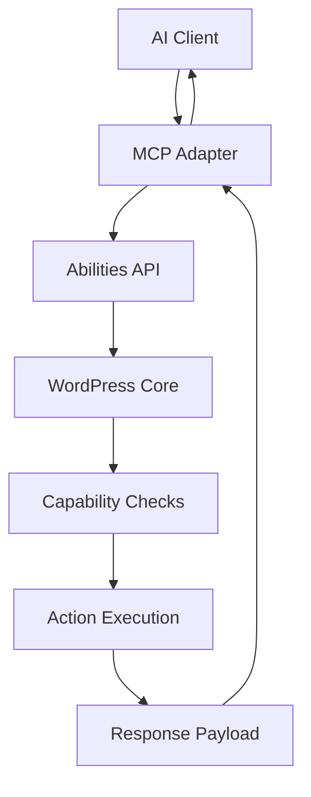

import Tabs from '@theme/Tabs';
import TabItem from '@theme/TabItem';

I shipped a focused review of the WordPress MCP Adapter—how it exposes Abilities API actions to AI clients and what that means for transport and security.
<!-- truncate -->

**Why I Built It**
I keep seeing teams wire AI agents directly to privileged WordPress actions without a crisp threat model. I wanted a concrete, developer‑friendly read that clarifies what the adapter actually exposes, how the transport behaves, and where the real security boundaries live.

**The Solution**
I documented the adapter’s action surface, traced the request/response flow, and called out the assumptions that matter (capability checks, nonce/session constraints, and transport isolation). The goal was to turn “magic agent access” into a predictable, reviewable pipeline.



<Tabs>
  <TabItem value="req" label="Ability Request">
    ```json
    {
      "ability": "posts.create",
      "args": {
        "title": "Hello",
        "status": "draft"
      },
      "context": {
        "site": "example.com",
        "user": "editor"
      }
    }
    ```
  </TabItem>
  <TabItem value="resp" label="Ability Response">
    ```json
    {
      "ok": true,
      "result": {
        "id": 123,
        "status": "draft"
      }
    }
    ```
  </TabItem>
</Tabs>

:::warning
Treat the MCP boundary as untrusted input. You still need capability checks, nonces, and strict allow‑lists around actions.
:::

<details>
  <summary>Click to view raw logs</summary>
  [adapter] received ability=posts.create
  [adapter] user=editor site=example.com
  [adapter] capability=edit_posts ok
  [adapter] response id=123 status=draft
</details>

**The Code**
No separate repo for this topic—this was a focused review and documentation pass.

**What I Learned**
- The Abilities API surface is the true contract; transport is just delivery.
- Security hinges on capability checks and a narrow action allow‑list, not on “AI” branding.
- Auditable logs at the adapter boundary are the fastest way to debug and trust agent actions.
## References
- [Make WordPress Core](https://make.wordpress.org/core/)
- [WordPress Developer Blog](https://developer.wordpress.org/news/)
