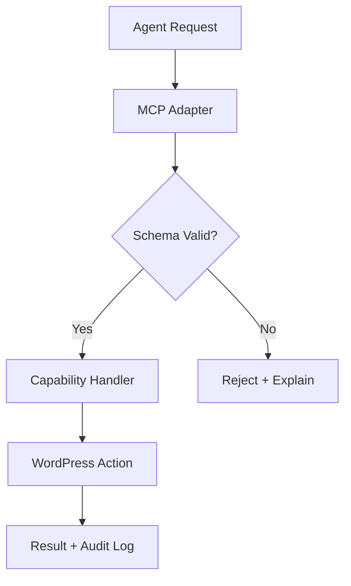

import Tabs from '@theme/Tabs';
import TabItem from '@theme/TabItem';

**The Hook**
The WordPress MCP Adapter turns “AI can use WordPress” from a vague promise into a concrete interface, but it only helps if you draw hard boundaries around what the agent is allowed to touch.

**Why I Built It**
I keep seeing teams wire agents directly to admin APIs and then act surprised when output feels brittle or unsafe. What I actually need is a small, explicit surface area where the agent can read state, propose changes, and get deterministic failures when it goes out of bounds. The MCP Adapter is interesting because it frames those capabilities as a contract, not a grab-bag of magical WordPress actions.

**The Solution**
The MCP Adapter acts as a translation layer between the agent and WordPress capabilities. I’d treat it like an API gateway for actions: strict schemas in, validated operations out. The win here is predictability — the loss is flexibility. If you skip the contract, you’re back to an agent poking at admin endpoints until something breaks.



<Tabs>
  <TabItem value="strict" label="Strict Contract">
    ```json
    {
      "capability": "content.create",
      "payload": {
        "type": "post",
        "title": "Draft",
        "status": "draft"
      }
    }
    ```
  </TabItem>
  <TabItem value="loose" label="Loose Contract">
    ```json
    {
      "action": "do something in WP",
      "payload": {
        "maybe": "a post?"
      }
    }
    ```
  </TabItem>
</Tabs>

:::warning
If you can’t list your allowed capabilities on a single page, you probably shouldn’t let an agent run live actions.
:::

:::tip
Treat every capability as a feature flag. If it can’t be toggled off instantly, it’s too risky for production use.
:::

<details>
  <summary>Click to view raw logs</summary>
  2026-02-05T10:42:11Z mcp.adapter INFO request=content.create
  2026-02-05T10:42:11Z mcp.adapter WARN schema_mismatch field=payload.title
  2026-02-05T10:42:11Z mcp.adapter INFO response=400
</details>

**The Code**
No separate repo for this topic—this is a protocol-level learning, not a standalone project.

**What I Learned**
- The adapter is only useful if you enforce schemas and reject unclear requests; otherwise it just disguises unsafe actions.
- Capabilities should be scoped like product features, not like admin permissions — “publish a post” is already too broad.
- If the adapter can’t emit an auditable log line for each action, it’s not ready for production.
- I’d avoid connecting it to live editors without a draft-only mode and a hard review step.

## References
- [Drupal.org](https://www.drupal.org)
- [Planet Drupal](https://www.drupal.org/planet)
