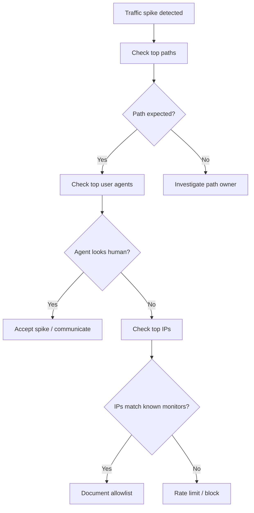

import Tabs from '@theme/Tabs';
import TabItem from '@theme/TabItem';

**The Hook**: I sketched a traffic forensics workflow around Pantheon’s new “top IPs / user agents / paths” metrics so teams can spot noisy traffic fast and stop guessing where spikes come from.

**Why I Built It**
Traffic anomalies are expensive to chase when the only thing you see is “visits went up.” The new Site Dashboard metrics (top IPs, user agents, and visited paths) give enough signal to separate “real users” from scrapers and misconfigured monitors. I wanted a repeatable process that turns those metrics into actions: block, throttle, or accept the noise.

**The Solution**
I modeled a triage flow that starts with path hotspots, then correlates user agents and IPs to decide whether the traffic is expected. The key is to treat these metrics like a lightweight incident triage tool, not a full analytics platform.



<Tabs>
  <TabItem value="block" label="Block/Throttle">
    ```nginx
    # Example pattern: block aggressive bot user agents
    if ($http_user_agent ~* "(AhrefsBot|SemrushBot|MJ12bot)") {
      return 403;
    }

    # Example: rate limit a single noisy IP range
    limit_req_zone $binary_remote_addr zone=perip:10m rate=10r/s;
    ```
  </TabItem>
  <TabItem value="observe" label="Observe/Accept">
    ```text
    - Mark the spike as “expected” in incident notes
    - Capture the top 5 paths and user agents
    - Recheck after 24 hours to confirm decay
    ```
  </TabItem>
</Tabs>

:::warning
These metrics are directional, not forensic. They don’t replace full analytics, and they can miss distributed traffic patterns.
:::

<details>
  <summary>Click to view raw logs</summary>
  Example notes I’d keep for a spike:
  - Top path: /wp-json/* (spike +300%)
  - Top user agent: Go-http-client/1.1
  - Top IPs: 3 IPs accounting for 65% of requests
  - Action: throttled IPs; added monitor to allowlist
</details>

**The Code**
No separate repo for this topic—this is a process pattern, not a code artifact.

**What I Learned**
- These “top traffic patterns” metrics are most useful as a triage trigger, not a reporting dashboard. Use them to decide “block or accept,” then move on.
- A single hot path is usually the fastest signal. If the path is unexpected, investigate immediately; if it’s expected, inspect user agents before touching IPs.
- Blocking by user agent is cheap but brittle. It’s worth doing for obvious bots, but you should pair it with rate limits so you don’t over-block legitimate clients.
- If you can’t explain a spike within 15 minutes using these metrics, escalate to full analytics—don’t waste hours in the dashboard.