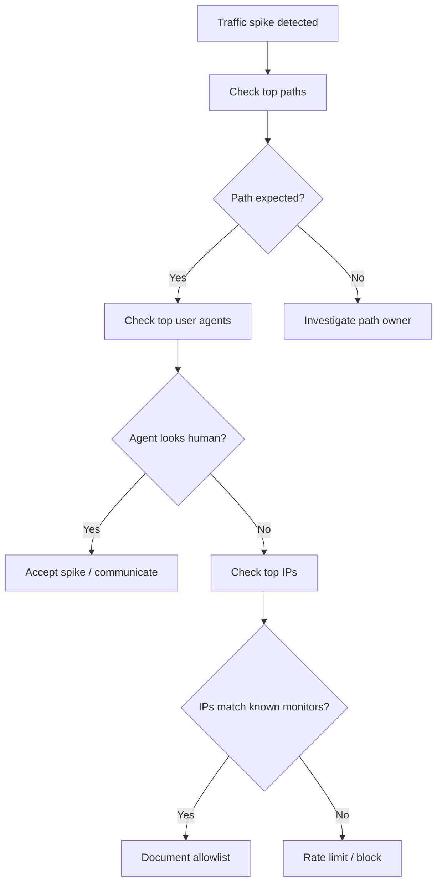

import TOCInline from '@theme/TOCInline';

I sketched a traffic forensics workflow around Pantheon's new "top IPs / user agents / paths" metrics and turned it into a small, shippable reference so teams can spot noisy traffic fast and stop guessing where spikes come from.

<!-- truncate -->

<TOCInline toc={toc} minHeadingLevel={2} maxHeadingLevel={2} />

<details>
<summary>TL;DR — 30 second version</summary>

- Pantheon now exposes top IPs, user agents, and visited paths in the Site Dashboard
- I built a triage workflow: path hotspots first, then user agents, then IPs
- Treat these metrics as a triage trigger, not a reporting dashboard
- If you can't explain a spike within 15 minutes, escalate to full analytics

</details>

## Why I Built It

Traffic anomalies are expensive to chase when the only thing you see is "visits went up." The new Site Dashboard metrics (top IPs, user agents, and visited paths) give enough signal to separate "real users" from scrapers and misconfigured monitors. I wanted a repeatable process that turns those metrics into actions: block, throttle, or accept the noise -- and a concrete artifact I can hand to someone else.

## The Triage Flow

I modeled a triage flow that starts with path hotspots, then correlates user agents and IPs to decide whether the traffic is expected. The key is to treat these metrics like a lightweight incident triage tool, not a full analytics platform.


```mermaid
flowchart TD
  A[Traffic spike detected] --> B[Check top paths]
  B --> C{Path expected?}
  C -- Yes --> D[Check top user agents]
  C -- No --> E[Investigate path owner]
  D --> F{Agent looks human?}
  F -- Yes --> G[Accept spike / communicate]
  F -- No --> H[Check top IPs]
  H --> I{IPs match known monitors?}
  I -- Yes --> J[Document allowlist]
  I -- No --> K[Rate limit / block]
```

### Block/Throttle Pattern

```nginx title="nginx bot blocking example"
# Block aggressive bot user agents
if ($http_user_agent ~* "(AhrefsBot|SemrushBot|MJ12bot)") {
  return 403;
}

# Rate limit a single noisy IP range
limit_req_zone $binary_remote_addr zone=perip:10m rate=10r/s;
```

### Observe/Accept Checklist

```text title="Spike observation notes template"
- Mark the spike as "expected" in incident notes
- Capture the top 5 paths and user agents
- Recheck after 24 hours to confirm decay
```

:::warning[Scope Limitation]
These metrics are directional, not forensic. They don't replace full analytics, and they can miss distributed traffic patterns.
:::

:::tip[Top Takeaway]
A single hot path is usually the fastest signal. If the path is unexpected, investigate immediately; if it is expected, inspect user agents before touching IPs.
:::

### Example Spike Notes

```text title="Example spike investigation notes"
- Top path: /wp-json/* (spike +300%)
- Top user agent: Go-http-client/1.1
- Top IPs: 3 IPs accounting for 65% of requests
- Action: throttled IPs; added monitor to allowlist
```

## The Code

I packaged the workflow into a small, browsable repo with the diagrams, notes, and reference configs so it is easy to reuse or extend. You can clone it or skim the key files here: [View Code](https://github.com/victorstack-ai/pantheon-traffic-forensics)

## What I Learned

- These "top traffic patterns" metrics are most useful as a triage trigger, not a reporting dashboard. Use them to decide "block or accept," then move on.
- A single hot path is usually the fastest signal. If the path is unexpected, investigate immediately; if it is expected, inspect user agents before touching IPs.
- Blocking by user agent is cheap but brittle. It is worth doing for obvious bots, but pairing it with rate limits prevents over-blocking legitimate clients.
- If a spike cannot be explained within 15 minutes using these metrics, escalate to full analytics -- do not waste hours in the dashboard.

## Signal Summary

| Topic | Signal | Action | Priority |
|---|---|---|---|
| Path Hotspots | Unexpected path in top list | Investigate path owner immediately | High |
| User Agents | Non-human agents dominating | Block known bots + rate limit | Medium |
| IP Concentration | Few IPs = most traffic | Throttle or allowlist | Medium |
| 15-Minute Rule | Can't explain spike quickly | Escalate to full analytics | High |

## Why this matters for Drupal and WordPress

Pantheon hosts both Drupal and WordPress sites, and traffic spikes directly impact hosting costs on both platforms. Drupal sites running Varnish and WordPress sites behind page caching can both be disrupted by bot traffic hitting uncacheable paths like `/jsonapi/*` or `/wp-json/*`. This forensics workflow helps Drupal and WordPress site owners quickly distinguish real traffic from scrapers and misconfigured monitors before escalating to full analytics.

## References

- [Site Dashboard now reports traffic metrics for top IPs, user agents, and visited paths](https://docs.pantheon.io/release-notes/2026/02/site-dashboard-metrics-top-traffic-patterns)
- [Pantheon Site Dashboard](https://docs.pantheon.io)


***
*Looking for an Architect who doesn't just write code, but builds the AI systems that multiply your team's output? View my enterprise CMS case studies at [victorjimenezdev.github.io](https://victorjimenezdev.github.io) or connect with me on LinkedIn.*
