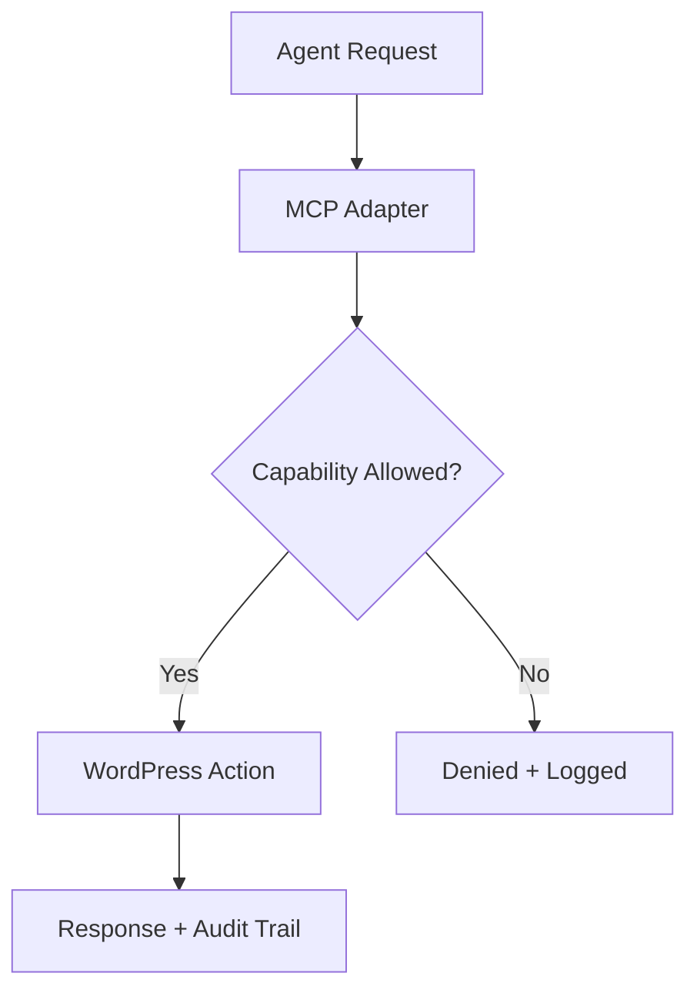

import Tabs from '@theme/Tabs';
import TabItem from '@theme/TabItem';

**The Hook**: The new WordPress MCP Adapter makes WordPress feel like a real, programmable surface for AI agents—useful, but only if you police scope and permissions hard.

**Why I Built It**: I keep seeing teams bolt “AI” on top of WordPress with one-off scripts and brittle APIs. It works until you need consistent permissions, audit trails, and predictable behavior. The MCP Adapter reframes WordPress as a first-class tool endpoint for agents. That matters because if you treat WordPress like a black box, you ship unpredictable automations; if you treat it like a tool with explicit capabilities, you can actually reason about risk and behavior.

**The Solution**: The adapter maps WordPress capabilities into an MCP-friendly interface, so an agent can request actions with constrained, auditable scope. The win is not “more AI,” it’s a safer contract.



I’d implement it like a strict gatekeeper: define what actions the agent can take (read content, draft posts, update metadata), then enforce that in one place. The moment you let the agent call arbitrary endpoints, you’ve basically invited privilege escalation.

<Tabs>
  <TabItem value="mcp" label="MCP Contract">
    ```json
    {
      "tool": "wordpress",
      "action": "draft_post",
      "inputs": {
        "title": "...",
        "content": "...",
        "status": "draft"
      }
    }
    ```
  </TabItem>
  <TabItem value="wp" label="WP Handler">
    ```php
    // Validate capability, sanitize inputs, then call wp_insert_post().
    // Refuse any action outside the allowlist.
    ```
  </TabItem>
</Tabs>

:::warning
The adapter is not a free pass to “let AI edit production.” Treat it like a power tool: lock it down, log it, and default to read-only in live environments.
:::

<details>
  <summary>Click to view raw logs</summary>
  action=draft_post user=agent-bot result=denied reason=capability_missing
  action=update_meta user=agent-bot result=allowed id=123
</details>

**The Code**: No separate repo for this topic—this was a learning deep-dive, not a shipped project.

**What I Learned**:
- The MCP pattern only helps if you actually define a tight allowlist; without it, you’ve just exposed another privileged API surface.
- Auditable logs are non-negotiable; if you can’t answer “what changed and why,” don’t run the agent in production.
- Start read-only. If stakeholders push for write access, prove safety with staged permissions and rollback paths.
- The adapter is best for predictable content workflows (drafts, metadata updates, taxonomy tagging). It’s a bad fit for anything with legal or editorial risk unless you add human review.
## References
- [Laravel News](https://laravel-news.com)
- [PHP: The Right Way](https://phptherightway.com/)
