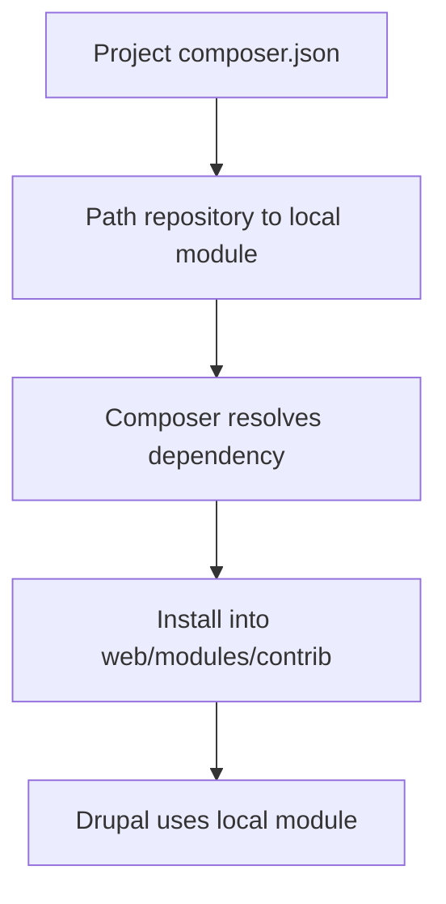

import Tabs from '@theme/Tabs';
import TabItem from '@theme/TabItem';

**The Hook**
Composer path repositories make local Drupal module dependency work sane again — but only if you’re disciplined about versioning and install paths.

**Why I Built It**
I keep hitting the same friction in Drupal projects: I’m building module A locally, but module B depends on A. The usual options are ugly: push half‑baked changes to a git remote just to test, or patch things manually in `vendor/` and lose the state on the next install. I wanted a dev loop that’s fast, reproducible, and doesn’t lie about what’s actually installed.

**The Solution**
Composer path repositories let me point Composer at a local directory and treat it like a package. The dependency resolves as if it came from Packagist, but it installs from my local filesystem. The key is to treat the local module like a real package (proper `composer.json`, semantic versioning, and an explicit install path).



Here’s the compare I keep in my notes:

<Tabs>
  <TabItem value="path" label="Path Repo">
    ```json
    {
      "repositories": [
        {
          "type": "path",
          "url": "../modules/custom/example_module",
          "options": { "symlink": true }
        }
      ],
      "require": {
        "vendor/example_module": "*"
      }
    }
    ```
  </TabItem>
  <TabItem value="git" label="Git Remote">
    ```json
    {
      "repositories": [
        {
          "type": "vcs",
          "url": "https://github.com/vendor/example_module"
        }
      ],
      "require": {
        "vendor/example_module": "dev-main"
      }
    }
    ```
  </TabItem>
</Tabs>

Gotchas I hit:
- **Symlinks are great until they aren’t.** Some deployment targets or CI environments don’t like symlinks; switch to `symlink: false` if your pipeline freaks out.
- **Version drift is real.** If your local module’s `composer.json` declares `1.0.0` but your project expects `^2.0`, you’ll burn time on “why isn’t this updating?”
- **Don’t ship this by accident.** Path repositories should never leak into production composer configs.

:::warning
I only use path repositories in development. For releases, I push a real tag and switch to a VCS or Packagist source.
:::

<details>
  <summary>Click to view raw logs</summary>
  Composer may emit warnings like:
  - "Repository type path is not canonical"
  - "Package is not installable to web/modules/contrib"
  Treat these as signals to fix package metadata or install paths.
</details>

**The Code**
No separate repo for this topic — it’s a workflow pattern applied across multiple Drupal projects.

**What I Learned**
- Path repositories are worth it when you’re iterating on interdependent modules daily; they cut feedback loops from minutes to seconds.
- If you can’t keep semantic versions honest, you’ll chase ghost bugs. Keep the local module’s version in sync with what the root project expects.
- Avoid this in production configs. It’s a dev convenience, not a deployment strategy.
- If a team uses mixed OS environments, test `symlink` behavior early; Windows setups can be brittle.
