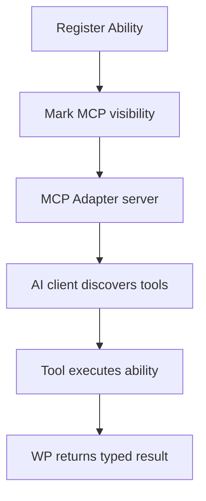

import Tabs from '@theme/Tabs';
import TabItem from '@theme/TabItem';

I shipped a clean mental model for the WordPress MCP Adapter: it turns Abilities into MCP tools so AI clients can safely call WordPress functionality without inventing ad‑hoc APIs.

**Why I Built It**
I’ve been watching teams bolt AI features onto WordPress by wiring custom REST endpoints, and every one of those snowflakes breaks the moment you need permissions, auditing, or consistent schemas. The MCP Adapter lands right on that problem: it standardizes how AI clients discover and execute what a site can do, instead of forcing every plugin to invent its own interface. I wanted a crisp way to explain when this is worth using, and when it’s just extra moving parts.

**The Solution**
At the core is the Abilities API: you register a capability with a name, schema, permission checks, and an execution callback. The MCP Adapter exposes those abilities as MCP tools, so clients like Cursor or Claude can discover and call them.

Here’s the conceptual flow I’m using:



Where it gets tricky is scope and transport:
- Local development uses STDIO via WP‑CLI. It’s fast and straightforward, but only works when the AI client runs on the same machine as WordPress.
- Public environments need HTTP transport, which adds proxy/authentication overhead but avoids exposing WP‑CLI on a remote host.

<Tabs>
  <TabItem value="stdio" label="STDIO (Local)">
    ```json
    {
      "mcpServers": {
        "wordpress-mcp": {
          "command": "wp",
          "args": [
            "--path=/path/to/wp",
            "mcp-adapter",
            "serve",
            "--server=mcp-adapter-default-server",
            "--user=admin"
          ]
        }
      }
    }
    ```
  </TabItem>
  <TabItem value="http" label="HTTP (Remote)">
    ```json
    {
      "mcpServers": {
        "wordpress-mcp": {
          "command": "npx",
          "args": ["-y", "@automattic/mcp-wordpress-remote@latest"]
        }
      }
    }
    ```
  </TabItem>
</Tabs>

:::warning
If you expose destructive abilities (delete posts, update users), you’re effectively handing those powers to any connected AI client. Start with read‑only abilities and lock down permissions before expanding scope.
:::

A subtle gotcha: abilities are not automatically MCP‑public. You must explicitly flag them (or expose them via a custom MCP server) so you don’t accidentally open internal actions to external tools.

<details>
  <summary>Click to view a minimal MCP debugging checklist</summary>
  1. Confirm the MCP server starts (no WP‑CLI errors).
  2. Verify the ability shows up in the tool discovery list.
  3. Validate permissions by testing with a non‑admin user.
  4. Check that output schemas match what the AI client expects.
</details>

**The Code**
No separate repo for this topic—this is a conceptual integration based on the upstream MCP Adapter and Abilities APIs rather than a standalone project.

**What I Learned**
- MCP is only a win if you already care about typed schemas and permission gating. If your plugin is a quick internal tool, REST might still be simpler.
- The safest rollout path is: register read‑only abilities, mark them MCP‑public, and validate their output shape in one client before adding more tools.
- STDIO transport is the lowest-friction path for local experiments, but HTTP is the only real option for multi‑developer teams or hosted sites.
- Custom MCP servers are worth it when you need to curate exactly which abilities an AI client can see.

:::tip
Treat MCP exposure like API surface area: smaller is safer, and easier to test.
:::
