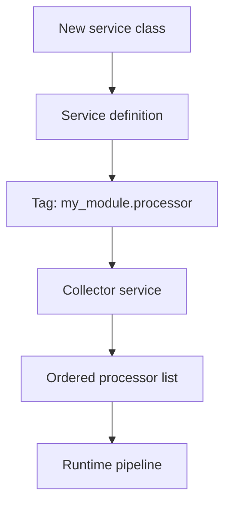

import Tabs from '@theme/Tabs';
import TabItem from '@theme/TabItem';

I’m leaning on Drupal service collectors to turn “discoverable plugins” into deterministic runtime wiring, so new services can register themselves without me touching a central list.

**Why I Built It**
I keep seeing the same failure mode in modular Drupal apps: a brittle “registry” service that requires manual edits any time a new handler, validator, or exporter lands. That’s slow, error‑prone, and makes true plugin-driven development feel fake. Service collectors let me flip that: add a service, tag it, and it joins the system automatically. The trade‑off is hidden complexity—if you don’t understand collection order and tagging, you can end up with subtle mis‑wiring.

**The Solution**
I designed a service‑collection pattern where discrete services announce themselves via tags, and a collector assembles them into a predictable pipeline.



<Tabs>
  <TabItem value="yaml" label="services.yml">
```yaml
services:
  my_module.processor.alpha:
    class: Drupal\my_module\Processor\AlphaProcessor
    tags:
      - { name: my_module.processor, priority: 50 }

  my_module.processor.beta:
    class: Drupal\my_module\Processor\BetaProcessor
    tags:
      - { name: my_module.processor, priority: 10 }

  my_module.processor_collector:
    class: Drupal\my_module\Processor\ProcessorCollector
    arguments: ['@service_container']
```
  </TabItem>
  <TabItem value="php" label="Collector">
```php
<?php
namespace Drupal\my_module\Processor;

use Symfony\Component\DependencyInjection\ContainerInterface;

final class ProcessorCollector {
  public function __construct(private ContainerInterface $container) {}

  /** @return ProcessorInterface[] */
  public function all(): array {
    $services = $this->container->findTaggedServiceIds('my_module.processor');
    // In real code: sort by priority + stabilize ordering.
    $processors = [];
    foreach ($services as $id => $tags) {
      $processors[] = $this->container->get($id);
    }
    return $processors;
  }
}
```
  </TabItem>
</Tabs>

:::warning
Collectors are only “automatic” if you enforce tagging conventions. Without guardrails, you’ll silently miss services and ship partial behavior.
:::

**Gotchas**
- Ordering is real business logic. If you don’t define priorities, “random” order differences will appear between environments.
- Service discovery can hide dependencies. Make sure each processor is idempotent and can safely be skipped or re‑ordered.
- Debugging gets harder: you can’t `grep` for a single registry list anymore. I counter that with explicit tag names and documentation.

<details>
  <summary>Click to view raw logs</summary>
  Collected 2 services for tag my_module.processor
  Order after priority sort: alpha, beta
</details>

**The Code**
No separate repo for this topic—this is an architectural pattern, not a standalone project.

**What I Learned**
- Service collectors are worth it when new handlers arrive frequently and ownership is distributed across teams.
- I’d avoid collectors for security‑sensitive flows where explicit wiring is more auditable.
- Priority sorting is not optional; treat it like part of your API contract.
- If you can’t explain the tag names to a new teammate in 30 seconds, the system is already too implicit.

## References
- [Make WordPress Core](https://make.wordpress.org/core/)
- [Gutenberg](https://developer.wordpress.org/block-editor/)
