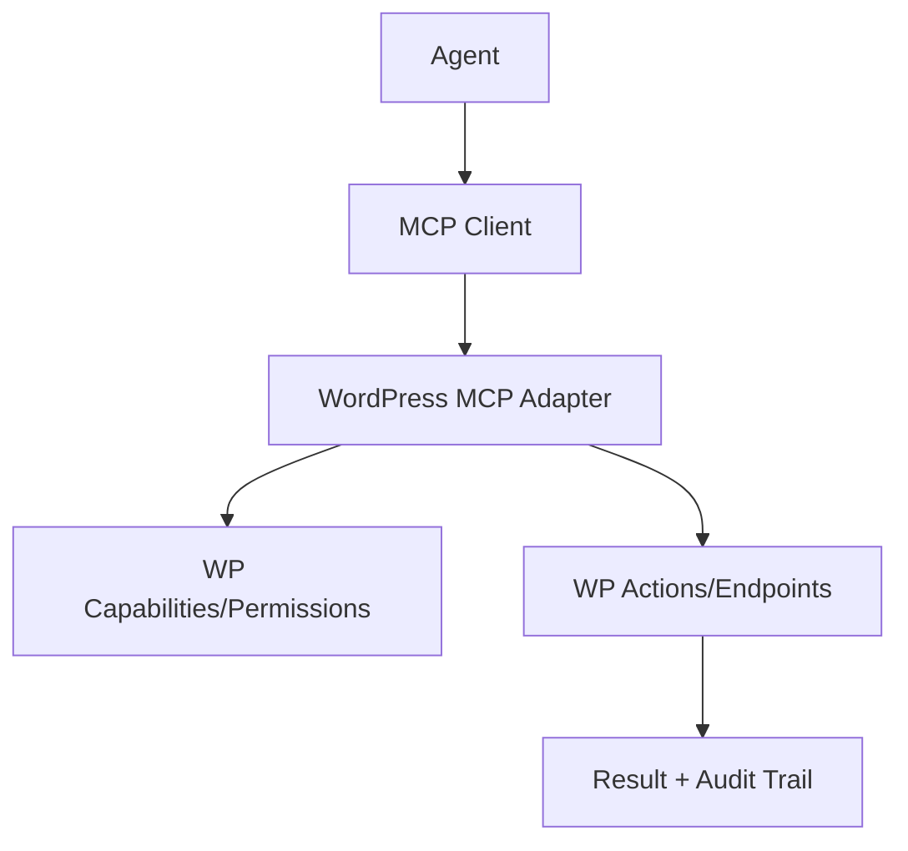

import Tabs from '@theme/Tabs';
import TabItem from '@theme/TabItem';

**The Hook**
The WordPress MCP Adapter is the first clean, standardized way I have seen to let AI agents act on WordPress safely and predictably, without hardcoding a jungle of bespoke tools.

**Why I Built It**
I did not build the adapter itself, but I have been fighting the same integration pain for months: every agent has its own verbs, every WP plugin exposes a different shape, and the result is fragile automation. The adapter turns WordPress capabilities into a consistent MCP interface. That matters because it gives you a single control plane for tooling, and it makes agent actions auditable instead of magical. The downside is you now have one more abstraction layer to debug, so you only want this when you actually need cross-tool automation.

**The Solution**
The core idea is to expose WordPress actions as MCP tools so agents can discover and call them through a common protocol. It shifts the burden from per-agent integration to a single adapter that maps WP capabilities into MCP. That is powerful, but it adds constraints: you are only as safe as your capability definitions and their permission model. If your WordPress roles are messy, the adapter will faithfully expose that mess to your agents.

<Tabs>
  <TabItem value="good" label="Good Fit">
    Use this when you want multiple agents or tools to operate on the same WP instance with consistent, inspectable actions.
  </TabItem>
  <TabItem value="bad" label="Bad Fit">
    Skip this if your automation is single-purpose or your WP permissions are already a moving target.
  </TabItem>
</Tabs>

:::warning
If your WordPress roles are not locked down, the adapter will not save you. It will just automate the mistakes faster.
:::

  
Click to view raw logs

  Example tool call: list_posts, update_post, publish_post
  Example permission checks: edit_posts, publish_posts

**The Code**
No separate repo for this topic, because it is a platform integration I am evaluating, not a standalone project I shipped.

**What I Learned**
- This approach is worth it when you need repeatable AI workflows across multiple WordPress sites or teams.
- It falls over fast if your roles and capabilities are not clean; fix that first.
- The adapter is not a silver bullet for safety. You still need explicit guards, logging, and a rollback plan.
- I would not introduce this for one-off automations. The extra layer is only justified when you need scale and consistency.