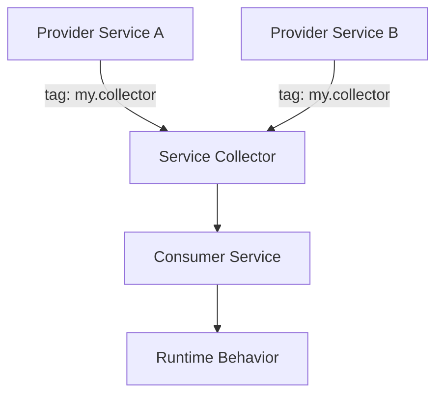

import Tabs from '@theme/Tabs';
import TabItem from '@theme/TabItem';

**The Hook**
I mapped Drupal service collectors into a repeatable pattern so teams can discover and aggregate tagged services without hard‑coding dependencies everywhere.

**Why I Built It**
Service collectors solve a real pain: you want many modules to provide pluggable implementations, but you don’t want every consumer service to know every provider. Tags + collection keep the container clean and extensible. The trap is that it looks magical until it breaks. I wanted a concrete mental model: who owns the tag, who consumes it, and where ordering or priority actually lives.

**The Solution**
I treat service collectors as a three‑part contract: a tag definition, a collector, and the consumer. If you can’t answer which part owns each responsibility, you’ll ship fragile wiring.



The collector’s job is to discover tagged services, optionally sort them, then expose the list to a consumer. The consumer’s job is to iterate predictably and fail loudly if a required capability isn’t present.

<Tabs>
  <TabItem value="yaml" label="Service YML">
    ```yaml
    services:
      my.provider_a:
        class: Drupal\\my_module\\Provider\\ProviderA
        tags:
          - { name: my.collector, priority: 10 }

      my.provider_b:
        class: Drupal\\my_module\\Provider\\ProviderB
        tags:
          - { name: my.collector, priority: 0 }

      my.collector:
        class: Drupal\\my_module\\Collector\\MyCollector
        arguments: ['@service_container']
    ```
  </TabItem>
  <TabItem value="php" label="Collector">
    ```php
    final class MyCollector {
      public function __construct(ContainerInterface $container) {
        $this->container = $container;
      }

      public function all(): array {
        $services = [];
        foreach ($this->container->findTaggedServiceIds('my.collector') as $id => $tags) {
          $priority = $tags[0]['priority'] ?? 0;
          $services[$priority][] = $this->container->get($id);
        }
        krsort($services);
        return array_merge(...array_values($services));
      }
    }
    ```
  </TabItem>
</Tabs>

:::warning
Collectors are great for extension points, but terrible for strict ordering guarantees across modules. If order matters, define explicit weights and document them, or you’ll ship nondeterministic behavior in production.
:::

**The Code**
No separate repo for this topic—this is a learning pattern, not a shipped module yet.

**What I Learned**
- Use service collectors when you want open‑ended extension points; don’t use them when you need strict ordering or hard dependencies.
- Tags are the public contract. If you rename a tag, you’re effectively making a breaking change.
- Keep collectors thin: discovery and sort, nothing more. Business logic belongs in the consumer so it’s testable and explicit.
- If priorities matter, default to `0` and document the range your ecosystem should use (e.g., `-100..100`).
## References
- [OpenAI Codex](https://openai.com)
- [Claude Opus 4.6](https://www.anthropic.com/news/claude-opus-4-6)
