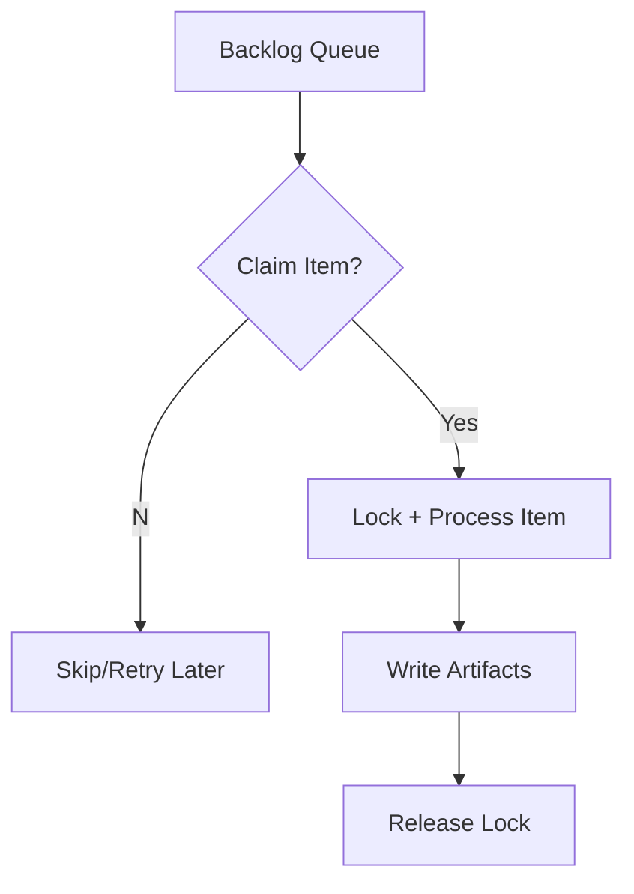

import Tabs from '@theme/Tabs';
import TabItem from '@theme/TabItem';

I shipped a smarter, more autonomous backlog pipeline with item-level locking and a new article writer job.

**Why I Built It**
I was tired of noisy backlog runs stepping on each other, wasting cycles, and creating ambiguity about what actually got done. I wanted a system that could safely claim work, process it in parallel, and still produce reliable artifacts without babysitting.

**The Solution**
I implemented item-level locking for backlog tasks, refactored `run_backlog_task.py` to claim and process items deterministically, and added an autonomous article writer job to convert progress into shippable writeups.



<Tabs>
  <TabItem value="py" label="Python">
    ```python
    # Claim an item, process it, and release the lock.
    item = claim_next_item()
    if item:
        try:
            process(item)
            write_artifacts(item)
        finally:
            release_lock(item)
    ```
  </TabItem>
  <TabItem value="js" label="JS">
    ```js
    // Example: enqueue a new article-writing job
    queue.enqueue({ type: 'article', source: 'devlog', date: '2026-02-05' });
    ```
  </TabItem>
</Tabs>

<details>
  <summary>Click to view raw logs</summary>
  Claimed item: backlog/2026-02-05
  Lock acquired: backlog/2026-02-05
  Processed item: backlog/2026-02-05
  Wrote artifact: devlog
  Lock released: backlog/2026-02-05
</details>

:::note
Item-level locks keep parallel agents from trampling each other, which makes automation feel boring—in the best possible way.
:::

:::tip
Claiming items explicitly lets you scale to more agents without rewriting your orchestration model.
:::

:::warning
If locks aren’t released on failure, you’ll silently stall progress. Always release in a `finally` block.
:::

:::danger
Never skip idempotency checks—retries will happen whether you like it or not.
:::

**The Code**
[View Code](https://github.com/victorstack-ai/agent-hq)

**What I Learned**
- PHP 8.4 is bringing features that will make modern PHP ergonomics feel less like a compromise and more like a choice.
- WordPress 6.7 pushes core forward again, and I’m watching how it affects plugin compatibility and editor workflows.
- Drupal 11 prep is a reminder that major version transitions are won or lost in the migration plan, not the launch day.
