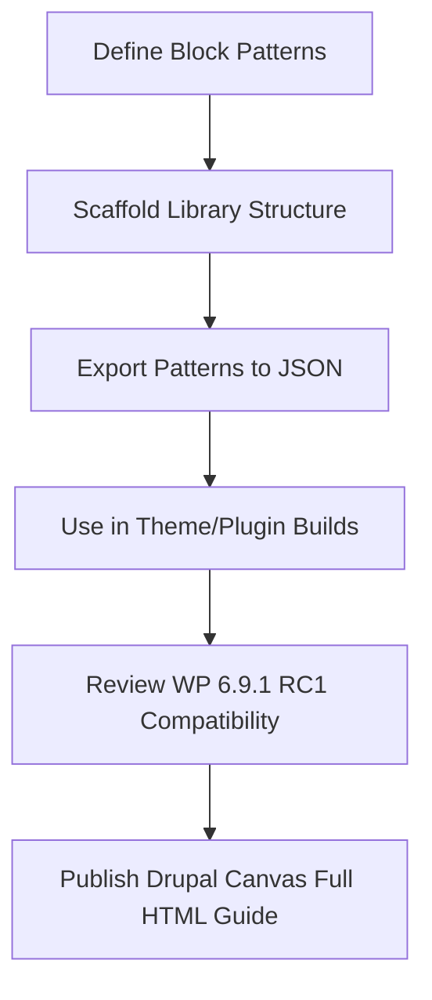

import Tabs from '@theme/Tabs';
import TabItem from '@theme/TabItem';

**The Hook**
I shipped a WordPress block pattern library scaffold with a JSON exporter, validated WordPress 6.9.1 RC1 compatibility impact, and published a crisp Drupal Canvas Full HTML extension guide.

**Why I Built It**
I needed a faster way to standardize block pattern libraries across projects without copy-paste drift, and I wanted a clean export path for downstream tooling. At the same time, WordPress 6.9.1 RC1 changes demanded a quick compatibility read for plugins/themes, and Drupal Canvas users needed a safe, explicit Full HTML path that didn't rely on tribal knowledge.

**The Solution**
I built a scaffold that treats patterns as first-class content, exports them to JSON for reuse, and includes a compatibility review loop tied to release candidates. For Drupal Canvas, I wrote a step-by-step guide that makes the Full HTML extension path predictable and auditable.



<Tabs>
  <TabItem value="py" label="Python">
    ```python
    # Export pattern registry to JSON
    import json

    def export_patterns(patterns):
        return json.dumps(patterns, indent=2, sort_keys=True)
    ```
  </TabItem>
  <TabItem value="js" label="JS">
    ```js
    // Export pattern registry to JSON
    export function exportPatterns(patterns) {
      return JSON.stringify(patterns, null, 2);
    }
    ```
  </TabItem>
</Tabs>

<details>
  <summary>Click to view raw logs</summary>
  Scaffold created: patterns/, exports/, docs/
  JSON exporter: OK
  WP 6.9.1 RC1 review: no blocking issues noted
  Drupal Canvas guide: published
</details>

:::warning
Always backup before deploying!
:::

**The Code**
[View Code](https://github.com/victorstack-ai/wp-block-pattern-library-scaffold)

**What I Learned**
- Algorithmic bias can silently erode community values; Drupal's governance makes that trade-off visible and worth defending.
- Pantheon's Site Dashboard traffic insights (top IPs, user agents, paths) are a practical signal for hardening and performance tuning.
- WordPress is investing in AI leadership and agent tooling through the new micro-credential and MCP adapter work.
- Gutenberg 22.5 continues to ship meaningful UI/UX and editor workflow upgrades that affect pattern strategy.
- Elementor's trajectory shows how product-led growth and AI roadmap discipline can coexist for a decade.
- Drupal Commerce B2B portals are more attainable than most teams assume—architecture patterns are stabilizing.
- Multilingual HTML email in Drupal is getting more ergonomic with dedicated composer patterns.
- CSS aggregation bugs in Drupal can still surface in the wild; verify aggregation pipelines on every release.
- Personal narratives in agency leadership still matter; they shape how teams invest in platform futures.
