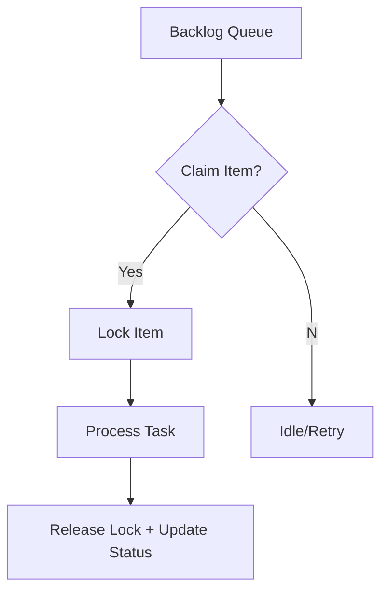

import Tabs from '@theme/Tabs';
import TabItem from '@theme/TabItem';

**The Hook**: I shipped multi-agent backlog processing with item-level locking, a new autonomous article writer job, and a cleaner `run_backlog_task.py` that can claim work safely.

**Why I Built It**

I hit the same pain point again and again: multiple agents stepping on the same backlog item, or waiting too long to pick anything up. I built this because I was tired of noisy conflicts and idle time. I wanted the system to scale without babysitting, while still keeping task ownership crisp and auditable.

**The Solution**

I focused on three pieces: item-level locking to prevent collisions, a job that can author articles on its own schedule, and a refactor to make claiming backlog items first-class. That creates a clean pipeline from “new task” to “claimed” to “done.”



<Tabs>
  <TabItem value="py" label="Python">
    ```python
    # Claim-first processing to avoid collisions
    item = backlog.claim_next(worker_id)
    if item:
        with backlog.lock(item.id):
            run_task(item)
            backlog.complete(item.id)
    ```
  </TabItem>
  <TabItem value="js" label="JS">
    ```js
    // Agent-side view of the claim/lock flow
    const item = await backlog.claimNext(workerId);
    if (item) {
      await backlog.lock(item.id);
      await runTask(item);
      await backlog.complete(item.id);
    }
    ```
  </TabItem>
</Tabs>

<details>
  <summary>Click to view raw logs</summary>
  Worker A claimed item #142
  Worker A acquired lock for item #142
  Worker A completed item #142
  Worker A released lock for item #142
</details>

:::note
Claiming first made the system feel faster and safer — less time spent on retries, more time on actual work.
:::

:::tip
If you’re building your own agent scheduler, start with lock semantics before you scale the worker count.
:::

:::warning
A single global lock is simpler, but it becomes a bottleneck fast.
:::

:::danger
If you skip lock expiry logic, a crashed worker can freeze the entire queue.
:::

**The Code**

[View Code](https://github.com/victorstack-ai/agent-hq)

**What I Learned**

- PHP 8.4 is shaping up with new features that push modern typing and developer ergonomics even further.
- WordPress 6.7 landed with meaningful platform upgrades that will change how I think about plugin compatibility.
- Drupal 11 prep is real and happening now — it’s time to audit modules early instead of scrambling later.
