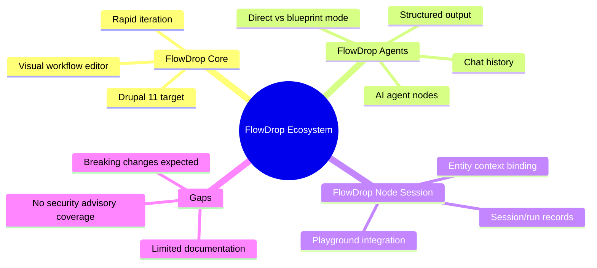
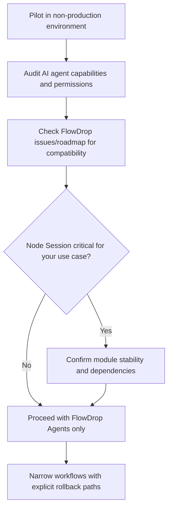

import Tabs from '@theme/Tabs';
import TabItem from '@theme/TabItem';

FlowDrop is a visual, drag-and-drop workflow editor for Drupal with AI integration hooks. The core project is moving quickly with Drupal 11 releases (0.5.1 shipped January 27, 2026), which makes it a good time to evaluate the AI-adjacent contrib pieces that plug into FlowDrop.

I looked at **FlowDrop Agents** and **FlowDrop Node Session** to see if they are ready for real editorial workflows.

<!-- truncate -->

:::info[Context]
FlowDrop and its sub-modules are **not covered by Drupal's security advisory policy**. These are early-stage modules created during the Drupal AI Hackathon (January 28, 2026). Treat them accordingly.
:::

## What FlowDrop Agents Adds

> "FlowDrop Agents bridges Drupal's `ai_agents` ecosystem into FlowDrop workflows."
>
> — FlowDrop Agents, [Drupal project page](https://www.drupal.org/project/flowdrop_agents)

The module exposes AI agents as first-class workflow nodes. It supports status tracking, structured output, chat history, and detailed error metadata. It also supports a "direct vs blueprint" mode so agents can either execute immediately or return a proposed change for review.

Created January 28, 2026. Updated February 4, 2026.

## What FlowDrop Node Session Adds

The module categories listing describes FlowDrop Node Session as providing entity-context support for FlowDrop playground sessions, allowing workflows to start with a Drupal entity (node, term, etc.) as the context. It is listed as actively maintained and under active development, but I could not access a full project page or release details at the time of this review.

If Node Session wires an entity into a playground session, the plausible model is: a session/run content entity stores a reference to the initiating entity and exposes it as part of the runtime context for subsequent nodes.

## Comparison: What You Get vs What is Missing

<Tabs>
<TabItem value="agents" label="FlowDrop Agents">

| Feature | Status |
|---|---|
| AI agents as workflow nodes | Available |
| Status tracking and error metadata | Available |
| Direct execution mode | Available |
| Blueprint/review mode | Available |
| Chat history support | Available |
| Security advisory coverage | **Not covered** |
| Production stability guarantee | **None** |

</TabItem>
<TabItem value="nodesession" label="FlowDrop Node Session">

| Feature | Status |
|---|---|
| Entity context for sessions | Described in listing |
| Full project page / docs | **Not accessible** |
| Release details | **Not accessible** |
| Approval/moderation hooks | **Unconfirmed** |
| Audit trail beyond session record | **Unconfirmed** |
| Bulk/scheduled execution | **Unconfirmed** |
| Rollback/diff tooling | **Unconfirmed** |

</TabItem>
</Tabs>

:::caution[Reality Check]
Both modules are hackathon-born, pre-security-advisory, and targeting a core FlowDrop project that explicitly warns about breaking changes. Do not wire these into production content pipelines without containment.
:::

## Content-Ops Gaps to Validate (Node Session)

Full gap list for Node Session evaluation

- Approval and moderation hooks for session-triggered updates.
- Audit trail visibility beyond the session/run record (who triggered, what fields were touched).
- Bulk and scheduled execution patterns for large content batches.
- Rollback or diff tooling for entity changes generated by sessions.
- Permission boundaries (who can start sessions on which entity types).

## Adoption Notes

| Concern | Reality |
|---|---|
| Stability | Expect breaking changes. Core FlowDrop explicitly encourages feedback but warns of rapid iteration. |
| Security | Not covered by Drupal's security advisory policy. Treat as early-stage. |
| Drupal version | Recent FlowDrop releases target Drupal `^11`. Blocker if you are still on D10. |
| Node Session readiness | Validate API surface and update cadence before adopting. |

## Recommended Next Steps Before Adoption

- Pilot in a non-production environment with narrow workflows and explicit rollback paths.
- Audit AI agent capabilities and ensure every agent node is backed by permissions and review gates you can explain.
- Check the latest FlowDrop issues/roadmap and confirm FlowDrop Agents' compatibility with your AI Agents setup.
- If Node Session is critical for your use case, confirm module stability and any dependencies before wiring it into production pipelines.

**Related:** FlowDrop Node Sessions (entity context, content-ops gaps) is covered in the companion content merged into this review.

## Why this matters for Drupal and WordPress

FlowDrop Agents represents a Drupal-native approach to AI-driven editorial workflows — something WordPress teams are exploring via separate plugin ecosystems like AutomatorWP and SureTriggers. For Drupal agencies, understanding FlowDrop's maturity level prevents premature adoption in client projects. The "direct vs blueprint" execution model is a pattern worth watching: it lets editors review AI-proposed changes before they land, which is critical for content governance on high-traffic Drupal sites.

## References

- [FlowDrop (Drupal project)](https://www.drupal.org/project/flowdrop)
- [FlowDrop Agents (Drupal project)](https://www.drupal.org/project/flowdrop_agents)
- [Drupal module categories: Content](https://www.drupal.org/module-categories/content)

***
*Need an Enterprise CMS Architect to modernize your legacy PHP platforms? View my case studies at [victorjimenezdev.github.io](https://victorjimenezdev.github.io) or connect with me on LinkedIn.*
