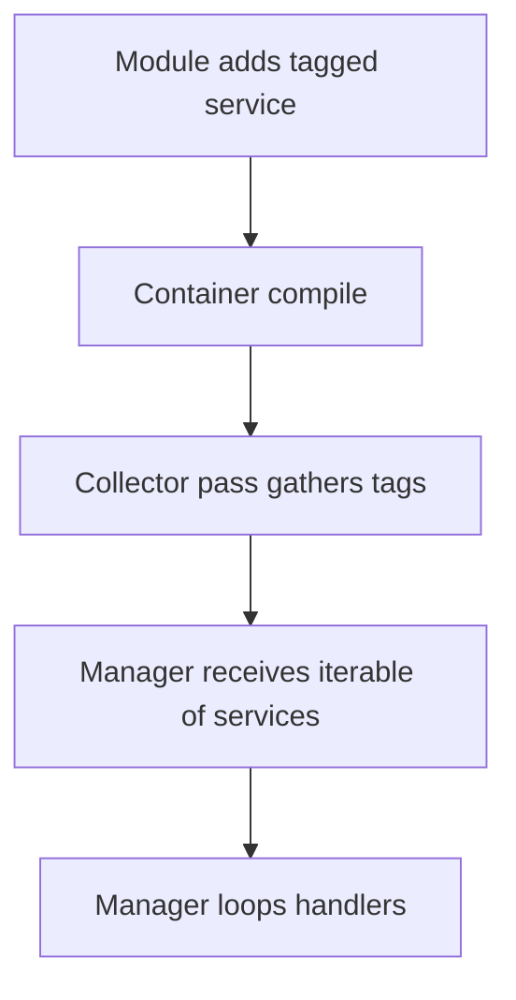

import Tabs from '@theme/Tabs';
import TabItem from '@theme/TabItem';

**The Hook**: Drupal service collectors are the cleanest way I’ve found to scale plugin-style services without turning your constructors into dependency soup.

**Why I Built It**
I keep seeing Drupal modules that grow a set of “handler” services (formatters, validators, exporters, etc.). The naïve approach wires each one manually into a manager. That works until the third team adds another handler and forgets to update the manager — now you’ve got features silently missing. Service collectors flip the dependency direction: you tag services, Drupal collects them, and your manager stays stable as the list grows. The trade‑off is indirection — which can be great for extensibility and terrible for debugging if you don’t document it.

**The Solution**
Service collectors use tagged services plus a compiler pass to inject an iterable into a manager. Think of it as a “registry” that Drupal assembles for you at container compile time.



<Tabs>
  <TabItem value="yaml" label="services.yml">
    ```yaml
    services:
      my_module.handler_alpha:
        class: Drupal\my_module\Handler\AlphaHandler
        tags:
          - { name: my_module.handler, priority: 10 }

      my_module.handler_beta:
        class: Drupal\my_module\Handler\BetaHandler
        tags:
          - { name: my_module.handler, priority: 0 }

      my_module.handler_manager:
        class: Drupal\my_module\Handler\HandlerManager
        tags:
          - { name: service_collector, tag: my_module.handler, call: addHandler, priority: 0 }
    ```
  </TabItem>
  <TabItem value="php" label="Manager">
    ```php
    <?php

    namespace Drupal\my_module\Handler;

    final class HandlerManager {
      private array $handlers = [];

      public function addHandler(HandlerInterface $handler): void {
        $this->handlers[] = $handler;
      }

      public function run(string $payload): array {
        $results = [];
        foreach ($this->handlers as $handler) {
          $results[] = $handler->handle($payload);
        }
        return $results;
      }
    }
    ```
  </TabItem>
</Tabs>

:::warning
Service collectors are compile‑time wiring. If you expect handlers to appear dynamically at runtime, this is the wrong tool.
:::

**Gotchas I’d Watch For**
- Order matters. Use `priority` on tags and document it, or you’ll debug “random” ordering that’s actually deterministic.
- Don’t overuse collectors. If you have only two handlers and zero extension points, explicit dependencies are easier to read.
- Make sure handlers are side‑effect safe. Your manager might call them in loops, so avoid hidden state unless you’re intentionally caching.

<details>
  <summary>Click to view raw logs</summary>
  Container compile: collected 2 services tagged my_module.handler
  Manager: addHandler(AlphaHandler)
  Manager: addHandler(BetaHandler)
</details>

**The Code**
[View Code](https://github.com/victorstack-ai/drupal-service-collector-demo)

**What I Learned**
- Service collectors are a solid fit when you want third‑party modules to add behavior without editing your manager.
- The flexibility comes with a cost: debugging requires tracing tags during container build, not just reading constructors.
- If ordering is meaningful, be explicit about priorities and test for it.
- For small or fixed sets of services, explicit injection is still the simplest and most reliable option.

## References
- [Drupal Service Container Deep Dive (Part 3): Service Collectors](https://www.thedroptimes.com/66222/drupal-service-container-deep-dive-part-3-service-collectors)
