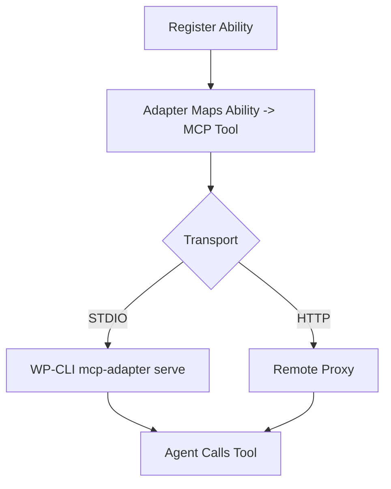

import Tabs from '@theme/Tabs';
import TabItem from '@theme/TabItem';

I can now treat a WordPress site like an MCP tool server—abilities become callable tools, which turns admin tasks into agent-friendly workflows.

**Why I Built It**
I keep seeing teams wire ad‑hoc AI actions directly into plugins, and it’s brittle: no shared schema, no discoverability, and permissions are bolted on after the fact. WordPress’s Abilities API + the MCP Adapter give a structured path: define a capability once, let clients discover it, then let MCP-aware agents call it safely. That makes agent workflows reproducible instead of magical.

**The Solution**
The MCP Adapter maps registered Abilities into MCP primitives (mostly tools) so AI clients can discover and execute them. The default adapter server exposes three discovery/exec tools and requires you to mark abilities as public for MCP access. For local dev, you can use STDIO transport via WP-CLI; for remote sites, a proxy can expose HTTP transport.



:::warning
This works best for read‑only or low‑risk abilities. If an ability mutates data, you must treat it like an API endpoint: strict permissions, rate limits, and audit logging.
:::

Here’s a minimal layout for an MCP server config (the adapter’s examples use `mcpServers` for Claude/Cursor, and `servers` for VS Code):

<Tabs>
  <TabItem value="claude" label="Claude/Cursor">
    ```json
    {
      "mcpServers": {
        "wordpress-mcp-server": {
          "command": "wp",
          "args": [
            "--path=/path/to/wordpress",
            "mcp-adapter",
            "serve",
            "--server=mcp-adapter-default-server",
            "--user=admin"
          ]
        }
      }
    }
    ```
  </TabItem>
  <TabItem value="vscode" label="VS Code">
    ```json
    {
      "servers": {
        "wordpress-mcp-server": {
          "command": "wp",
          "args": [
            "--path=/path/to/wordpress",
            "mcp-adapter",
            "serve",
            "--server=mcp-adapter-default-server",
            "--user=admin"
          ]
        }
      }
    }
    ```
  </TabItem>
</Tabs>

Gotchas I’m watching:
- Abilities must be explicitly exposed for MCP access, otherwise they won’t show up via discovery.
- A “tool” is executable logic; if the ability is purely informational, you can map it as a resource instead to avoid accidental execution.
- STDIO is perfect for local experiments; HTTP needs stronger auth and operational guardrails.

**The Code**
[View Code](https://github.com/victorstack-ai/wp-mcp-adapter-demo)

**What I Learned**
- Abilities give WordPress a stable, cross‑context contract that MCP can expose without custom glue. That’s a big step toward agent‑ready plugins.
- The adapter’s discovery/inspect/execute trio makes agents safer: they can introspect before acting instead of guessing.
- I’d keep production usage read‑only at first; mutate‑on‑call abilities need the same rigor as public REST routes.