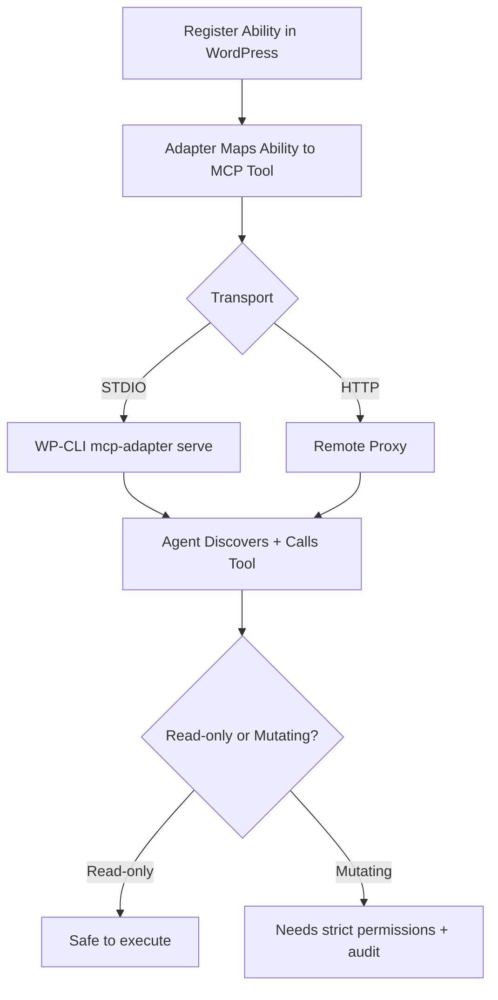

import TOCInline from '@theme/TOCInline';

I can now treat a WordPress site like an MCP tool server -- abilities become callable tools, which turns admin tasks into agent-friendly workflows.

<!-- truncate -->

<TOCInline toc={toc} minHeadingLevel={2} maxHeadingLevel={2} />

<details>
<summary>TL;DR — 30 second version</summary>

- WordPress Abilities API + MCP Adapter maps registered abilities into discoverable MCP tools
- STDIO transport via WP-CLI for local dev; HTTP proxy for remote
- Abilities must be explicitly exposed for MCP access
- Keep production usage read-only at first; mutating abilities need REST-level rigor

</details>

## Why I Built It

I keep seeing teams wire ad-hoc AI actions directly into plugins, and it is brittle: no shared schema, no discoverability, and permissions are bolted on after the fact. WordPress's Abilities API + the MCP Adapter give a structured path: define a capability once, let clients discover it, then let MCP-aware agents call it safely. That makes agent workflows reproducible instead of magical.

## The Architecture

The MCP Adapter maps registered Abilities into MCP primitives (mostly tools) so AI clients can discover and execute them. The default adapter server exposes three discovery/exec tools and requires abilities to be marked as public for MCP access. For local dev, STDIO transport via WP-CLI works well; for remote sites, a proxy can expose HTTP transport.


```mermaid
flowchart TD
  A[Register Ability in WordPress] --> B[Adapter Maps Ability to MCP Tool]
  B --> C{Transport}
  C -- STDIO --> D[WP-CLI mcp-adapter serve]
  C -- HTTP --> E[Remote Proxy]
  D --> F[Agent Discovers + Calls Tool]
  E --> F
  F --> G{Read-only or Mutating?}
  G -->|Read-only| H[Safe to execute]
  G -->|Mutating| I[Needs strict permissions + audit]
```

:::warning[Production Safety]
This works best for read-only or low-risk abilities. If an ability mutates data, it needs the same rigor as a public API endpoint: strict permissions, rate limits, and audit logging.
:::

### MCP Server Configuration

Here is a minimal layout for an MCP server config (the adapter's examples use `mcpServers` for Claude/Cursor, and `servers` for VS Code):

```json title="Claude/Cursor MCP config" showLineNumbers
{
  "mcpServers": {
    "wordpress-mcp-server": {
      "command": "wp",
      "args": [
        "--path=/path/to/wordpress",
        "mcp-adapter",
        "serve",
        "--server=mcp-adapter-default-server",
        "--user=admin"
      ]
    }
  }
}
```

```json title="VS Code MCP config" showLineNumbers
{
  "servers": {
    "wordpress-mcp-server": {
      "command": "wp",
      "args": [
        "--path=/path/to/wordpress",
        "mcp-adapter",
        "serve",
        "--server=mcp-adapter-default-server",
        "--user=admin"
      ]
    }
  }
}
```

:::tip[Top Takeaway]
Abilities give WordPress a stable, cross-context contract that MCP can expose without custom glue. That is a big step toward agent-ready plugins.
:::

:::info[Context]
A "tool" is executable logic; if the ability is purely informational, you can map it as a resource instead to avoid accidental execution. STDIO is perfect for local experiments; HTTP needs stronger auth and operational guardrails.
:::

## Gotchas I Am Watching

- Abilities must be explicitly exposed for MCP access, otherwise they won't show up via discovery.
- A "tool" is executable logic; if the ability is purely informational, map it as a resource instead.
- STDIO is perfect for local experiments; HTTP needs stronger auth and operational guardrails.

## The Code

[View Code](https://github.com/victorstack-ai/wp-mcp-adapter-demo)

## What I Learned

- Abilities give WordPress a stable, cross-context contract that MCP can expose without custom glue. That is a big step toward agent-ready plugins.
- The adapter's discovery/inspect/execute trio makes agents safer: they can introspect before acting instead of guessing.
- I would keep production usage read-only at first; mutate-on-call abilities need the same rigor as public REST routes.

## Signal Summary

| Topic | Signal | Action | Priority |
|---|---|---|---|
| WP Abilities API | Structured capability contracts | Define abilities with MCP exposure | High |
| MCP Adapter | Maps abilities to discoverable tools | Wire into agent workflows | High |
| STDIO Transport | Local dev friendly | Use WP-CLI for experiments | Medium |
| HTTP Transport | Remote access path | Add auth + rate limits before prod | High |

## Why this matters for Drupal and WordPress

The WordPress MCP Adapter is a milestone for WordPress plugin developers building AI-powered tools — it provides a standardized way to expose site capabilities to external agents without custom REST endpoints. WordPress agencies can use this to automate content audits, bulk updates, and site health checks via AI assistants. Drupal developers can compare this to Drupal's AI module ecosystem and ECA (Event-Condition-Action) patterns, which solve similar automation problems through different architectural choices.

## References

- [From Abilities to AI Agents: Introducing the WordPress MCP Adapter](https://developer.wordpress.org/news/2026/02/from-abilities-to-ai-agents-introducing-the-wordpress-mcp-adapter/)
- [WordPress Developer Blog](https://developer.wordpress.org/news/)


***
*Looking for an Architect who doesn't just write code, but builds the AI systems that multiply your team's output? View my enterprise CMS case studies at [victorjimenezdev.github.io](https://victorjimenezdev.github.io) or connect with me on LinkedIn.*
