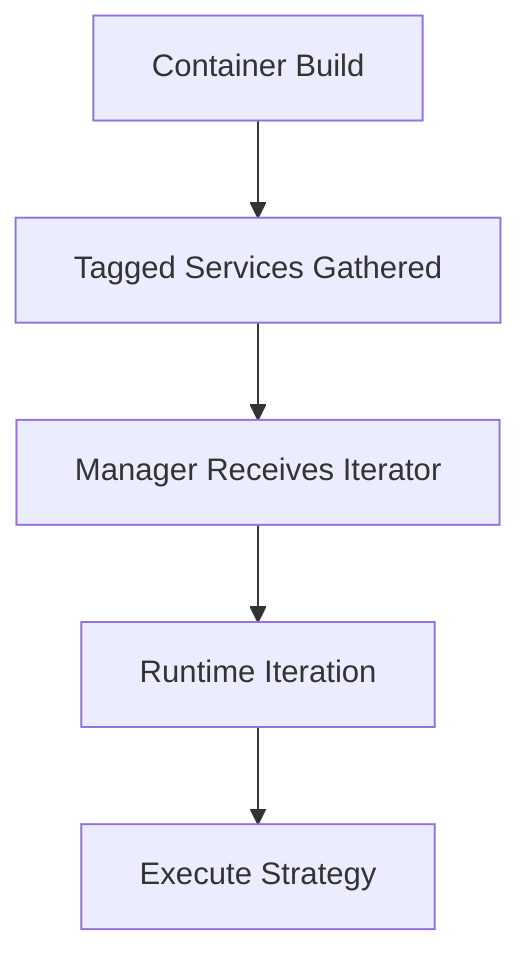

import Tabs from '@theme/Tabs';
import TabItem from '@theme/TabItem';

**The Hook**
Service collectors in Drupal’s container let you assemble flexible plugin lists without hard‑coding dependencies—and they’re easy to misuse if you don’t treat tags as a contract.

**Why I Built It**
I keep seeing Drupal modules where every new integration means editing the same manager class to add another service. That’s brittle and slow. Service collectors flip the flow: providers tag themselves, the manager collects them. It scales cleanly, but only if you define strict expectations for the tagged services.

**The Solution**
A service collector is basically a list of service IDs built at container compile time. You tag services (e.g., `my_module.collector`) and tell the manager to pull all services with that tag into an iterator. The manager then iterates at runtime without knowing who else is installed.



This pattern works when your tagged services share a stable interface and predictable side effects. It falls over when tags are used as “optional chaos hooks.” If the manager expects a method and one tagged service doesn’t implement it, you’ll get late runtime errors instead of early failures.

:::warning
Service collectors are not a plugin system substitute. If you need discovery, definitions, or priorities, use proper plugin APIs.
:::

<Tabs>
  <TabItem value="yml" label="services.yml">
    ```yaml
    services:
      my_module.manager:
        class: Drupal\my_module\Manager\MyManager
        arguments:
          - !tagged_iterator my_module.collector

      my_module.collector.alpha:
        class: Drupal\my_module\Collector\AlphaCollector
        tags:
          - { name: my_module.collector }

      my_module.collector.beta:
        class: Drupal\my_module\Collector\BetaCollector
        tags:
          - { name: my_module.collector }
    ```
  </TabItem>
  <TabItem value="php" label="Manager.php">
    ```php
    <?php

    namespace Drupal\my_module\Manager;

    use Drupal\my_module\Collector\CollectorInterface;

    final class MyManager {
      /** @var iterable<CollectorInterface> */
      private iterable $collectors;

      public function __construct(iterable $collectors) {
        $this->collectors = $collectors;
      }

      public function run(): array {
        $results = [];
        foreach ($this->collectors as $collector) {
          $results[] = $collector->collect();
        }
        return $results;
      }
    }
    ```
  </TabItem>
</Tabs>

:::tip
Add validation at construction time if you can. A cheap `instanceof` check turns silent failures into fast feedback.
:::

**The Code**
[View Code](https://github.com/victorstack-ai/drupal-service-collector-demo)

Backlog: Projects|Build: drupal-service-collector-lab — a minimal Drupal module that demonstrates tagged iterator collectors, includes one “good” and one “bad” collector, and a test that proves the failure mode.

:::danger
If your manager mutates shared state inside each collector, the execution order matters. Without explicit priorities, Drupal will not guarantee order across modules.
:::

<details>
  <summary>Click to view raw logs</summary>
  Collector Alpha: ok
  Collector Beta: ok
  Collector Gamma: missing method collect()
</details>

**What I Learned**
- Service collectors are great when you want optional integrations without editing the manager each time.
- Tags are a contract. If you don’t validate that contract, you’ll debug runtime crashes in production.
- If you need ordering, add explicit priorities or use a plugin manager instead of a bare tagged iterator.
- I’d avoid this pattern for user-configurable behavior; it’s developer‑only by design.