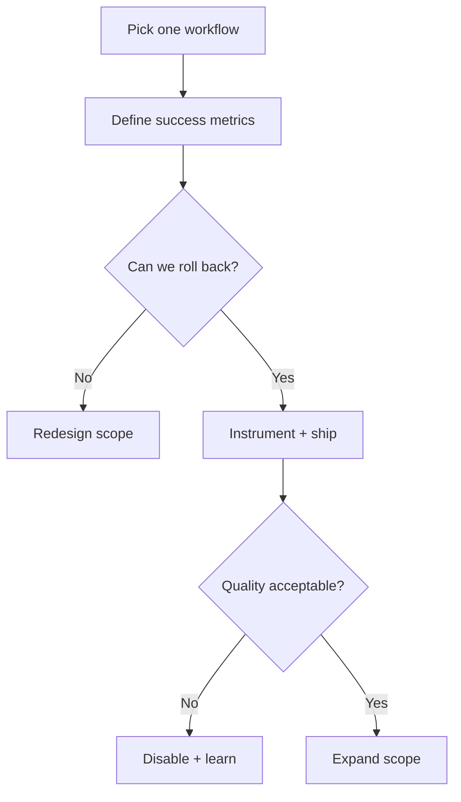

import Tabs from '@theme/Tabs';
import TabItem from '@theme/TabItem';

**The Hook**
Mitchell Hashimoto's AI adoption journey reinforced a hard rule for me: adoption only sticks when it's scoped, measurable, and reversible.

**Why I Built It**
I've seen teams stall because "let's use AI" is too vague and too risky at the same time. You can't measure it, you can't roll it back, and you can't explain why it helped. So I built a small adoption playbook for myself: pick a narrow workflow, define a failure mode, and add a hard off-switch. That's the only way experimentation becomes operational.

**The Solution**
I treat AI adoption like a feature flag rollout. Start with a thin slice, instrument it, and keep a manual path open. If the model or tool fails, the system should degrade to a boring, predictable flow.



This works when the workflow is deterministic enough to compare results. It falls over if your baseline is already fuzzy or you can't define "better."

:::warning
If you can't explain how to turn it off in a single sentence, you're not ready to ship it.
:::

**The Code**
No separate repo for this topic because this is a decision framework, not a shippable artifact.

<Tabs>
  <TabItem value="policy" label="Policy Doc">
    ```markdown
    # AI Adoption Policy (Thin Slice)
    - Scope: release-note drafts only
    - Success: 20% faster authoring, same QA rejection rate
    - Guardrail: human editor approval required
    - Kill switch: env var AI_DRAFTS=false
    ```
  </TabItem>
  <TabItem value="config" label="Config Guard">
    ```yaml
    features:
      ai_drafts:
        enabled: false
        owner: release-team
        metrics:
          - time_to_publish
          - qa_reject_rate
    ```
  </TabItem>
</Tabs>

:::tip
Start with a workflow that already has timestamps or measurable outcomes. You'll get signal without building new telemetry.
:::

<details>
  <summary>Click to view raw logs</summary>
  experiment=ai_drafts
  baseline_time_to_publish=34m
  trial_time_to_publish=26m
  qa_reject_rate=unchanged
  decision=keep_enabled_with_editor_gate
</details>

:::danger
Don't let a demo turn into policy. If it can't be evaluated against a baseline, it's not production-ready.
:::

**What I Learned**
- AI adoption dies when it's framed as a blanket capability instead of a scoped workflow.
- A rollback plan is not optional; it's the difference between learning and chaos.
- If you can't measure outcome quality, you're gambling, not shipping.

## References
- [Mitchell Hashimoto: My AI Adoption Journey](https://mitchellh.com/writing/my-ai-adoption-journey)
- [Simon Willison: Mitchell Hashimoto on AI adoption](https://simonwillison.net/2026/Feb/5/ai-adoption-journey/)
