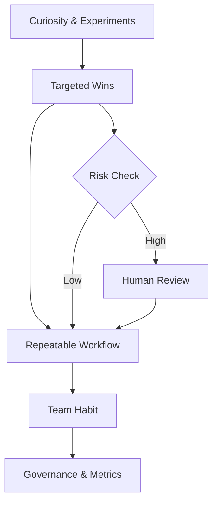

import Tabs from '@theme/Tabs';
import TabItem from '@theme/TabItem';

**The Hook**
Real AI adoption isn’t a tool swap—it’s a behavior shift, and the fastest wins come from shrinking the gap between “experiment” and “default workflow.”

**Why I Built It**
I keep seeing teams try to “adopt AI” by picking a single model or product and calling it done. That’s not adoption; that’s procurement. The real problem is the messy middle: pilots that never scale, workflows that don’t stick, and uncertainty about which tasks are safe to automate. I wanted a clear, pragmatic map of what actually changes when a team moves from “AI as a demo” to “AI as a habit.”

**The Solution**
Think of adoption as a pipeline: curiosity, narrow wins, repeatable workflows, then policy and tooling that make those workflows boring—in the best way.



What breaks:
- **Over-indexing on demos.** Flashy results don’t survive contact with real constraints—latency, privacy, or failure modes.
- **Skipping the “repeatable” stage.** If a workflow can’t be run by someone else on Tuesday at 2 p.m., it’s not a workflow.
- **Ignoring risk gates.** The jump from “try it” to “ship it” needs explicit checks.

:::warning
If you can’t explain the failure mode in one sentence, it’s not ready for default use.
:::

**The Code**
This topic is a process and culture play, not a single code artifact. For a concrete deliverable on agentic adoption and scaling lessons, see the [Netomi agentic lessons playbook](https://github.com/victorstack-ai/netomi-agentic-lessons-playbook).

[View Code](https://github.com/victorstack-ai/netomi-agentic-lessons-playbook)

<Tabs>
  <TabItem value="checklist" label="Adoption Checklist">

```text
- One workflow with measurable time savings
- Clear handoff when the model is uncertain
- A fallback path that does not depend on AI
- A lightweight review step for high-risk outputs
- A feedback loop from users to improve prompts or tools
```

  </TabItem>
  <TabItem value="policy" label="Risk Gate Snippet">

```yaml
ai_risk_gate:
  low_risk:
    - internal_docs_drafts
    - boilerplate_code
  medium_risk:
    - customer_emails
    - data_transforms
  high_risk:
    - financial_outputs
    - legal_text
    - production_config_changes
  rule: "High risk requires human review before publish"
```

  </TabItem>
</Tabs>

:::tip
Start with low-risk, high-frequency tasks. The habit matters more than the headline feature.
:::

**What I Learned**
- “Adoption” fails when the team has no default path for uncertainty—always design the fallback first.
- Repeatable workflows beat one-off wins; the second run is where the truth shows up.
- Governance isn’t a blocker if it’s lightweight and explicit; it’s a trust accelerator.
- I’d avoid putting AI in any path that can’t degrade safely or be reviewed quickly.

## References
- [Mitchell Hashimoto: My AI Adoption Journey](https://simonwillison.net/2026/Feb/5/ai-adoption-journey/#atom-everything)
