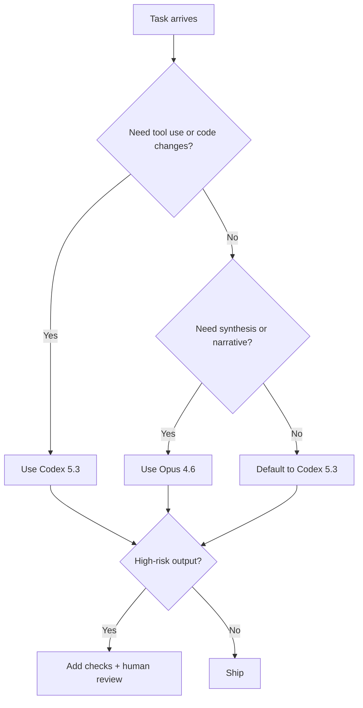

import Tabs from '@theme/Tabs';
import TabItem from '@theme/TabItem';

I shipped a model-selection playbook for when to use Opus 4.6 vs Codex 5.3, because shipping software is less about “best model” and more about “least surprise.”

## Why I Built It
I’m tired of vague “X is smarter” model talk. In production, I need to know what breaks, what costs time, and how to guardrail it. The new Opus 4.6 and Codex 5.3 releases are promising, but the value only shows up if you choose the right model for the right slice of work.

## The Solution
I boiled the releases down into a decision flow: treat Codex 5.3 as the “do the task” engine (tool use, code understanding, execution), and treat Opus 4.6 as the “reasoning and synthesis” engine (big-picture thinking, trade-off analysis, long-form explanation). That’s the core split. But the edge cases matter.



Here’s how I keep it practical in code-heavy workflows:

<Tabs>
  <TabItem value="codex" label="Codex 5.3">
    ```ts
    // Good for: code edits, tool execution, structured outputs
    // Guardrail: always validate outputs
    const task = {
      type: 'code-change',
      risk: 'medium',
      checks: ['lint', 'tests', 'diff-review'],
    };
    ```
  </TabItem>
  <TabItem value="opus" label="Opus 4.6">
    ```md
    # Good for: high-level synthesis, trade-offs, long-form analysis
    # Guardrail: require concrete constraints + acceptance criteria
    - Frame the problem
    - Compare options
    - State failure modes
    ```
  </TabItem>
</Tabs>

Caveats I’m not ignoring:
- If you want runnable edits and tool usage, Opus can be a detour. I wouldn’t put it in the loop unless you need the narrative or product framing first.
- Codex is faster and more precise for tactical edits, but it can overfit to local context. If you feed it a wrong assumption, it will happily build a castle on it.

:::warning
If the task is high risk (security, billing, irreversible changes), I don’t care how strong the model is — I add checks and human review.
:::

<details>
  <summary>Click to view raw logs</summary>
  Decision notes:
  - Use Codex 5.3 when tool execution is required.
  - Use Opus 4.6 when the output is a narrative or strategy document.
  - Always add guardrails when the risk level is high.
</details>

## The Code
No separate repo for this topic—this is a model-selection framework, not a codebase.

## What I Learned
- Codex 5.3 is the right default when tool use or code changes are on the critical path.
- Opus 4.6 shines when the deliverable is a narrative, a plan, or a trade-off decision.
- The fastest way to ship is picking the model that matches the job, not the one with the most hype.
- Model choice doesn’t replace checks; it only shifts where you place them.

## References
- [Opus 4.6 and Codex 5.3](https://simonwillison.net/2026/Feb/5/two-new-models/#atom-everything)
- [GPT-5.3-Codex System Card](https://openai.com/index/gpt-5-3-codex-system-card)
- [Introducing GPT-5.3-Codex](https://openai.com/index/introducing-gpt-5-3-codex)
