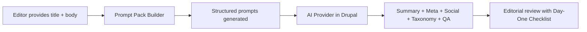

import Tabs from '@theme/Tabs';
import TabItem from '@theme/TabItem';

AI in Drupal CMS 2.0 gets real value when the first week produces repeatable output, not one-off experiments. I wanted a simple kit that editors can plug into their workflow on day one: clear prompts, consistent tone, and fast QA.

Most teams start with a blank prompt box. That kills adoption before it starts.

<!-- truncate -->

:::info[Context]
This is not a module that wraps an API and calls it AI. It is a small toolkit that turns common editorial tasks into reusable prompt templates, plus a checklist that keeps the workflow anchored to real publishing needs.
:::

## Why I Built It

> "Most teams start with a blank prompt box. That slows adoption and makes results unpredictable."

I keep seeing the same pattern: team gets AI module, team opens prompt field, team stares at prompt field, team gives up. The fix is defaults. Good defaults. Editorial defaults that match how content teams actually work.

## The Solution

The module ships two tiny utilities:

<Tabs>
  <TabItem value="promptpack" label="Prompt Pack Builder">

Standardizes summaries, meta descriptions, social snippets, taxonomy suggestions, and content QA. Give it a title and body (plus optional audience, tone, and goal) and it returns a structured set of prompts that can feed any AI provider you connect in Drupal.

```php title="prompt_pack_builder.php"
// Input: title, body, audience, tone, goal
// highlight-next-line
$prompts = $promptPackBuilder->generate($title, $body, $options);
// Returns: summary, meta_description, social_snippet, taxonomy_suggestions, qa_checks
```

  </TabItem>
  <TabItem value="checklist" label="Day-One Checklist">

A lightweight operational baseline for editors and content strategists. Align on audience, tone, and goals before content moves through review.

| Checklist Item | Purpose |
|---|---|
| Define target audience | Anchors prompt context |
| Set tone/voice guidelines | Consistent AI output |
| Establish content goals | Measurable quality bar |
| Configure AI provider | Technical prerequisite |
| Run first prompt pack test | Validation before rollout |

  </TabItem>
</Tabs>

## How It Works



| Pros | Cons |
|---|---|
| Immediate editorial value from day one | Requires AI provider already configured |
| Standardized prompts reduce unpredictability | Prompt quality depends on input quality |
| Checklist prevents scope creep | Not a full workflow engine |
| Works with any Drupal AI provider | Small module, limited scope by design |

:::caution[Reality Check]
This toolkit does not replace editorial judgment. It removes the blank-prompt-box problem so your team can start iterating on actual content instead of staring at an empty field.
:::

## The Code

You can clone and extend the module here: [View Code](https://github.com/victorstack-ai/drupal-ai-dayone-toolkit)

<details>
<summary>What the prompt pack returns</summary>

- **Summary**: 2-3 sentence content summary for internal use
- **Meta description**: SEO-optimized description under 160 characters
- **Social snippet**: Platform-ready excerpt for social sharing
- **Taxonomy suggestions**: Recommended tags/categories based on content
- **QA checks**: Automated quality signals (length, readability, keyword density)

</details>

## What I Learned

AI workflows in Drupal are easier to adopt when you turn editorial intentions into defaults. Clear prompts, consistent tone, and a checklist of day-one tasks help teams ship faster with fewer surprises.

The real barrier to AI adoption in CMS is not the model. It is the empty text field.

## References

- [Drupal AI module](https://www.drupal.org/project/ai)
