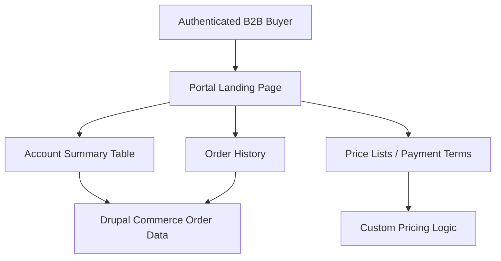

import Tabs from '@theme/Tabs';
import TabItem from '@theme/TabItem';

Centarro argues you can deliver a B2B portal experience on top of a standard Drupal Commerce store without spinning up a separate platform or domain. I built a demo module to test if that claim holds up in practice.

<!-- truncate -->

## The Claim

> "Any Drupal Commerce site can have a B2B portal."
>
> — Centarro, [Blog Post](https://centarro.io/blog/any-drupal-commerce-site-can-have-a-b2b-portal)

The core argument: keep B2B and B2C on the same Drupal Commerce install while differentiating catalog access, price lists, and payment terms. No bespoke front end required. A clear authenticated landing page plus targeted account data gets you most of the way there.

:::info[Context]
Centarro is a key contributor to Drupal Commerce and positions this guidance alongside a Commerce Kickstart webinar on February 26, 2026 that walks through implementation patterns. This is not abstract advice — they are selling implementation services around it.
:::

## What I Built

I wanted a concrete, extendable starting point for the portal experience described in the post: a gated landing page, clear account highlights, and a place to route buyers to the next action.

<Tabs>
<TabItem value="module" label="Module Features">

| Feature | Implementation |
|---|---|
| B2B portal route | Custom Drupal route with access control |
| Admin-tunable labels | Configuration form for portal text |
| Summary table | Isolated builder, swappable for real Commerce data |
| Account highlights | Placeholder for customer profiles and pricing |

</TabItem>
<TabItem value="architecture" label="Portal Architecture">

</TabItem>
</Tabs>

The summary builder is isolated so it can be swapped for real Commerce order data, customer profiles, or pricing logic.

## Centarro Guidance: Pros and Cons

| Pros | Cons |
|---|---|
| Single install reduces ops complexity | Portal UX is limited by Drupal theming layer |
| Commerce modules handle pricing/catalog natively | Differentiated catalog access requires careful role setup |
| No separate platform to maintain | B2B-specific features (quoting, approval flows) need custom work |
| Webinar provides implementation walkthrough | Guidance is tied to Centarro services pitch |

:::caution[Reality Check]
A portal "doesn't need a bespoke front end to start" is true for basic B2B landing pages. But real B2B workflows — quoting, multi-approver checkout, net-30 terms, PO number capture — require significant custom development regardless of platform. The portal is the easy part.
:::

What the Commerce Kickstart webinar covers (February 26, 2026)

- Hands-on walkthrough for implementing B2B portal patterns
- Catalog access differentiation between B2B and B2C
- Price list configuration per customer type
- Payment terms and account-level settings
- Integration with existing Drupal Commerce modules

## The Code

[View Code](https://github.com/victorstack-ai/drupal-commerce-b2b-portal-demo)

## What I Learned

- Centarro's guidance centers on keeping B2B and B2C on the same Drupal Commerce install while differentiating catalog access, price lists, and payment terms.
- A portal doesn't need a bespoke front end to start; a clear authenticated landing page plus targeted account data gets you most of the way there.
- The companion Commerce Kickstart webinar on February 26, 2026 is positioned as a hands-on walkthrough for implementing these portal patterns.
- The hard part is not the portal page. It is the business logic behind it.

## Why this matters for Drupal and WordPress

Drupal Commerce's ability to serve B2B and B2C from a single install is a competitive differentiator against WooCommerce, which typically requires separate plugins or instances for wholesale pricing and gated catalogs. Drupal agencies evaluating whether to pitch Commerce for B2B clients can use Centarro's portal pattern as a concrete starting point. WordPress/WooCommerce teams comparing approaches should note that Drupal's role-based access and entity reference architecture make catalog differentiation a configuration task rather than a plugin dependency.

## References

- [Centarro: Any Drupal Commerce Site Can Have a B2B Portal](https://centarro.io/blog/any-drupal-commerce-site-can-have-a-b2b-portal)
- [Drupal Planet coverage](https://www.drupal.org/planet/drupal/2026-02-04/any-drupal-commerce-site-can-have-a-b2b-portal)

***
*Looking for an Architect who doesn't just write code, but builds the AI systems that multiply your team's output? View my enterprise CMS case studies at [victorjimenezdev.github.io](https://victorjimenezdev.github.io) or connect with me on LinkedIn.*
