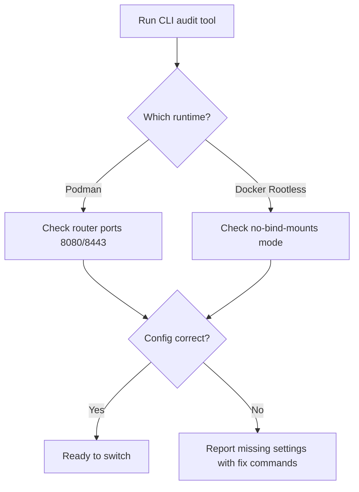

import Tabs from '@theme/Tabs';
import TabItem from '@theme/TabItem';

DDEV 1.25.0 ships experimental support for Podman and Docker rootless. This opens up corporate-friendly runtimes, but introduces trade-offs that the announcement does not emphasize enough.

I built a CLI that audits your `global_config.yaml` so you know before you flip the switch.

<!-- truncate -->

## The Claim

> "DDEV 1.25.0 adds experimental support for both Podman and Docker rootless."
>
> — DDEV Blog, [Podman and Docker Rootless](https://ddev.com/blog/podman-and-docker-rootless)

:::info[Context]
"Experimental" means what it says. DDEV is being transparent about the maturity level here, which I respect. But teams need to understand the specific configuration requirements before committing to Podman or rootless Docker in shared environments.
:::

## What Actually Changes

<Tabs>
<TabItem value="podman" label="Podman on macOS">

| Setting | Required Value | Why |
|---|---|---|
| Router HTTP port | `8080` | Podman on macOS cannot bind to port 80 |
| Router HTTPS port | `8443` | Podman on macOS cannot bind to port 443 |
| Global config location | `$HOME/.ddev` or XDG path | Standard DDEV config path |

```yaml title="$HOME/.ddev/global_config.yaml"
router_http_port: "8080"
# highlight-next-line
router_https_port: "8443"
```

</TabItem>
<TabItem value="rootless" label="Docker Rootless">

| Setting | Required Value | Why |
|---|---|---|
| Bind mount mode | `no-bind-mounts` | Docker rootless cannot use bind mounts |
| Global config location | `$HOME/.ddev` or XDG path | Standard DDEV config path |

```yaml title="$HOME/.ddev/global_config.yaml"
# highlight-next-line
no_bind_mounts: true
```

</TabItem>
</Tabs>

## The Real Trade-offs

| Feature | Standard Docker | Podman (macOS) | Docker Rootless |
|---|---|---|---|
| Port 80/443 binding | Yes | **No** — needs 8080/8443 | Yes (with caveats) |
| Bind mounts | Yes | Yes | **No** — requires no-bind-mounts |
| Corporate policy friendly | Depends | Yes | Yes |
| Config changes required | None | Port overrides | Mount mode change |
| Maturity | Stable | **Experimental** | **Experimental** |

:::caution[Reality Check]
If your team shares DDEV config via repo-committed `.ddev/config.yaml`, switching to Podman or rootless Docker means everyone on the team needs matching global config. One developer with default ports and another with 8080/8443 will produce different environments. Coordinate before switching.
:::

## What I Built

A CLI that audits `global_config.yaml` and flags missing settings for Podman or Docker rootless, with a focused checklist for macOS Podman users.



[View Code](https://github.com/victorstack-ai/drupal-ddev-podman-rootless-review)

<details>
<summary>Full macOS Podman checklist</summary>

1. Install Podman via Homebrew or official package
2. Ensure `global_config.yaml` sets `router_http_port: "8080"`
3. Ensure `global_config.yaml` sets `router_https_port: "8443"`
4. Verify Podman machine is running (`podman machine start`)
5. Run `ddev start` and confirm routing works on new ports
6. Update team documentation with new port numbers
7. Check browser bookmarks and proxy configs for port changes

</details>

## What I Learned

- DDEV 1.25.0 adds experimental support for both Podman and Docker rootless.
- Podman on macOS cannot bind to ports 80/443, so DDEV needs router ports set to 8080/8443.
- Docker rootless cannot use bind mounts, so `no-bind-mounts` mode is required.
- DDEV global configuration lives in `global_config.yaml`, and the config can live under `$HOME/.ddev` or an XDG location.
- The biggest risk is not the runtime change itself. It is team coordination around shared config.

## Why this matters for Drupal and WordPress

DDEV is the most widely used local development environment for both Drupal and WordPress projects. Podman and Docker rootless support matters for agencies and enterprise teams whose corporate policies prohibit Docker Desktop or require rootless containers. Drupal and WordPress developers sharing `.ddev/config.yaml` via git need to coordinate runtime choices across the team — one developer on Podman with port 8080 and another on standard Docker with port 80 will produce inconsistent local environments.

## References

- [DDEV: Podman and Docker Rootless](https://ddev.com/blog/podman-and-docker-rootless)
- [DDEV Architecture Documentation](https://docs.ddev.com/en/stable/users/usage/architecture/)
- [DDEV Config YAML Reference](https://docs.ddev.com/en/stable/users/configuration/config_yaml/)
