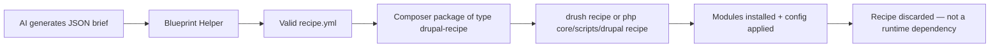

import Tabs from '@theme/Tabs';
import TabItem from '@theme/TabItem';

Drupal CMS recipes are the most practical building block for AI-driven site assembly: they translate a plan into installable modules and configuration with one apply step. I built a small recipe package and a PHP blueprint helper to test how well this works in practice.

<!-- truncate -->

## The Pitch

> "Recipes are Composer packages of type `drupal-recipe` meant to be unpacked and applied, not kept as runtime dependencies."
>
> — Drupal Recipes Initiative, [Author Guide](https://project.pages.drupalcode.org/distributions_recipes/recipe_author_guide.html)

This is the key insight. Recipes are not modules. They are disposable install instructions that configure your site and get out of the way. That model is exactly what AI site builders need: emit a recipe, apply it, done.

:::info[Context]
The Recipes initiative APIs are available in core as **experimental** in Drupal 10.3+ and Drupal 11. Applying a recipe happens from the webroot via `drush recipe` (Drush 13+) or `php core/scripts/drupal recipe`. The core recipe-unpack workflow places recipes in a `/recipes` directory.
:::

## How Recipes Work



<Tabs>
<TabItem value="recipe" label="Recipe Structure">

```yaml title="recipe.yml" showLineNumbers
name: "AI Site Builder Baseline"
description: "Installs a baseline site-building stack with AI Builder role."
type: "drupal-recipe"
install:
- node
- block
- views
- ai
config:
  actions:
user.role.ai_builder:
createIfNotExists:
label: "AI Builder"
grantPermissions:
- "administer nodes"
- "access content overview"
```

</TabItem>
<TabItem value="helper" label="Blueprint Helper (PHP)">

```php title="src/BlueprintHelper.php" showLineNumbers
class BlueprintHelper {
// highlight-next-line
public function fromJson(string $jsonBrief): string {
$brief = json_decode($jsonBrief, true);
$recipe = [
'name' => $brief['name'],
'description' => $brief['description'],
'type' => 'drupal-recipe',
'install' => $brief['modules'],
'config' => ['actions' => $brief['config_actions']],
];
return Yaml::dump($recipe, 4);
}
}
```

</TabItem>
</Tabs>

## Recipe Capabilities at a Glance

| Feature | How It Works |
|---|---|
| Module installation | List modules under `install` key |
| Config creation | `createIfNotExists` for config entities |
| Permission grants | `grantPermissions` action on role entities |
| Simple config updates | `simpleConfigUpdate` for settings |
| Application method | `drush recipe` (Drush 13+) or `php core/scripts/drupal recipe` |
| Package type | `drupal-recipe` — Composer package, not a module |
| Runtime dependency | **None** — applied and discarded |

:::caution[Reality Check]
Recipes are experimental. The API surface is evolving. If you build tooling that emits recipes, pin to a specific core version and test on every minor update. The "apply once and forget" model also means there is no built-in rollback. If a recipe installs the wrong module, you are cleaning up manually.
:::

<details>
<summary>Full list of recipe config actions</summary>

- `createIfNotExists` — Creates a config entity if it does not already exist
- `grantPermissions` — Grants permissions to a role
- `simpleConfigUpdate` — Updates simple configuration values
- Config entity IDs are used as keys to target specific entities
- Actions are expressed in `recipe.yml` under `config.actions`

</details>

## The Code

[View Code](https://github.com/victorstack-ai/drupal-cms-ai-recipe-builder)

## What I Learned

- Recipes are Composer packages of type `drupal-recipe` meant to be unpacked and applied, not kept as runtime dependencies.
- Applying a recipe happens from the webroot via `drush recipe` (Drush 13+) or `php core/scripts/drupal recipe`, and the core recipe-unpack workflow can place recipes in a `/recipes` directory.
- Recipe configuration actions live in `recipe.yml` and are expressed as config entity IDs plus actions like `createIfNotExists`, `grantPermissions`, and `simpleConfigUpdate`.
- The Recipes initiative APIs are available in core as experimental in Drupal 10.3+ and Drupal 11.
- For AI site building, recipes are the right abstraction layer. The hard part is not generating the YAML — it is validating that the generated recipe does what you intended.

## References

- [Drupal Recipe Unpack README](https://api.drupal.org/api/drupal/composer%21Plugin%21RecipeUnpack%21README.md/11.x)
- [How to Download and Apply Drupal Recipes](https://www.drupal.org/docs/extending-drupal/drupal-recipes/how-to-download-and-apply-drupal-recipes)
- [Config Actions Documentation](https://project.pages.drupalcode.org/distributions_recipes/config_actions.html)
- [Recipe Author Guide](https://project.pages.drupalcode.org/distributions_recipes/recipe_author_guide.html)
- [Distributions Recipes Project](https://www.drupal.org/project/distributions_recipes)
