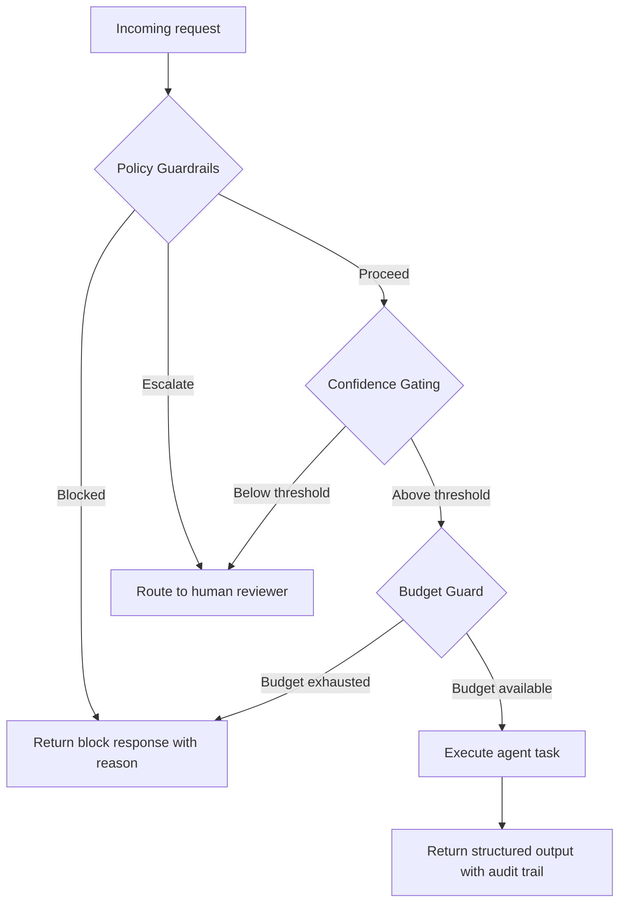

import Tabs from '@theme/Tabs';
import TabItem from '@theme/TabItem';

Enterprise agentic systems scale when they feel less like a demo and more like a governed service. That means routing, guardrails, and budgets are first-class citizens from day one, not afterthoughts bolted on before a compliance review.

I built a lightweight playbook that turns Netomi-style enterprise lessons into code you can run and test.

<!-- truncate -->

## The Core Insight

> "Enterprise agentic systems scale when they feel less like a demo and more like a governed service."

This is the part most agentic demos skip entirely. They show you a happy-path conversation and never mention what happens when confidence drops, spend spikes, or sensitive intents slip through.

:::info[Context]
Netomi operates in enterprise customer service automation. Their lessons are specific to high-volume, regulated environments where a single unguarded agent response can create legal or financial exposure. The patterns here apply broadly, but the urgency is higher in regulated verticals.
:::

## The Three Mechanics

The playbook centers on three mechanics. Each decision is surfaced as structured output so it can be audited later.

<Tabs>
<TabItem value="guardrails" label="Policy Guardrails">

Block or escalate sensitive intents before they reach the model.

```python title="guardrails.py"
def evaluate_intent(intent: str, policy: dict) -> dict:
if intent in policy["blocked_intents"]:
# highlight-next-line
return {"action": "block", "reason": f"Intent '{intent}' is policy-blocked"}
if intent in policy["escalation_intents"]:
return {"action": "escalate", "reason": f"Intent '{intent}' requires human review"}
return {"action": "proceed"}
```

</TabItem>
<TabItem value="confidence" label="Confidence Gating">

Push uncertainty to humans instead of guessing.

```python title="confidence_gate.py"
def confidence_check(score: float, threshold: float = 0.7) -> dict:
if score < threshold:
# highlight-next-line
return {"action": "escalate", "reason": f"Confidence {score} below threshold {threshold}"}
return {"action": "proceed", "confidence": score}
```

</TabItem>
<TabItem value="budget" label="Budget Guard">

Keep costs predictable by making spend limits part of routing, not an afterthought.

```python title="budget_guard.py"
def check_budget(current_spend: float, limit: float) -> dict:
if current_spend >= limit:
# highlight-next-line
return {"action": "block", "reason": f"Budget exhausted: ${current_spend} >= ${limit}"}
remaining = limit - current_spend
return {"action": "proceed", "remaining_budget": remaining}
```

</TabItem>
</Tabs>

## How They Fit Together



## Enterprise Agentic Patterns: What Matters vs What is Marketing

| Pattern | Real Value | Marketing Inflation |
|---|---|---|
| Policy guardrails | Prevents regulatory exposure | "AI governance platform" |
| Confidence gating | Reduces hallucination impact | "Self-aware AI" |
| Budget controls | Predictable cost per interaction | "Intelligent cost optimization" |
| Structured audit output | Compliance and debugging | "Full observability suite" |
| Human escalation | Safety net for edge cases | "Seamless human-AI collaboration" |

:::caution[Reality Check]
A tiny playbook is enough to capture the operational posture of enterprise agentic systems. You do not need a "platform" to implement guardrails, confidence gating, and budget checks. You need three functions and the discipline to call them before every agent action.
:::

<details>
<summary>Full structured output schema</summary>

Each decision produces a JSON record:

```json showLineNumbers
{
  "request_id": "uuid",
  "timestamp": "ISO-8601",
  "intent": "refund_request",
  "guardrail_result": {"action": "proceed"},
  "confidence_result": {"action": "proceed", "confidence": 0.85},
  "budget_result": {"action": "proceed", "remaining_budget": 42.50},
  "agent_response": "...",
  "audit_trail": ["guardrail:pass", "confidence:0.85", "budget:ok"]
}
```

</details>

## The Code

[View Code](https://github.com/victorstack-ai/netomi-agentic-lessons-playbook)

## What I Learned

- Guardrails and human escalation become clearer when they are codified as small, testable rules.
- Budget limits are easier to enforce when they are part of routing, not an afterthought.
- A tiny playbook is enough to capture the operational posture of enterprise agentic systems.
- The gap between "agentic demo" and "agentic service" is governance code, not more model capabilities.

## Why this matters for Drupal and WordPress

Drupal and WordPress sites increasingly embed AI chatbots, content assistants, and automated support agents via modules like Drupal AI or WordPress plugins like AI Engine. These guardrail, confidence-gating, and budget-check patterns apply directly — an unguarded chatbot on a Drupal Commerce site or a WooCommerce store can generate refund promises or pricing errors that create real liability. Agencies deploying AI features on client CMS sites should wire these three checks into their integration layer before any agent capability goes live.
