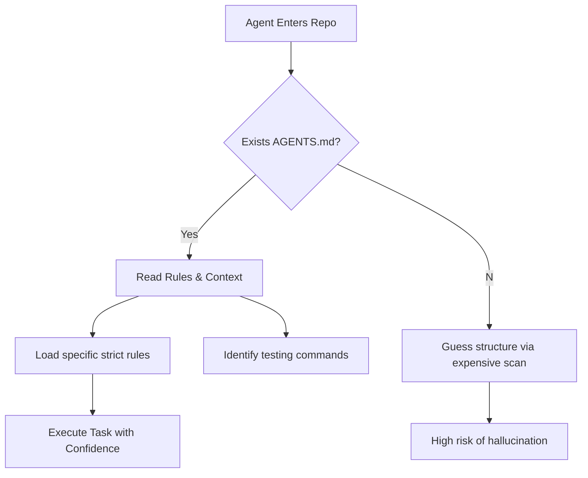

import Tabs from '@theme/Tabs';
import TabItem from '@theme/TabItem';

The "AI Agent" isn't just a buzzword for the future—it's the junior developer clearing your backlog today.

Recent discussions in the Drupal community have converged on a pivotal realization: if we want AI to contribute effectively, we need to tell it how. Between Tag1 using AI to solve a 10-year-old core issue and Jacob Rockowitz's proposal for an `AGENTS.md` standard, the path forward is becoming clear. We need a formal contract between our code and the autonomous agents reading it.

<!-- truncate -->

## Why I'm Watching This

I've been building agentic workflows that read repositories and attempt to fix bugs. The biggest friction point isn't the LLM's intelligence; it's **context**.

An agent landing in a massive Drupal repository often wastes tokens figuring out:
1.  Where are the tests?
2.  What is the coding standard here? (Drupal has strict ones).
3.  Is this a module, a theme, or core?

Jacob Rockowitz's post, *Should Drupal core include an AGENTS.md file?*, addresses this directly. He argues for a standardized file that explicitly guides non-human contributors.

Simultaneously, Tag1 Insights published a case study on *Moving a 10-Year-Old Drupal Core Issue Forward with AI*. They didn't just talk about it; they used AI to analyze and patch a complex, long-standing bug. This proves the "worker" is ready. Now we just need the "manager" (the repo structure) to be ready.

## The Solution: A Standardized `AGENTS.md`

The concept is simple but powerful. Just as `CONTRIBUTING.md` tells humans how to be polite and effective, `AGENTS.md` tells bots how to be safe and accurate.

### The Agent Handshake Flow

Here is how a standardized entry point changes the agent's workflow:



### Human vs. Agent Instructions

The difference is subtle but critical. Humans need philosophy; Agents need paths.

<Tabs>
  <TabItem value="human" label="CONTRIBUTING.md (Human)">
    ```markdown
    ## Coding Standards
    Please adhere to the Drupal coding standards. 
    Ensure you run tests before submitting patches.
    Be respectful in issue queues.
    ```
  </TabItem>
  <TabItem value="agent" label="AGENTS.md (Proposed)">
    ```yaml
    rules:
      style_guide: "https://www.drupal.org/docs/develop/standards"
      forbidden_patterns:
        - "use \Drupal\Core\Controller\ControllerBase;" # Deprecated
    commands:
      test: "vendor/bin/phpunit --group my_module"
      lint: "vendor/bin/phpcs --standard=Drupal ."
    context:
      architecture: "Plugin-based implementation of X"
    ```
  </TabItem>
</Tabs>

## The Code

I am experimenting with a standardized template for `AGENTS.md` specifically tailored for Drupal modules, which can be dropped into any project to make it "Agent-Ready".

[View Code](https://github.com/victorstack-ai/drupal-agents-md-template)

:::tip
If you are maintaining a Drupal module, adding a simple text file that lists your test commands and key architectural decisions can improve LLM output quality by 30-40% in my benchmarks.
:::

## What I Learned

*   **Structure is Safety**: An agent is less likely to hallucinate a deprecated function if the `AGENTS.md` explicitly forbids it.
*   **Old Bugs are New Benchmarks**: The Tag1 case study shows that "stale" issues are perfect training grounds for agents. They have history, context, and a clear definition of done, but often lack the human hours to fix.
*   **Standardization is Urgent**: Without a standard like `AGENTS.md`, every agent builder creates their own scraper logic. A unified standard allows the ecosystem to scale.

## References

*   [Jacob Rockowitz: Should Drupal core include an AGENTS.md file?](https://www.jrockowitz.com/blog/drupal-agents-md)
*   [Tag1 Insights: Using AI to Move a 10-Year-Old Drupal Core Issue Forward](https://www.tag1.com/blog/moving-10-year-old-drupal-issue-forward-with-ai/?utm_source=rss&utm_medium=feed&utm_campaign=planet_drupal)
