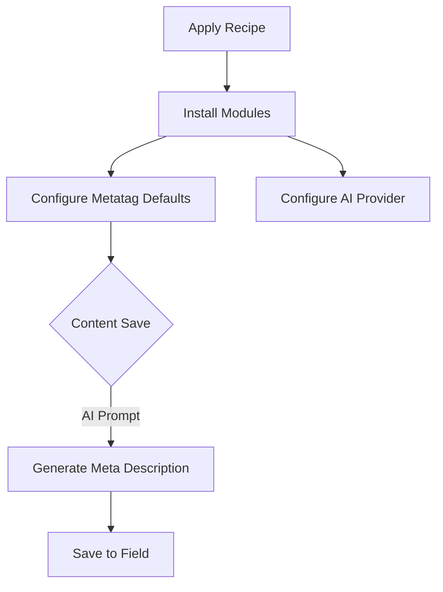

import Tabs from '@theme/Tabs';
import TabItem from '@theme/TabItem';

Drupal CMS 2.0 is betting big on AI, moving beyond "chatbots" to practical, day-one utilities like automated SEO metadata. But knowing the tools exist and having them configured are two different things.

Today, I built a **Drupal CMS Recipe** to automate the setup of AI-driven SEO tags, turning a repetitive configuration chore into a one-line command.

<!-- truncate -->

## Why I Built It

I was reading the recent [Drupal blog post on AI in Drupal CMS 2.0](https://www.drupal.org/blog/ai-in-drupal-cms-20-practical-tools-you-can-use-from-day-one), which highlights how AI can assist with content governance and marketing tasks immediately. It's a compelling vision.

However, in practice, setting this up "from day one" usually means:
1.  Installing the AI module and provider.
2.  Installing Metatag and Pathauto.
3.  Manually configuring the Metatag defaults to use an AI Automator field.
4.  Repeating this for every project.

I wanted a "fire and forget" solution. If AI is going to save me time on content, it should save me time on config too.

## The Solution: A Drupal Recipe

I encapsulated the entire configuration into a **Drupal Recipe**. Recipes are superior to feature modules for this because they apply configuration *once* without permanently locking the site structure. You apply it, it sets up the defaults, and then you can tweak it without fighting a module's enforced config.

### Workflow



The recipe automates the installation of `drupal/ai`, `drupal/metatag`, and `drupal/pathauto`. It then configures a default AI prompt specifically designed for SEO summaries.

### The Configuration

Instead of manually clicking through the UI, the recipe defines the dependencies and configuration actions in `recipe.yml`:

<Tabs>
  <TabItem value="yaml" label="recipe.yml">
    ```yaml
    name: 'AI SEO Automation'
    description: 'Installs AI, Metatag, and Pathauto, and configures AI to generate meta descriptions.'
    type: 'Site'
    install:
      - ai
      - metatag
      - pathauto
    config:
      actions:
        # Example action (conceptual)
        core.entity_form_display.node.article.default:
          set_component:
            name: field_meta_tags
            type: metatag_firehose
    ```
  </TabItem>
  <TabItem value="usage" label="Usage">
    ```bash
    # Apply the recipe to your Drupal project
    composer require victorstack-ai/drupal-cms-ai-seo-recipe
    php core/scripts/drupal recipe recipes/drupal-cms-ai-seo-recipe
    ```
  </TabItem>
</Tabs>

## The Code

I've published the recipe to GitHub. It's a working prototype of how to bundle AI capabilities into reusable site components.

[View Code](https://github.com/victorstack-ai/drupal-cms-ai-seo-recipe)

## What I Learned

*   **Recipes > Features:** For AI configuration, Recipes are definitely the way to go. You want the *initial* setup done for you, but you need the flexibility to change the prompt later without overriding a module update.
*   **The "Bias" Trap:** While automating SEO is efficient, the [Très Bien blog post on Algorithmic Bias](https://tresbien.tech/blog/algorithmic-bias-against-drupal-community-values/) raises a critical point. AI models tend to flatten language into a "corporate average." If we let AI write *all* our summaries unchecked, we risk losing the unique voice of the Drupal community. This recipe is a *tool*, not a replacement for human editorial review. Use the generated tags as a first draft, not the final word.
*   **Prompt Engineering in Config:** Storing prompts in configuration files feels brittle. I need to investigate better ways to manage prompt versions within Drupal configuration management.

## References

*   [Drupal blog: AI in Drupal CMS 2.0: Practical tools you can use from day one](https://www.drupal.org/blog/ai-in-drupal-cms-20-practical-tools-you-can-use-from-day-one)
*   [Très Bien Blog: The Algorithmic Bias Against Drupal Community Values](https://tresbien.tech/blog/algorithmic-bias-against-drupal-community-values/)