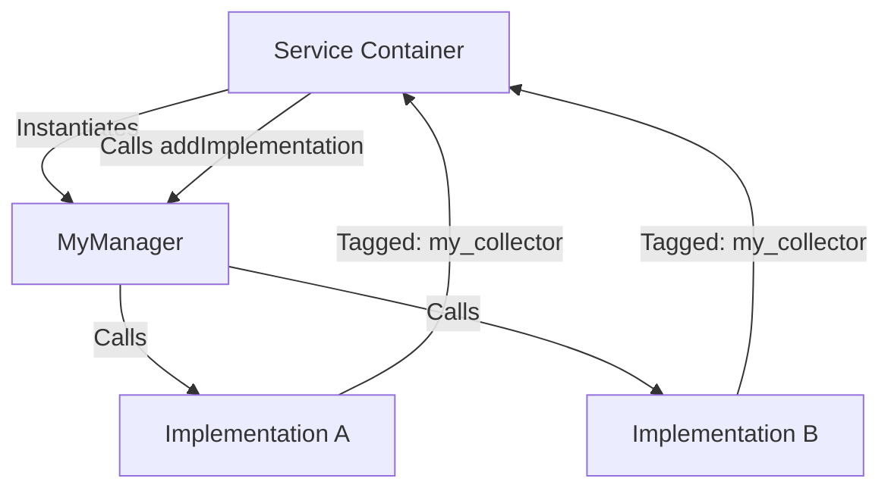

import Tabs from '@theme/Tabs';
import TabItem from '@theme/TabItem';

If you've ever wondered how Drupal magically discovers all its breadcrumb builders, access checkers, or authentication providers, you're looking at the **Service Collector** pattern. It's the secret sauce that makes Drupal one of the most extensible CMSs on the planet.

## Why I Built It

In complex Drupal projects, you often end up with a "Manager" class that needs to execute logic across a variety of implementations. Hardcoding these dependencies into the constructor is a maintenance nightmare. Instead, we use Symfony tags and Drupal's collector mechanism to let implementations "register" themselves with the manager.

I wanted to blueprint a clean implementation of this because, while common in core, it's often misunderstood in contrib space.

## The Solution

The Service Collector pattern relies on two pieces: a **Manager** class that defines a collection method (usually `addMethod`) and a **Service Definition** that uses a `tag` with a `collector` attribute.



### Implementation Details

In the modern Drupal container, you don't even need a `CompilerPass` for simple cases. You can define the collector directly in your `services.yml`.

<Tabs>
  <TabItem value="yml" label="services.yml">
    ```yaml
    services:
      my_module.manager:
        class: Drupal\my_module\MyManager
        tags:
          - { name: service_collector, tag: my_plugin, call: addPlugin }

      my_module.plugin_a:
        class: Drupal\my_module\PluginA
        tags:
          - { name: my_plugin, priority: 10 }
    ```
  </TabItem>
  <TabItem value="php" label="MyManager.php">
    ```php
    namespace Drupal\my_module;

    class MyManager {
      protected $plugins = [];

      public function addPlugin(MyInterface $plugin) {
        $this->plugins[] = $plugin;
      }

      public function executeAll() {
        foreach ($this->plugins as $plugin) {
          $plugin->doWork();
        }
      }
    }
    ```
  </TabItem>
</Tabs>

:::tip
Always use `priority` in your tags if order matters. Drupal's service collector respects it by default.
:::

## The Code

I've scaffolded a demo module that implements a custom "Data Processor" pipeline using this pattern. It shows how to handle priorities and type-hinted injection.

[View Code](https://github.com/victorstack-ai/drupal-service-collector-demo)

## What I Learned

*   **Decoupling is King:** The manager doesn't need to know *anything* about the implementations until runtime.
*   **Performance:** Service collectors are evaluated during container compilation. This means there's zero overhead at runtime for discovering services.
*   **Council Insight:** Reading David Bishop's thoughts on UK Council websites reminded me that "architectural elegance" doesn't matter if the user journey is broken. Even the best service container won't save a site with poor accessibility or navigation.
*   **Gotcha:** If your manager requires implementations to be available during its own constructor, you might run into circular dependencies. Avoid doing work in the constructor; use the collected services later.

## References

- [The Drop Times: David Bishop on Council Insight and Rethinking How UK Council Websites Are Evaluated](https://www.thedroptimes.com/interview/66236/david-bishop-interview-council-insight-user-journeys-and-evaluating-uk-council-websites?utm_source=Drupal Planet)
- [David Bishop on Council Insight and Rethinking How UK Council Websites Are Evaluated](https://www.thedroptimes.com/interview/66236/david-bishop-interview-council-insight-user-journeys-and-evaluating-uk-council-websites)
- [The Drop Times: Drupal service container deep dive (Part 3): service collectors](https://www.thedroptimes.com/66222/drupal-service-container-deep-dive-part-3-service-collectors?utm_source=Drupal Planet)
