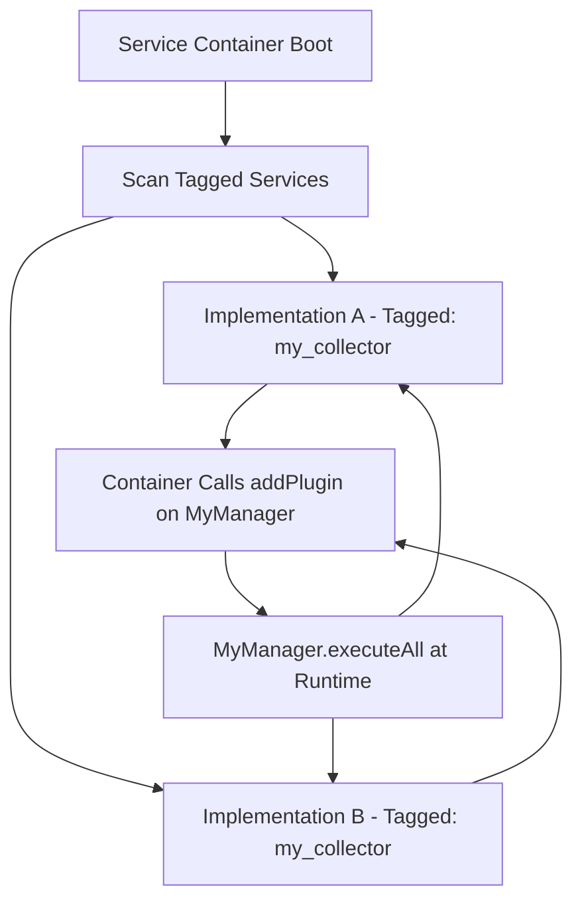

import TOCInline from '@theme/TOCInline';

If you have ever wondered how Drupal magically discovers all its breadcrumb builders, access checkers, or authentication providers, you are looking at the **Service Collector** pattern. It is the secret sauce that makes Drupal one of the most extensible CMSs on the planet.

<!-- truncate -->

<TOCInline toc={toc} minHeadingLevel={2} maxHeadingLevel={2} />

<details>
<summary>TL;DR — 30 second version</summary>

- Service Collectors let implementations "register" themselves with a Manager via Symfony tags
- Zero runtime overhead -- evaluated during container compilation
- No CompilerPass needed for simple cases in modern Drupal
- Always use `priority` in your tags if execution order matters

</details>

## Why I Built It

In complex Drupal projects, you often end up with a "Manager" class that needs to execute logic across a variety of implementations. Hardcoding these dependencies into the constructor is a maintenance nightmare. Instead, we use Symfony tags and Drupal's collector mechanism to let implementations "register" themselves with the manager.

I wanted to blueprint a clean implementation of this because, while common in core, it is often misunderstood in contrib space.

## The Architecture

The Service Collector pattern relies on two pieces: a **Manager** class that defines a collection method (usually `addMethod`) and a **Service Definition** that uses a `tag` with a `collector` attribute.


```mermaid
flowchart TD
  A[Service Container Boot] --> B[Scan Tagged Services]
  B --> C[Implementation A - Tagged: my_collector]
  B --> D[Implementation B - Tagged: my_collector]
  C --> E[Container Calls addPlugin on MyManager]
  D --> E
  E --> F[MyManager.executeAll at Runtime]
  F --> C
  F --> D
```

## Implementation Details

In the modern Drupal container, you don't even need a `CompilerPass` for simple cases. You can define the collector directly in your `services.yml`.

### Service Definition

```yaml title="my_module.services.yml" showLineNumbers
services:
  my_module.manager:
    class: Drupal\my_module\MyManager
    tags:
      - { name: service_collector, tag: my_plugin, call: addPlugin }

  my_module.plugin_a:
    class: Drupal\my_module\PluginA
    tags:
      - { name: my_plugin, priority: 10 }
```

### Manager Class

```php title="src/MyManager.php" showLineNumbers
namespace Drupal\my_module;

class MyManager {
  protected $plugins = [];

  public function addPlugin(MyInterface $plugin) {
    $this->plugins[] = $plugin;
  }

  public function executeAll() {
    foreach ($this->plugins as $plugin) {
      $plugin->doWork();
    }
  }
}
```

:::tip[Top Takeaway]
Always use `priority` in your tags if order matters. Drupal's service collector respects it by default. This is how core ensures breadcrumb builders, access checkers, and auth providers run in the right sequence.
:::

:::info[Context]
Service collectors are evaluated during container compilation. This means there is zero overhead at runtime for discovering services. The cost is paid once at build time, not on every request.
:::

## The Code

I have scaffolded a demo module that implements a custom "Data Processor" pipeline using this pattern. It shows how to handle priorities and type-hinted injection.

[View Code](https://github.com/victorstack-ai/drupal-service-collector-demo)

## What I Learned

- **Decoupling is King:** The manager doesn't need to know *anything* about the implementations until runtime.
- **Performance:** Service collectors are evaluated during container compilation. Zero overhead at runtime for discovering services.
- **Council Insight:** Reading David Bishop's thoughts on UK Council websites reminded me that "architectural elegance" doesn't matter if the user journey is broken. Even the best service container won't save a site with poor accessibility or navigation.
- **Gotcha:** If your manager requires implementations to be available during its own constructor, you might run into circular dependencies. Avoid doing work in the constructor; use the collected services later.

## Signal Summary

| Topic | Signal | Action | Priority |
|---|---|---|---|
| Service Collectors | Core extensibility pattern | Use for any Manager + implementations setup | High |
| Priority Tags | Execution order matters | Always set priority in service tags | Medium |
| Container Compilation | Zero runtime overhead | Use for performance-sensitive paths | Medium |
| UK Council Websites | User journey > architecture | Audit user paths, not just code quality | Low |

## Why This Matters for Drupal and WordPress

The Service Collector pattern is central to how Drupal core organizes breadcrumb builders, access checkers, and authentication providers — understanding it is essential for any serious contrib module developer. WordPress developers building complex plugins face a similar challenge of extensible service discovery; studying Drupal's container-based approach offers a blueprint for cleaner plugin architectures, especially as WordPress explores more object-oriented patterns in newer releases.

## References

- [The Drop Times: David Bishop on Council Insight and Rethinking How UK Council Websites Are Evaluated](https://www.thedroptimes.com/interview/66236/david-bishop-interview-council-insight-user-journeys-and-evaluating-uk-council-websites?utm_source=Drupal Planet)
- [David Bishop on Council Insight and Rethinking How UK Council Websites Are Evaluated](https://www.thedroptimes.com/interview/66236/david-bishop-interview-council-insight-user-journeys-and-evaluating-uk-council-websites)
- [The Drop Times: Drupal service container deep dive (Part 3): service collectors](https://www.thedroptimes.com/66222/drupal-service-container-deep-dive-part-3-service-collectors?utm_source=Drupal Planet)
