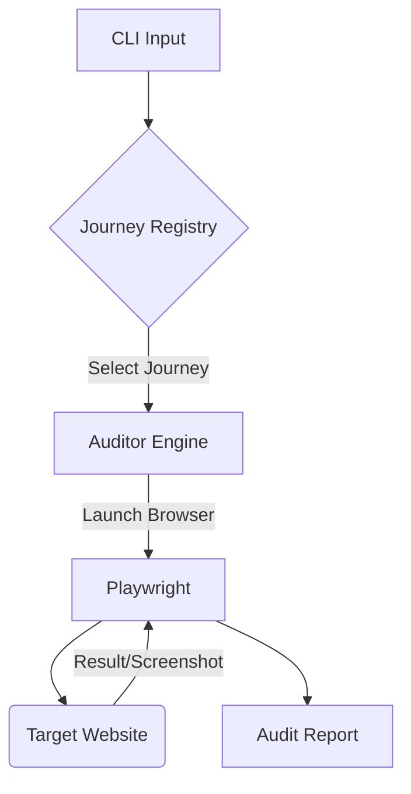

import Tabs from '@theme/Tabs';
import TabItem from '@theme/TabItem';

I built a Playwright-based auditor to automate the "user journey" evaluation methodology for UK Council websites, inspired by David Bishop's work.

<!-- truncate -->

## Why I Built It

I was reading **David Bishop's interview on The Drop Times** about "Council Insight" and his approach to evaluating UK council websites. He argues for looking beyond simple uptime or basic accessibility checks and focusing on the actual *user journey*—can a citizen actually pay their tax or find their bin collection day without frustration?

Manual auditing is slow and subjective. I wanted to see if I could codify these "happy paths" into a reproducible, automated suite. If we can define what a "successful" interaction looks like for a standard service (like "Pay Council Tax"), we can run it against 100+ sites overnight rather than one by one.

## The Solution

I built a CLI tool, `uk-council-journey-audit`, that models user intents as **Journeys**. It uses **Playwright** to execute these journeys against a target URL.

The architecture is simple:



The core challenge isn't the scraping—it's the **resilience**. Council websites run on everything from Drupal to SharePoint to custom legacy piles. I used a "fuzzy selector" approach in Playwright, looking for semantic markers (e.g., buttons labeled "Pay", "Submit", "Search") rather than rigid CSS IDs.

### Implementation Details

I separated the definition of a `Journey` from the execution logic. This allows non-developers to potentially define steps in a JSON or YAML format later.

<Tabs>
  <TabItem value="py" label="models.py">
    ```python
    from dataclasses import dataclass
    from typing import List, Optional

    @dataclass
    class JourneyStep:
        action: str  # 'click', 'fill', 'verify_text'
        target: str  # Semantic target e.g. 'Pay Button'
        value: Optional[str] = None

    @dataclass
    class AuditResult:
        success: bool
        duration_ms: int
        failure_reason: Optional[str] = None
        screenshot_path: Optional[str] = None
    ```
  </TabItem>
  <TabItem value="cli" label="cli.py">
    ```python
    import click
    from auditor import run_audit

    @click.command()
    @click.argument('url')
    @click.option('--journey', default='pay_tax', help='Type of journey to audit')
    def audit(url, journey):
        """Run a Council Insight audit against a URL."""
        click.echo(f"Auditing {url} for journey: {journey}...")
        result = run_audit(url, journey)
        if result.success:
            click.secho("SUCCESS", fg="green")
        else:
            click.secho(f"FAILED: {result.failure_reason}", fg="red")
    ```
  </TabItem>
</Tabs>

:::tip
When automating government sites, always respect `robots.txt` and include a polite User-Agent string. I baked a throttle into the auditor to ensure we don't accidentally DOS a small council server.
:::

## The Code

I've open-sourced the auditor. It's a work in progress, but the core "Pay Council Tax" journey is functional.

[View Code](https://github.com/victorstack-ai/uk-council-journey-audit)

## What I Learned

*   **Semantic auditing is hard:** You can't just check for HTTP 200. A page that loads a "Service Unavailable" message is a technical success but a user journey failure. My auditor had to learn to recognize "soft 404s" (error messages embedded in valid HTML).
*   **Standardization is a myth:** Even among councils using the same CMS (like LocalGov Drupal), the actual implementation of forms varies wildly.
*   **The "Council Insight" value:** David Bishop is right. The technical stack matters less than the pathway. I found sites that were technically fast but required 5 clicks to find a payment page, whereas slower sites had it one click away. Automating the *click count* metric is a powerful way to visualize this friction.

## References

*   [The Drop Times: David Bishop on Council Insight and Rethinking How UK Council Websites Are Evaluated](https://www.thedroptimes.com/interview/66236/david-bishop-interview-council-insight-user-journeys-and-evaluating-uk-council-websites?utm_source=Drupal%20Planet)
*   [David Bishop on Council Insight and Rethinking How UK Council Websites Are Evaluated](https://www.thedroptimes.com/interview/66236/david-bishop-interview-council-insight-user-journeys-and-evaluating-uk-council-websites)