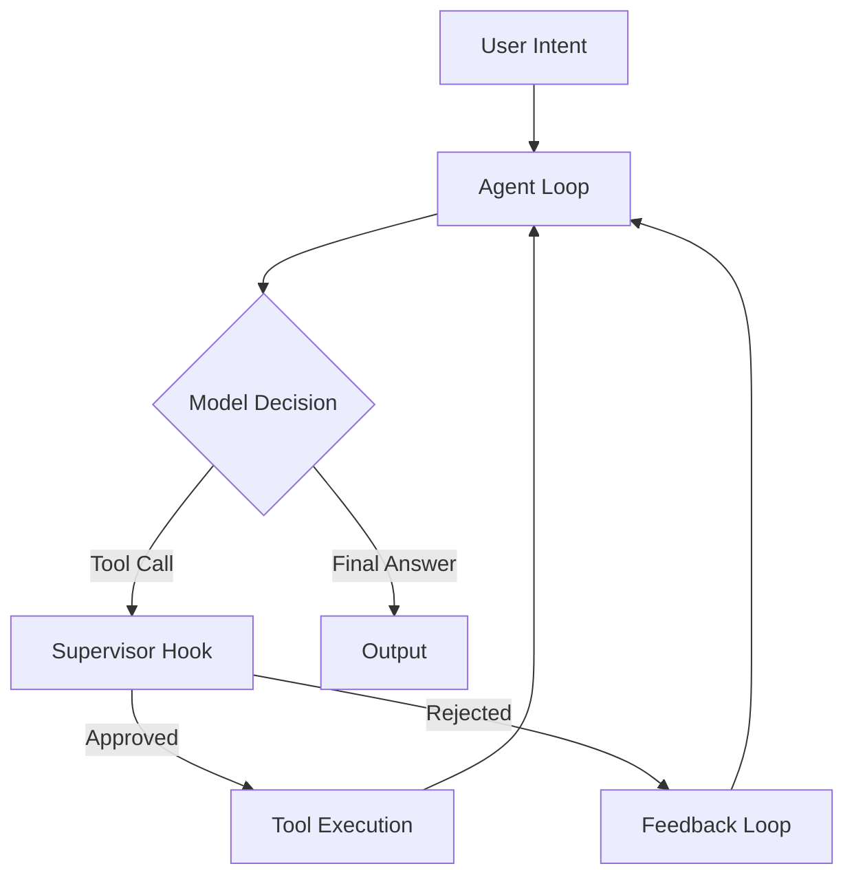

import Tabs from '@theme/Tabs';
import TabItem from '@theme/TabItem';

GPT-5.3-Codex just dropped, and I wasted no time throwing it into a custom agent harness to see if it can actually handle complex supervision loops better than its predecessors.

## Why I Built It

The announcement of [GPT-5.3-Codex](https://openai.com/index/introducing-gpt-5-3-codex) promised significantly better instruction following for long-chain tasks. Usually, when a model claims "better reasoning," it means "more verbose." I wanted to verify if it could actually maintain state and adhere to strict tool-use protocols without drifting off into hallucination land after turn 10.

Instead of testing it on a simple script, I built `codex-agent-harness`—a Python-based environment that simulates a terminal, manages a tool registry, and enforces a supervisor hook to catch the agent if it tries to run `rm -rf /` (or just hallucinates a command that doesn't exist).

## The Solution

The harness is built around a few core components: a `ToolRegistry` that maps Python functions to schema definitions, and an `Agent` loop that manages the conversation history and context window.

One of the key features is the "Supervisor Hook." This isn't just a logger; it's an interceptor. Before the agent's chosen action is executed, the harness pauses, evaluates the safety of the call, and can reject it entirely.

### Architecture



### The Tool Registry

I wanted the tool definitions to be as lightweight as possible. I used decorators to register functions, automatically generating the JSON schema needed for the API.

<Tabs>
  <TabItem value="py" label="Registry Implementation">
  ```python
  class ToolRegistry:
      def __init__(self):
          self.tools = {}

      def register(self, func):
          """Decorator to register a tool."""
          schema = self._generate_schema(func)
          self.tools[func.__name__] = {
              "func": func,
              "schema": schema
          }
          return func

      def _generate_schema(self, func):
          # Simplified schema generation logic
          return {
              "name": func.__name__,
              "description": func.__doc__,
              "parameters": {"type": "object", "properties": {}}
          }
  ```
  </TabItem>
  <TabItem value="usage" label="Usage">
  ```python
  registry = ToolRegistry()

  @registry.register
  def read_file(file_path: str):
      """Reads a file from the local filesystem."""
      with open(file_path, 'r') as f:
          return f.read()
  ```
  </TabItem>
</Tabs>

## The Code

I've published the harness as a standalone repo. It's a great starting point if you want to test new models in a controlled, local environment without spinning up a full orchestration framework.

[View Code](https://github.com/victorstack-ai/codex-agent-harness)

## What I Learned

*   **Context Adherence is Real:** GPT-5.3-Codex actually respects the system prompt's negative constraints (e.g., "Do not use `sudo`") much better than 4.6, which often needed reminders.
*   **Structured Outputs:** The model is far less prone to "syntax drift" in its JSON outputs. I didn't have to write nearly as much retry logic for malformed JSON.
*   **The "Lazy" Factor:** Interestingly, 5.3 seems a bit *too* efficient. If you don't explicitly ask for verbose logs, it will just say "Done." Great for production, bad for debugging. I had to force it to be verbose in the system prompt.

## References

*   [Opus 4.6 and Codex 5.3](https://simonwillison.net/2026/Feb/5/two-new-models/#atom-everything)
*   [Introducing GPT-5.3-Codex](https://openai.com/index/introducing-gpt-5-3-codex)
*   [GPT-5.3-Codex System Card](https://openai.com/index/gpt-5-3-codex-system-card)