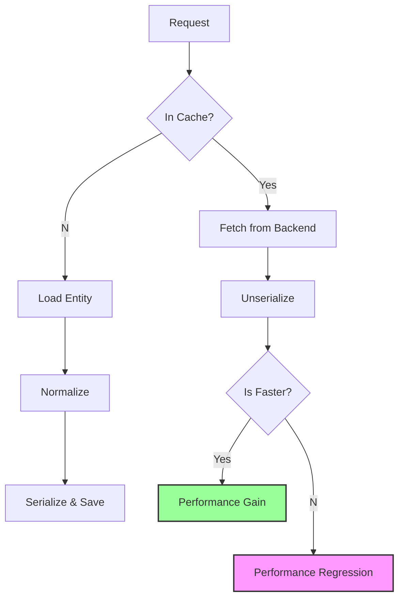

import Tabs from '@theme/Tabs';
import TabItem from '@theme/TabItem';

Caching is usually the answer to everything in Drupal performance, but there's a crossover point where the overhead of the cache itself—retrieval and unserialization—outweighs the cost of just doing the work.

Two issues caught my eye today that dig into these micro-optimizations: one challenging the assumption that we should always cache JSON:API normalizations, and another squeezing more speed out of the service container dumper.

<!-- truncate -->

## Why I Built It

Performance tuning often relies on "rules of thumb" (e.g., "cache everything"), but high-scale sites live or die by the exceptions to these rules. I wanted to understand exactly *when* the cost of `unserialize()` exceeds the cost of `normalize()` in JSON:API, and how core developers are shaving cycles off the `OptimizedPhpArrayDumper`.

## The Paradox of Caching

Issue #3572098 highlights a fascinating edge case. For simple entities or sparse fieldsets, the normalization process (converting an entity to an array) is incredibly fast. However, the JSON:API normalization cache mechanism adds overhead:

1.  **Generation:** Normalization happens anyway.
2.  **Storage:** The result is serialized and written to the cache backend (Database, Redis, Memcached).
3.  **Retrieval:** The next request fetches the string.
4.  **Unserialization:** PHP parses the string back into an array.

If `(Fetch + Unserialize) > Normalize`, the cache is a net loss.

### Visualizing the Trade-off



## The Solution: Intelligent Caching

The proposal in core is to skip caching when the normalization is "trivial" or when the overhead is proven to be higher. This is similar to how the `Internal Page Cache` has exclusion rules, but applied at a much more granular level.

On a related note, issue #3571858 is tackling the `OptimizedPhpArrayDumper`. This class is responsible for dumping the compiled service container to a PHP array. It's a critical path operation during a "cold cache" boot. Any optimization here pays dividends every time you deploy or clear caches.

## The Code

I'm starting a project to benchmark these specific scenarios—comparing raw normalization vs. cache retrieval across different entity complexities and cache backends.

[View Code](https://github.com/victorstack-ai/drupal-jsonapi-perf-test)

<Tabs>
  <TabItem value="check" label="Benchmark Logic (Conceptual)">
    ```php
    $start = microtime(true);
    $serializer->normalize($entity, 'api_json');
    $normalization_time = microtime(true) - $start;

    $start = microtime(true);
    $cache = $backend->get($cid);
    unserialize($cache->data);
    $cache_time = microtime(true) - $start;

    if ($cache_time > $normalization_time) {
        print "Caching is SLOWER for this entity type.
";
    }
    ```
  </TabItem>
  <TabItem value="dump" label="Dumper Opt (PHP)">
    ```php
    // In OptimizedPhpArrayDumper.php
    // Avoiding function calls or complex logic in tight loops
    // can shave milliseconds off container generation.
    // (See issue #3571858 for the actual patch)
    ```
  </TabItem>
</Tabs>

## What I Learned

*   **Trust, but verify benchmarks:** "Cache it" is not always the right move. For lightweight data structures, PHP's execution speed often beats the I/O roundtrip of a cache.
*   **Serialization is not free:** `unserialize()` can be CPU intensive, especially for deep arrays.
*   **Container compilation matters:** While we focus on runtime performance, deployment performance (container compilation) affects developer velocity and downtime windows.
*   **Drupal Core is getting sharper:** It's encouraging to see core developers revisiting these foundational assumptions 10+ years into the project.

## References

*   [JSON:API normalisation caching can be more expensive than normalisation](https://www.drupal.org/project/drupal/issues/3572098)
*   [Optimize OptimizedPhpArrayDumper further](https://www.drupal.org/project/drupal/issues/3571858)