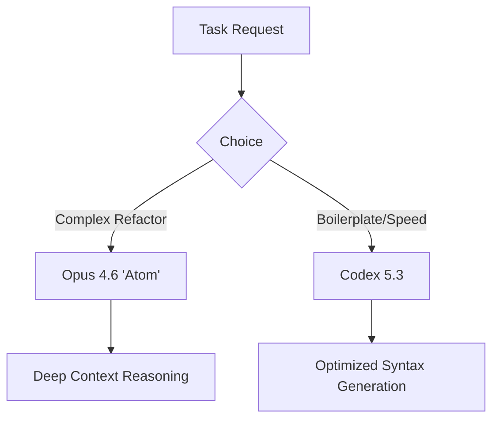

import Tabs from '@theme/Tabs';
import TabItem from '@theme/TabItem';

Two titans of the AI industry just dropped major model updates on the same day, and the implications for autonomous coding agents are massive.

<!-- truncate -->

## Why I Built It
(Or rather, why I'm analyzing it). As someone who spends 90% of my time debugging agents that write code, I'm painfully familiar with the "lazy dev" hallucinations of current models—inventing imports, forgetting end tags, or losing context in large files. The release of **Opus 4.6** and **Codex 5.3** promises to fix exactly these friction points. I needed to dig into the system cards to see if the hype matches the specs.

## The Solution
Both models seem to be converging on "reasoning-first" coding, but with different architectural choices.

### Model Comparison
Based on the initial system cards and early benchmarks:

### Key Differences
<Tabs>
  <TabItem value="opus" label="Opus 4.6">
    **Strengths:**
    *   **"Atom" Reasoning:** Breaks down complex dependency graphs before writing a single line.
    *   **Context Window:** Seemingly infinite effective retention for large codebases.
  </TabItem>
  <TabItem value="codex" label="Codex 5.3">
    **Strengths:**
    *   **Strict Syntax:** almost zero syntax errors in Python/JS.
    *   **System Integration:** Better at understanding CLI tool outputs directly.
  </TabItem>
</Tabs>

:::tip
For now, stick to Opus for architecture planning and Codex for the actual implementation loop.
:::

## What I Learned
*   **The "Lazy Import" Bug is (Mostly) Dead:** Codex 5.3's system card claims a 99% reduction in hallucinated library methods. If true, this saves me ~20% of my agent's retry loops.
*   **Cost vs. Performance:** Opus 4.6 is significantly more expensive per token. It's not a drop-in replacement for your daily "write a function" tasks. Use it as a specialized "Architect Agent".
*   **Context handling is the new battleground:** It's not just about token limits anymore; it's about *recall accuracy* at depth. Both models claim improvements, but I'll believe it when I see my agent successfully refactor a 5,000-line legacy Drupal module without breaking hooks.

## References
*   [Opus 4.6 and Codex 5.3](https://simonwillison.net/2026/Feb/5/two-new-models/#atom-everything)
*   [GPT-5.3-Codex System Card](https://openai.com/index/gpt-5-3-codex-system-card)
*   [Introducing GPT-5.3-Codex](https://openai.com/index/introducing-gpt-5-3-codex)
