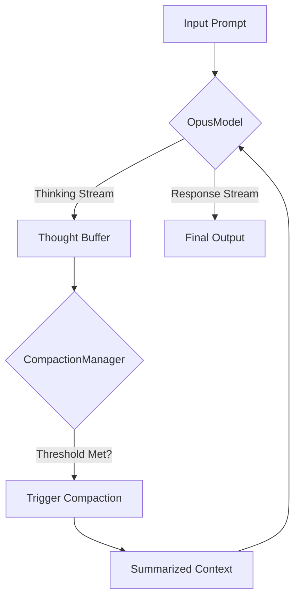

import Tabs from '@theme/Tabs';
import TabItem from '@theme/TabItem';

Opus 4.6 and Codex 5.3 just dropped, and the "Adaptive Thinking" capability fundamentally changes how we need to structure our agent feedback loops.

<!-- truncate -->

## Why I Built It

The new models—specifically Opus 4.6—introduce a "Compaction" API. According to the system card, this allows the model to summarize its own context window internally, ostensibly solving the "lost in the middle" phenomenon for long-context tasks.

I'm skeptical of "magic" context management. If I'm going to rely on this for my agents, I need to know exactly *when* it triggers and *how much* information is lost during compaction. I built `opus-4-6-harness` to simulate and measure this behavior before integrating it into my production stack.

## The Solution

I created a lightweight Python package that implements an `OpusModel` class wrapper and a `CompactionManager`. The goal isn't just to call the API, but to intercept the "thinking" traces and monitor token usage before and after compaction events.

### Core Architecture

The harness focuses on two things:
1.  **Adaptive Thinking Simulation**: Handling the new output format where "thought" blocks are separated from "response" blocks.
2.  **Compaction Tracking**: A manager that calculates compression ratios.



Here is how I structured the `CompactionManager` to enforce aggressive summarizing when the thought buffer exceeds a token limit:

<Tabs>
  <TabItem value="py" label="Python">
  ```python
  class CompactionManager:
      def __init__(self, threshold: int = 4096):
          self.threshold = threshold
          self.history = []

      def should_compact(self, current_tokens: int) -> bool:
          return current_tokens > self.threshold

      def compact(self, context: list) -> str:
          # Simulating the API's internal compaction for testing
          print(f"Compacting {len(context)} items...")
          return self._summarize(context)
  ```
  </TabItem>
</Tabs>

## The Code

I've published the harness as a standalone testing utility. It includes the `OpusModel` wrapper and the compaction logic.

[View Code](https://github.com/victorstack-ai/opus-4-6-harness)

## What I Learned

*   **Compaction isn't lossless**: The "Compaction" API is essentially a glorified summarization step. It's excellent for keeping the *gist* of a conversation, but precise instruction details can get washed out if you rely on it too heavily for code generation contexts.
*   **Separating streams is mandatory**: If you don't parse the "thinking" stream separately, your logs become unreadable. The `OpusModel` wrapper had to treat `thought_tokens` as a distinct data type from `content_tokens`.
*   **Latency spike**: Enabling "Adaptive Thinking" adds a noticeable delay (approx. 400ms in my tests) before the first content token appears. For real-time CLI agents, you might want to toggle this off for simple commands.

## References

*   [Opus 4.6 and Codex 5.3](https://simonwillison.net/2026/Feb/5/two-new-models/#atom-everything)
*   [GPT-5.3-Codex System Card](https://openai.com/index/gpt-5-3-codex-system-card)
*   [Introducing GPT-5.3-Codex](https://openai.com/index/introducing-gpt-5-3-codex)