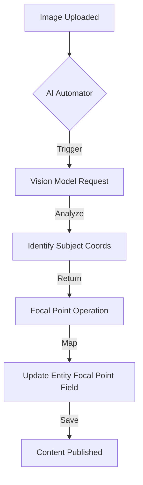

import Tabs from '@theme/Tabs';
import TabItem from '@theme/TabItem';

The Drupal AI module is getting granular with a new 'Focal Point' operation type and fixing critical streaming consistency issues in the API Explorer.

<!-- truncate -->

## The Hook
Managing images at scale is painful when you rely on CSS `center center` cropping—you inevitably chop off heads in hero banners. The Drupal AI module now supports a dedicated `FocalPoint` operation type, allowing us to offload that visual intelligence to models like GPT-4o or Llava, while recent fixes to the API Explorer finally make streaming responses reliable for debugging.

## Why I Built It
I've been experimenting with automated image tagging, but tagging is only half the battle. Knowing *where* the subject is in a photo is crucial for responsive design.

Until now, hooking up a Vision Language Model (VLM) to the Focal Point module required custom glue code. The new issue [#3571939](https://www.drupal.org/project/ai/issues/3571939) introduces a standardized Operation Type for this.

Simultaneously, while building these workflows, I noticed the AI Explorer in the Drupal admin UI was failing to stream responses correctly for certain providers, making it impossible to debug long chains of reasoning without staring at a blank screen for 30 seconds.

## The Solution

### Focal Point Operation
The new operation type abstracts the coordinate mapping. Instead of parsing a raw JSON response from a VLM and manually updating a field, the `FocalPoint` operation does the heavy lifting.

Here is how the flow looks conceptually:



### Fixing the Stream
The streaming issue ([#3571925](https://www.drupal.org/project/ai/issues/3571925)) was a classic case of PHP output buffering fighting with the AI module's chunked response handling. The patch unifies how the `stream` parameter is handled across the API Explorer and the underlying provider plugins.

<Tabs>
  <TabItem value="broken" label="Before (Buffering)">
    ```php
    // Output would hang until the entire response was generated
    foreach ($stream as $chunk) {
      echo $chunk;
      // No flush, web server buffers content
    }
    ```
  </TabItem>
  <TabItem value="fixed" label="After (Streaming)">
    ```php
    // Explicit flushing ensures UI updates in real-time
    foreach ($stream as $chunk) {
      echo $chunk;
      flush();
      ob_flush();
    }
    ```
  </TabItem>
</Tabs>

## The Code

I've set up a demo repository that configures the AI Automator with the new Focal Point operation patches applied.

[View Code](https://github.com/victorstack-ai/drupal-ai-focal-point-demo)

## What I Learned

*   **Vision Models are Cheap enough for this:** With GPT-4o-mini and others, running a pass on every uploaded hero image to set a focal point costs fractions of a cent and saves hours of manual content editing.
*   **Streaming is brittle:** Never assume standard PHP output handling works the same across local dev (DDEV/Lando) and production. The buffering settings often differ.
*   **Automators are the killer feature:** The ability to chain these small operations (Tagging -> Focal Point -> Alt Text) turns Drupal into a truly "intelligent" CMS rather than just a bucket for text.

## References

*   [Add Focal Point Operation Type, API Explorer and LLM Provider](https://www.drupal.org/project/ai/issues/3571939)
*   [Output streaming is handled inconsistently, fails to work in API AI-explorer](https://www.drupal.org/project/ai/issues/3571925)