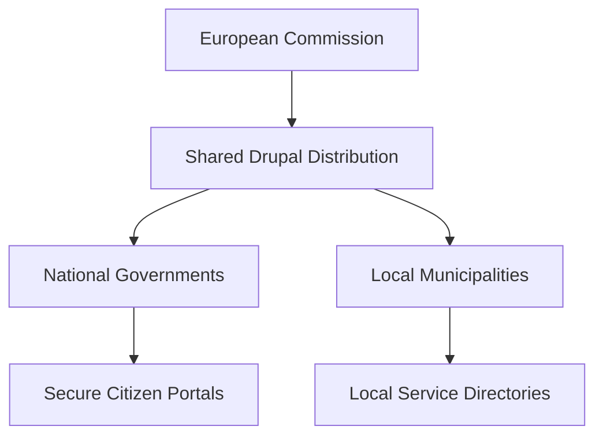

import Tabs from '@theme/Tabs';
import TabItem from '@theme/TabItem';

The "Drupal Pivot" isn't just another conference; it's a signal that the public sector is finally prioritizing digital sovereignty over vendor lock-in.

### The Problem: Vendor Lock-in vs. Public Interest
For years, government agencies have been trapped in proprietary ecosystems. The "Drupal Pivot" and "Drupal4Gov" movements are pushing back, positioning Drupal not just as a CMS, but as a critical infrastructure component for European institutions.

### The Strategy: Sovereignty by Design
The pivot focus is on "sovereignty by design." This means sharing code across borders—what works for a municipality in Belgium should be reusable for a department in Germany.

### The Solution: Shared Patterns vs. Silos
The goal is to move beyond "siloed" contrib and towards highly opinionated, secure distributions that meet EU compliance out of the box.

<Tabs>
  <TabItem value="standard" label="Standard Drupal">
    - General purpose.
    - Massive contrib ecosystem.
    - High maintenance for compliance.
  </TabItem>
  <TabItem value="gov" label="Drupal4Gov Pattern">
    - Hardened security by default.
    - Pre-baked A11y compliance.
    - Multilingual (EU-first) architecture.
  </TabItem>
</Tabs>

### The Code
No separate repo for this topic—this is an analysis of the evolving Drupal ecosystem in the public sector. I've added a task to build a compliance dashboard demo.
[View Code](https://github.com/victorstack-ai/drupal-gov-compliance-dashboard)

:::tip
If you're building for government, don't start from scratch. Look at the `drunomics` and `Tag1` insights on how to leverage existing public sector patterns.
:::

### What I Learned
- **Sovereignty is a feature**: Governments are willing to invest in Open Source specifically to avoid geopolitical and corporate dependency.
- **Sustainability through Contribution**: The "Pivot" highlights that contributing back to Core isn't just altruism; it's how you ensure the software you rely on doesn't bit-rot.
- **The "EU Pattern"**: There's a growing consensus on using Drupal to power large-scale, multilingual, and highly accessible citizen-facing services.

## References
- [ComputerMinds.co.uk: Drupal Pivot EU](https://www.computerminds.co.uk/articles/drupal-pivot-eu)
- [Tag1 Insights: Contributing to Drupal's Future At Drupal Pivot](https://www.tag1.com/blog/contributing-to-drupals-future/?utm_source=rss&utm_medium=feed&utm_campaign=planet_drupal)
- [drunomics: Drupal4Gov EU 2026: How Drupal Powers European Institutions and National Governments](https://drunomics.com/en/blog/drupal4gov-eu-2026-how-drupal-powers-european-institutions-and-national-governments-247)
