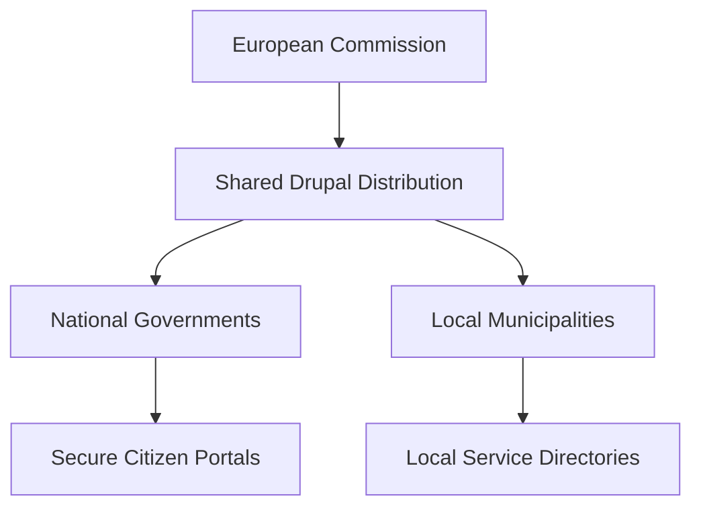
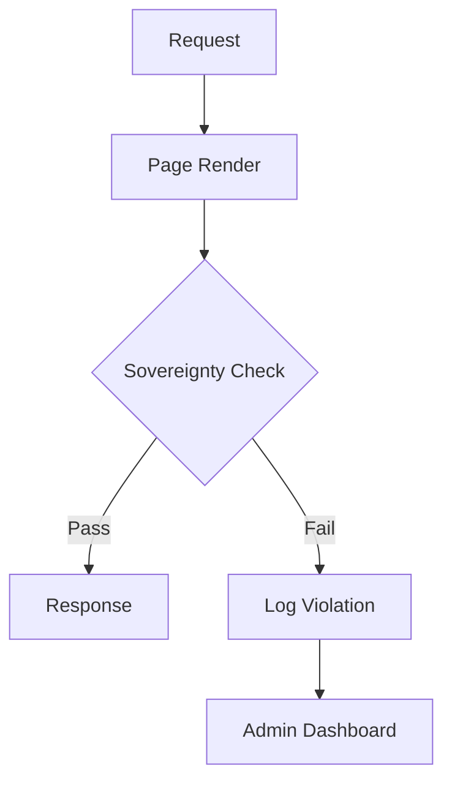

import Tabs from '@theme/Tabs';
import TabItem from '@theme/TabItem';

The "Drupal Pivot" isn't just another conference; it's a signal that the public sector is finally prioritizing digital sovereignty over vendor lock-in. Drupal is becoming the cornerstone of their strategy to escape proprietary ecosystems and guarantee data residency.

<!-- truncate -->

## The Problem: Vendor Lock-in vs. Public Interest

For years, government agencies have been trapped in proprietary ecosystems. The "Drupal Pivot" and "Drupal4Gov" movements are pushing back, positioning Drupal not just as a CMS, but as a critical infrastructure component for European institutions.

European institutions are heavily investing in Drupal not because it's "free," but because it's *theirs*. They can audit it, modify it, and crucially, ensure it doesn't phone home to non-EU servers. However, keeping a Drupal site "sovereign" is hard. Developers inadvertently add CDNs, Google Fonts, or third-party analytics that leak user IP addresses outside the EU/GDPR zone.

## The Strategy: Sovereignty by Design

The pivot focus is on "sovereignty by design." This means sharing code across borders — what works for a municipality in Belgium should be reusable for a department in Germany.



The goal is to move beyond "siloed" contrib and towards highly opinionated, secure distributions that meet EU compliance out of the box.

<Tabs>
  <TabItem value="standard" label="Standard Drupal">
    - General purpose.
    - Massive contrib ecosystem.
    - High maintenance for compliance.
  </TabItem>
  <TabItem value="gov" label="Drupal4Gov Pattern">
    - Hardened security by default.
    - Pre-baked A11y compliance.
    - Multilingual (EU-first) architecture.
  </TabItem>
</Tabs>

## The Solution: EU Sovereignty Checklist Module

I built the **Drupal EU Sovereignty Checklist**, a module that acts as a gatekeeper for your site's external footprint. It audits rendered HTML for external assets (CDNs, trackers, embeds) and flags non-allowlisted URLs so European public sector sites can stay sovereignty-compliant.

It works by scanning your rendered markup and active configuration for:
1. **External Assets**: CSS/JS loaded from CDNs (e.g., `cdn.jsdelivr.net`, `fonts.googleapis.com`).
2. **Third-party Trackers**: Google Analytics, Meta Pixel, etc.
3. **Embeds**: YouTube, Vimeo, Maps without "No-Cookie" modes.

<Tabs>
  <TabItem value="audit" label="Audit Logic (PHP)">
    ```php
    public function auditRenderedHtml(string $html): array {
      $violations = [];
      $dom = new \DOMDocument();
      @$dom->loadHTML($html);
      
      $tags = ['link' => 'href', 'script' => 'src', 'img' => 'src', 'iframe' => 'src'];
      
      foreach ($tags as $tag => $attr) {
        foreach ($dom->getElementsByTagName($tag) as $element) {
          $url = $element->getAttribute($attr);
          if ($this->isExternal($url) && !$this->isAllowlisted($url)) {
            $violations[] = [
              'tag' => $tag,
              'url' => $url,
              'risk' => 'Data Leak / GDPR Violation'
            ];
          }
        }
      }
      return $violations;
    }
    ```
  </TabItem>
  <TabItem value="config" label="Allowlist (YAML)">
    ```yaml
    # sovereignty_checklist.settings.yml
    allowlist_domains:
      - 'europa.eu'
      - 'analytics.europa.eu'
    strict_mode: true
    block_non_compliant_renders: false
    ```
  </TabItem>
</Tabs>

### The Architecture

The module uses a **Service Collector** pattern to allow other modules to register "Sovereignty Auditors."



[View Code](https://github.com/victorstack-ai/drupal-eu-sovereignty-checklist)

:::tip
If you're building for government, don't start from scratch. Look at the `drunomics` and `Tag1` insights on how to leverage existing public sector patterns.
:::

## What I Learned

- **Sovereignty is a feature**: Governments are willing to invest in Open Source specifically to avoid geopolitical and corporate dependency.
- **GDPR is an architectural constraint**: You can't just "bolt on" privacy. If your theme loads fonts from Google, you are leaking data before the consent banner even loads.
- **Local-first is the default**: To be compliant, we need to return to bundling assets locally. Composer asset-packagist and modern build pipelines make this easier, but the default "copy-paste snippet" habit is hard to break.
- **Sustainability through Contribution**: The "Pivot" highlights that contributing back to Core isn't just altruism; it's how you ensure the software you rely on doesn't bit-rot.
- **The "EU Pattern"**: There's a growing consensus on using Drupal to power large-scale, multilingual, and highly accessible citizen-facing services.

## References

- [ComputerMinds.co.uk: Drupal Pivot EU](https://www.computerminds.co.uk/articles/drupal-pivot-eu)
- [Tag1 Insights: Contributing to Drupal's Future At Drupal Pivot](https://www.tag1.com/blog/contributing-to-drupals-future/?utm_source=rss&utm_medium=feed&utm_campaign=planet_drupal)
- [drunomics: Drupal4Gov EU 2026: How Drupal Powers European Institutions and National Governments](https://drunomics.com/en/blog/drupal4gov-eu-2026-how-drupal-powers-european-institutions-and-national-governments-247)
