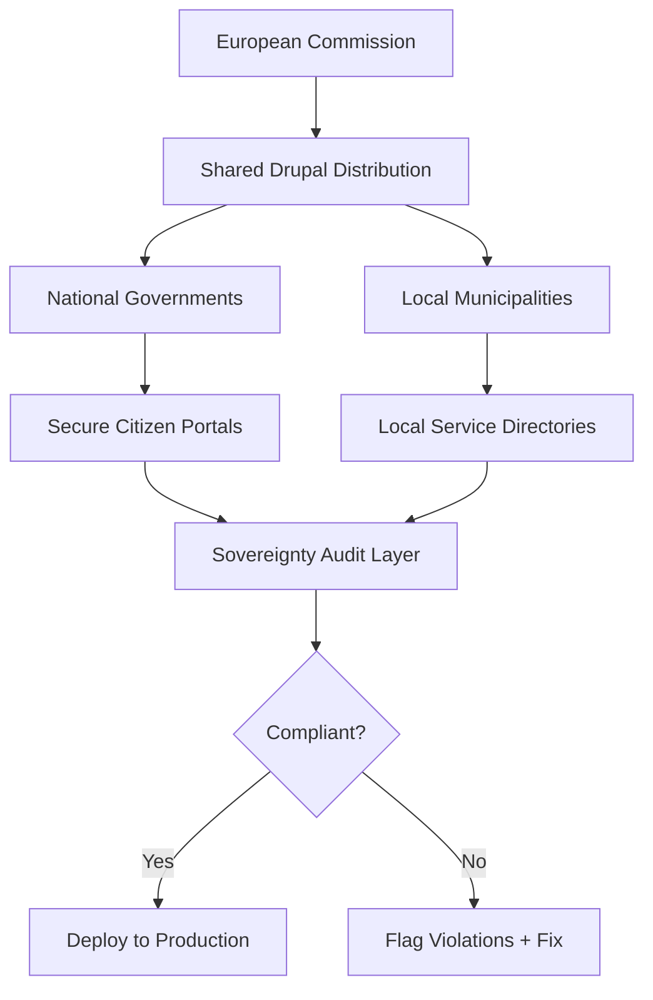
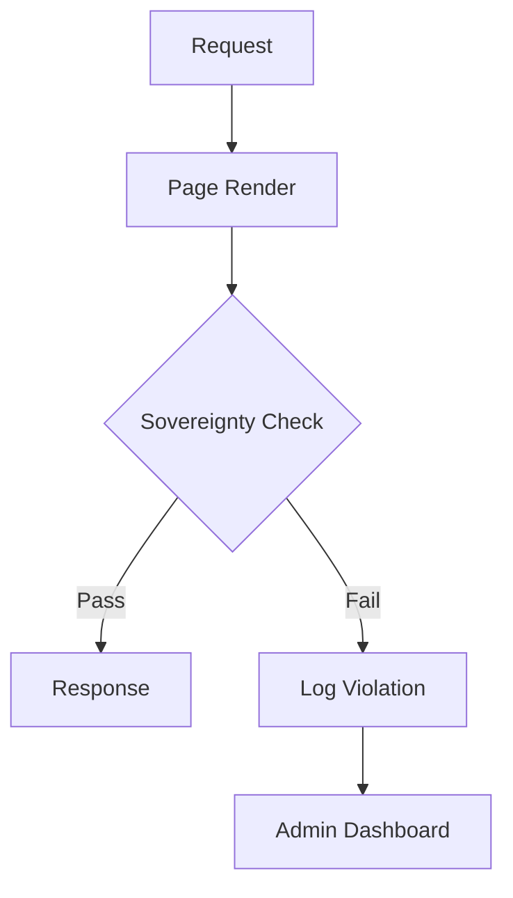

import TOCInline from '@theme/TOCInline';

The "Drupal Pivot" is not just another conference; it is a signal that the public sector is finally prioritizing digital sovereignty over vendor lock-in. Drupal is becoming the foundation of their strategy to escape proprietary ecosystems and guarantee data residency.

<!-- truncate -->

<TOCInline toc={toc} minHeadingLevel={2} maxHeadingLevel={2} />

<details>
<summary>TL;DR — 30 second version</summary>

- European institutions invest in Drupal because they can audit, modify, and control it
- GDPR is an architectural constraint, not a bolt-on
- I built a sovereignty checklist module that audits rendered HTML for external assets
- If your theme loads Google Fonts, you are leaking data before the consent banner loads

</details>

## The Problem: Vendor Lock-in vs. Public Interest

For years, government agencies have been trapped in proprietary ecosystems. The "Drupal Pivot" and "Drupal4Gov" movements are pushing back, positioning Drupal not just as a CMS, but as a critical infrastructure component for European institutions.

European institutions are heavily investing in Drupal not because it is "free," but because it is *theirs*. They can audit it, modify it, and crucially, ensure it does not phone home to non-EU servers. However, keeping a Drupal site "sovereign" is hard. Developers inadvertently add CDNs, Google Fonts, or third-party analytics that leak user IP addresses outside the EU/GDPR zone.

## The Strategy: Sovereignty by Design

The pivot focus is on "sovereignty by design." This means sharing code across borders -- what works for a municipality in Belgium should be reusable for a department in Germany.


```mermaid
flowchart TD
  A[European Commission] --> B[Shared Drupal Distribution]
  B --> C[National Governments]
  B --> D[Local Municipalities]
  C --> E[Secure Citizen Portals]
  D --> F[Local Service Directories]
  E --> G[Sovereignty Audit Layer]
  F --> G
  G --> H{Compliant?}
  H -->|Yes| I[Deploy to Production]
  H -->|No| J[Flag Violations + Fix]
```

The goal is to move beyond "siloed" contrib and towards highly opinionated, secure distributions that meet EU compliance out of the box.

:::info[Context]
Standard Drupal is general purpose with a massive contrib ecosystem but high maintenance for compliance. The Drupal4Gov pattern offers hardened security by default, pre-baked A11y compliance, and multilingual (EU-first) architecture.
:::

## The Solution: EU Sovereignty Checklist Module

I built the **Drupal EU Sovereignty Checklist**, a module that acts as a gatekeeper for your site's external footprint. It audits rendered HTML for external assets (CDNs, trackers, embeds) and flags non-allowlisted URLs so European public sector sites can stay sovereignty-compliant.

It works by scanning your rendered markup and active configuration for:
1. **External Assets**: CSS/JS loaded from CDNs (e.g., `cdn.jsdelivr.net`, `fonts.googleapis.com`).
2. **Third-party Trackers**: Google Analytics, Meta Pixel, etc.
3. **Embeds**: YouTube, Vimeo, Maps without "No-Cookie" modes.

### Audit Logic

```php title="src/SovereigntyAuditor.php" showLineNumbers
public function auditRenderedHtml(string $html): array {
  $violations = [];
  $dom = new \DOMDocument();
  @$dom->loadHTML($html);

  $tags = ['link' => 'href', 'script' => 'src', 'img' => 'src', 'iframe' => 'src'];

  foreach ($tags as $tag => $attr) {
    foreach ($dom->getElementsByTagName($tag) as $element) {
      $url = $element->getAttribute($attr);
      if ($this->isExternal($url) && !$this->isAllowlisted($url)) {
        $violations[] = [
          'tag' => $tag,
          'url' => $url,
          'risk' => 'Data Leak / GDPR Violation'
        ];
      }
    }
  }
  return $violations;
}
```

### Allowlist Configuration

```yaml title="sovereignty_checklist.settings.yml"
allowlist_domains:
  - 'europa.eu'
  - 'analytics.europa.eu'
strict_mode: true
block_non_compliant_renders: false
```

:::tip[Top Takeaway]
For government projects, do not start from scratch. The `drunomics` and `Tag1` insights show how to reuse existing public sector patterns. Then add a sovereignty audit layer on top.
:::

### Module Architecture

The module uses a **Service Collector** pattern to allow other modules to register "Sovereignty Auditors."


```mermaid
flowchart TD
  A[Request] --> B[Page Render]
  B --> C{Sovereignty Check}
  C -->|Pass| D[Response]
  C -->|Fail| E[Log Violation]
  E --> F[Admin Dashboard]
```

:::warning[GDPR Reality Check]
GDPR is an architectural constraint, not a bolt-on. If your theme loads fonts from Google, you are leaking data before the consent banner even loads. Local-first asset delivery is the default for compliant sites.
:::

[View Code](https://github.com/victorstack-ai/drupal-eu-sovereignty-checklist)

## What I Learned

- **Sovereignty is a feature**: Governments are willing to invest in Open Source specifically to avoid geopolitical and corporate dependency.
- **GDPR is an architectural constraint**: You can't just "bolt on" privacy. If your theme loads fonts from Google, you are leaking data before the consent banner even loads.
- **Local-first is the default**: To be compliant, we need to return to bundling assets locally. Composer asset-packagist and modern build pipelines make this easier, but the default "copy-paste snippet" habit is hard to break.
- **Sustainability through Contribution**: The "Pivot" highlights that contributing back to Core isn't just altruism; it is how you ensure the software you rely on doesn't bit-rot.
- **The "EU Pattern"**: There is a growing consensus on using Drupal to power large-scale, multilingual, and highly accessible citizen-facing services.

## Signal Summary

| Topic | Signal | Action | Priority |
|---|---|---|---|
| Digital Sovereignty | EU investing in Drupal as infra | Evaluate sovereignty audit for gov projects | High |
| External Asset Leaks | CDNs/fonts leak IPs pre-consent | Audit rendered HTML for external URLs | Critical |
| Drupal4Gov Pattern | Hardened, A11y, multilingual | Adopt for public sector projects | High |
| Local-First Assets | Compliance requires bundling | Use Composer asset-packagist | Medium |

## Why This Matters for Drupal and WordPress

Drupal agencies serving EU government clients must audit every theme and module for external asset leaks — Google Fonts, CDN-hosted JavaScript, and third-party analytics can violate GDPR before a consent banner even loads. WordPress sites in the public sector face identical requirements; the sovereignty checklist pattern applies directly to WordPress themes that load remote resources, and plugins like WP GDPR Compliance only cover part of the problem. Both platforms need build-time auditing of rendered HTML, not just policy checkboxes.

## References

- [ComputerMinds.co.uk: Drupal Pivot EU](https://www.computerminds.co.uk/articles/drupal-pivot-eu)
- [Tag1 Insights: Contributing to Drupal's Future At Drupal Pivot](https://www.tag1.com/blog/contributing-to-drupals-future/?utm_source=rss&utm_medium=feed&utm_campaign=planet_drupal)
- [drunomics: Drupal4Gov EU 2026: How Drupal Powers European Institutions and National Governments](https://drunomics.com/en/blog/drupal4gov-eu-2026-how-drupal-powers-european-institutions-and-national-governments-247)
