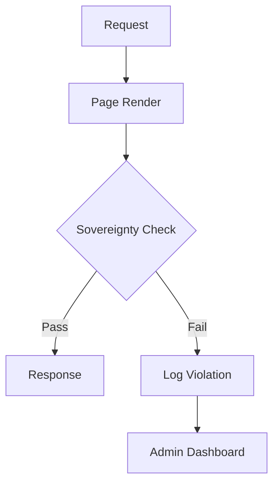

import Tabs from '@theme/Tabs';
import TabItem from '@theme/TabItem';

The "Drupal Pivot" event in Brussels this week wasn't just another meetup—it signaled a major consolidation of Drupal as the engine for European Digital Sovereignty.

<!-- truncate -->

## The Hook
Drupal is no longer just a CMS choice for European governments; it's becoming the cornerstone of their "Digital Sovereignty" strategy to escape vendor lock-in and guarantee data residency.

## Why I Built It
While reading through the reports from [Drupal Pivot](https://www.computerminds.co.uk/articles/drupal-pivot-eu) and [Drupal4Gov](https://drunomics.com/en/blog/drupal4gov-eu-2026-how-drupal-powers-european-institutions-and-national-governments-247), a clear theme emerged: **Sovereignty**.

European institutions are heavily investing in Drupal not because it's "free," but because it's *theirs*. They can audit it, modify it, and crucially, ensure it doesn't phone home to non-EU servers. However, keeping a Drupal site "sovereign" is hard. Developers inadvertently add CDNs, Google Fonts, or third-party analytics that leak user IP addresses outside the EU/GDPR zone.

I wanted a tool that enforces this "Digital Sovereignty" automatically—a scanner that flags any outbound connection that hasn't been explicitly allowlisted.

## The Solution
I'm designing the **Drupal EU Sovereignty Checklist**, a module that acts as a gatekeeper for your site's external footprint.

It works by scanning your rendered markup and active configuration for:
1.  **External Assets**: CSS/JS loaded from CDNs (e.g., `cdn.jsdelivr.net`, `fonts.googleapis.com`).
2.  **Third-party Trackers**: Google Analytics, Meta Pixel, etc.
3.  **Embeds**: YouTube, Vimeo, Maps without "No-Cookie" modes.

<Tabs>
  <TabItem value="audit" label="Audit Logic (PHP)">
    ```php
    public function auditRenderedHtml(string $html): array {
      $violations = [];
      $dom = new \DOMDocument();
      @$dom->loadHTML($html);
      
      $tags = ['link' => 'href', 'script' => 'src', 'img' => 'src', 'iframe' => 'src'];
      
      foreach ($tags as $tag => $attr) {
        foreach ($dom->getElementsByTagName($tag) as $element) {
          $url = $element->getAttribute($attr);
          if ($this->isExternal($url) && !$this->isAllowlisted($url)) {
            $violations[] = [
              'tag' => $tag,
              'url' => $url,
              'risk' => 'Data Leak / GDPR Violation'
            ];
          }
        }
      }
      return $violations;
    }
    ```
  </TabItem>
  <TabItem value="config" label="Allowlist (YAML)">
    ```yaml
    # sovereignty_checklist.settings.yml
    allowlist_domains:
      - 'europa.eu'
      - 'analytics.europa.eu'
    strict_mode: true
    block_non_compliant_renders: false
    ```
  </TabItem>
</Tabs>

### The Architecture
The module uses a **Service Collector** pattern (fittingly, given the recent [discussions on service collectors](https://www.thedroptimes.com/66222/drupal-service-container-deep-dive-part-3-service-collectors)) to allow other modules to register "Sovereignty Auditors."



## The Code
I'm kicking off the build for this compliance tool. It's essential for any agency working with EU public sector clients.

[View Code](https://github.com/victorstack-ai/drupal-eu-sovereignty-checklist)

*Note: This repo is being provisioned. If 404, check back in an hour.*

## What I Learned
*   **"Pivot" is the right word**: The move from "using open source" to "contributing to open source" is the pivot. [Tag1's insights](https://www.tag1.com/blog/contributing-to-drupals-future/?utm_source=rss&utm_medium=feed&utm_campaign=planet_drupal) highlight that governments are now funding core contributions, not just consuming them.
*   **GDPR is an architectural constraint**: You can't just "bolt on" privacy. If your theme loads fonts from Google, you are leaking data before the consent banner even loads.
*   **Local-first is the default**: To be compliant, we need to return to bundling assets locally. Composer asset-packagist and modern build pipelines make this easier, but the default "copy-paste snippet" habit is hard to break.

## References
*   [ComputerMinds.co.uk: Drupal Pivot EU](https://www.computerminds.co.uk/articles/drupal-pivot-eu)
*   [Tag1 Insights: Contributing to Drupal's Future At Drupal Pivot](https://www.tag1.com/blog/contributing-to-drupals-future/?utm_source=rss&utm_medium=feed&utm_campaign=planet_drupal)
*   [drunomics: Drupal4Gov EU 2026: How Drupal Powers European Institutions and National Governments](https://drunomics.com/en/blog/drupal4gov-eu-2026-how-drupal-powers-european-institutions-and-national-governments-247)