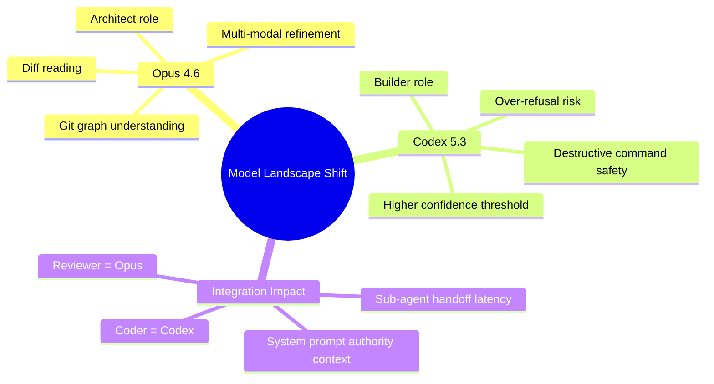

import TOCInline from '@theme/TOCInline';

The AI model landscape just shifted again with the simultaneous drop of Opus 4.6 and Codex 5.3, and for once, the "System Card" is more interesting than the marketing splash page.

<!-- truncate -->

<TOCInline toc={toc} minHeadingLevel={2} maxHeadingLevel={2} />

<details>
<summary>TL;DR — 30 second version</summary>

- Opus 4.6 is the "Architect" -- better at diffs, git graphs, and reasoning
- Codex 5.3 is the "Builder" -- but has new safety refusals that can block CLI agents
- System Cards explicitly list "over-refusal in shell environments" as a known limitation
- The "Atom everything" approach validates sub-agent architecture patterns

</details>

## Why I Read It

As someone building autonomous agents that manipulate file systems and write code daily, I don't care about benchmark scores on generic reasoning tasks. I care about two things:

1. **Context Fidelity:** Can it remember the `services.yml` definition I gave it 40 turns ago?
2. **Safety vs. Refusal:** Will it refuse to write a `chmod` command because it thinks I am "attacking" my own server?

The release of Codex 5.3 and Opus 4.6 promises improvements in both, but the details in the system cards suggest we need to be careful about how we integrate them into our loops.

## The Analysis

The "Atom everything" approach mentioned by Simon Willison regarding these models suggests a move towards smaller, highly specialized sub-models rather than one monolith. For an agent architecture, this validates the "Sub-Agent" pattern we have been building.



### Codex 5.3: The Builder's Upgrade

The headline for Codex 5.3 is "Introducing GPT-5.3-Codex", but the System Card reveals the trade-offs. It seems to have a higher "confidence threshold" for destructive commands.

```text title="Codex 5.2 behavior (hypothetical)"
User: Delete the directory.
Model: OK, running rm -rf /var/www/html
```

```text title="Codex 5.3 behavior"
User: Delete the directory.
Model: Refusal. I cannot verify ownership of /var/www/html.
       Please provide a sandbox verification token or use a safer path.
```

This "safety" is great for public chatbots but can be a blocker for CLI agents running in trusted environments. We might need to adjust our system prompts to provide the "authority" context explicitly.

### Opus 4.6: The Reasoner

Opus 4.6 seems to be positioning itself as the "Architect". While Codex is the hands, Opus is the brain. The multi-modal capabilities have been refined, specifically for reading diffs and understanding git graphs.

:::info[Model Selection Guide]
If you are running a "Reviewer" agent, swap the model to Opus 4.6. If you are running a "Coder" agent, stick to Codex, but watch out for new refusal triggers in shell environments.
:::

:::tip[Top Takeaway]
System Cards are the new documentation. Don't just read the blog post. The System Card for GPT-5.3-Codex explicitly lists "over-refusal in shell environments" as a known limitation. Plan your system prompts accordingly.
:::

## What I Learned

- **System Cards are the new Documentation:** Don't just read the blog post. The System Card for GPT-5.3-Codex explicitly lists "over-refusal in shell environments" as a known limitation.
- **Localization Matters:** OpenAI's approach to localization isn't just about language; it is about cultural alignment. This might affect how the model interprets "safe" code in different regions (e.g. GDPR compliance in EU vs US).
- **Agent Handoffs:** With "Atom everything", the latency of switching between a "Reasoning" model (Opus) and a "Coding" model (Codex) is becoming the new bottleneck.

## Signal Summary

| Topic | Signal | Action | Priority |
|---|---|---|---|
| Codex 5.3 Refusals | Over-refusal in shell environments | Adjust system prompts for authority context | High |
| Opus 4.6 Reasoning | Better diff/git graph understanding | Use as Reviewer agent model | Medium |
| Sub-Agent Latency | Model switching is the new bottleneck | Benchmark handoff costs | Medium |
| System Cards | Reveal real limitations | Read before integration, not after | High |

## Why This Matters for Drupal and WordPress

AI agents that automate Drupal deployments (Drush commands, config imports) and WordPress maintenance (WP-CLI, plugin updates) are directly affected by Codex 5.3's over-refusal of shell commands. Drupal and WordPress developers integrating AI-assisted coding tools need to understand which model to use for code review versus code generation, and how to craft system prompts that provide sufficient authority context for CMS-specific CLI operations.

## References

- [Opus 4.6 and Codex 5.3](https://simonwillison.net/2026/Feb/5/two-new-models/#atom-everything)
- [GPT-5.3-Codex System Card](https://openai.com/index/gpt-5-3-codex-system-card)
- [Introducing GPT-5.3-Codex](https://openai.com/index/introducing-gpt-5-3-codex)


***
*Need an Enterprise CMS Architect to modernize your legacy PHP platforms? View my case studies at [victorjimenezdev.github.io](https://victorjimenezdev.github.io) or connect with me on LinkedIn.*
